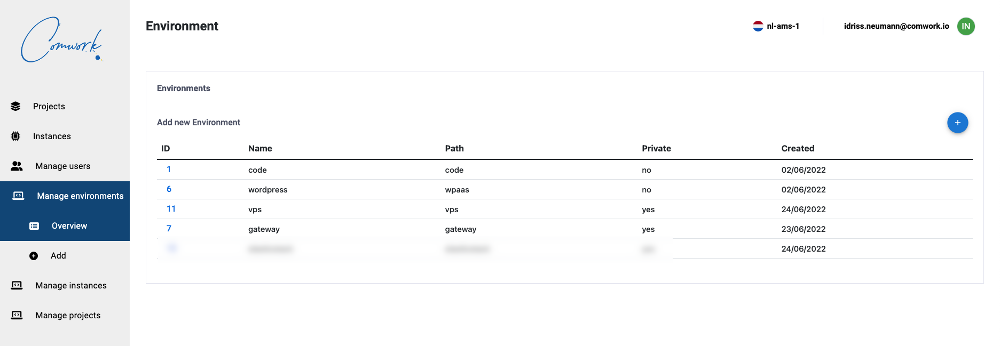
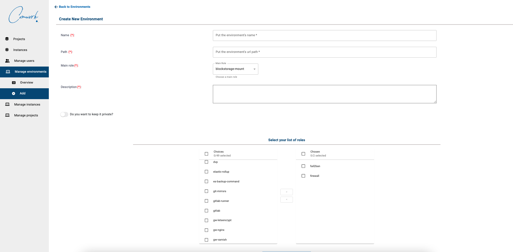

# Comwork Cloud

Here's the documentation of comwork cloud console and API.

It allows to provide cloud SaaS services like [code](https://code.comwork.io) or [wordpress](https://wpaas.comwork.io) in a "IaC" (infrastructure as code) way: you'll get access to a private [comwork gitlab](https://gitlab.comwork.io) repository that contains ansible roles and playbooks you'll be able to maintain. The modification on this repositories will automatically be applied in your instances.

## Table of content

[[_TOC_]]

## Console

The console is here: https://cloud.comwork.io

First you can register and ask to the comwork team to enable your account with a conf meeting you can setup here: https://calendly.com/idriss-neumann/intro-comwork-code

Then you'll be able to create your gitlab projects:

Then your instances:

### Administrators

You can manage the environments which are a set of ansible roles and templates.

Keeping environment private will make the environment not accessible for non-admin users.

## Api

There is a Restful API you can directly use here: https://cloud-api.comwork.io

You'll find the Swagger documentation if you click on the previous link.

## Terraform provider

There will be a terraform provider for automating project and instance creation/pause/deletion based on the previous API.

This work is in progress...
