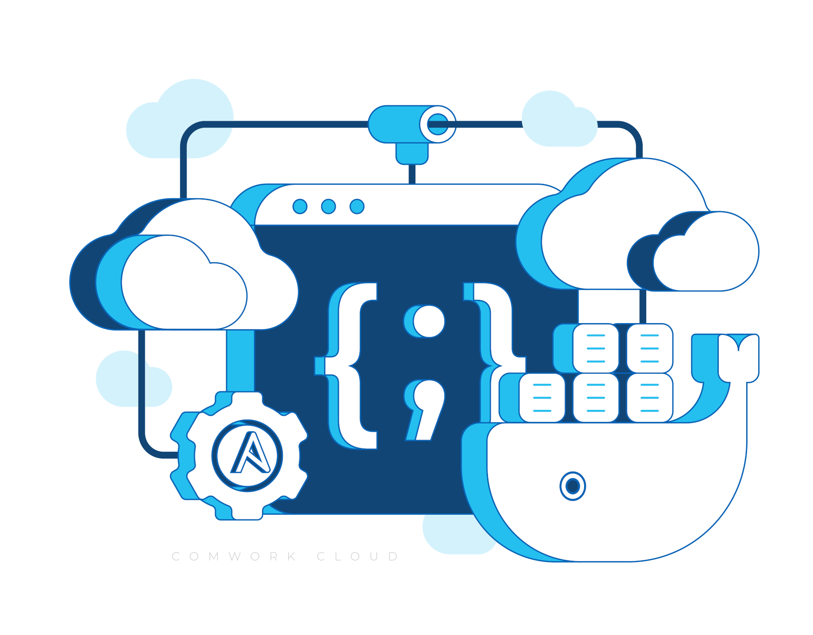

# Comwork Cloud

Here's the documentation of [comwork cloud console](https://cloud.comwork.io) and [API](https://cloud-api.comwork.io).

It allows us to provide cloud SaaS services like [code](./code.md) or [wpaas](./wpaas.md) in a "IaC" (infrastructure as code) way: you'll get access to a private [comwork gitlab](https://gitlab.comwork.io) repository that contains ansible roles and playbooks you'll be able to maintain. The modification on this repositories will automatically be applied in your instances.

The instance are hosted on Scaleway for now (but we intend to propose multiple cloud providers in the future).

## Links

* The documentation is available here: https://doc.cloud.comwork.io
* The markdown sources that are used to generate the documentation are availables here: https://gitlab.comwork.io/comwork_public/comwork_cloud

## Available resources

### Documentations

* [Web console](./web_console.md)
* [Restful api and terraform provider](./api.md)
* [VSCode web as a service](./code.md)
* [Portainer as a service](./portainer.md)
* [Wordpress as a service](./wpaas.md)
* [Matomo as a service](./matomo.md)
* [VPS as a service](./vps.md)
* [Sizing and pricing](./sizing_pricing.md)
* [Subscription procedure](./subscription.md)

### Tutorials

* [How to use git](./tutorials/git.md)
* [Portainer](./tutorials/portainer/README.md)
* [Connect to your instances with SSH](./tutorials/ssh.md)
