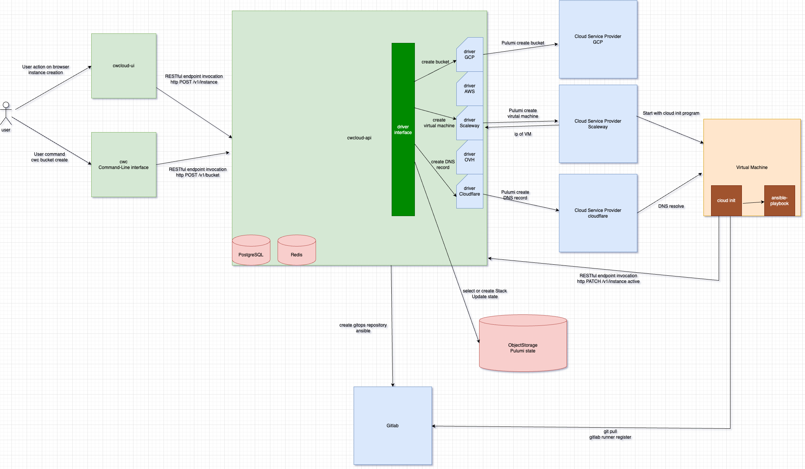
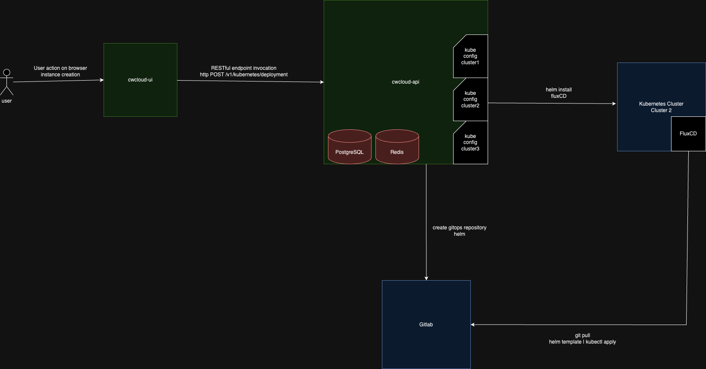

# Comwork Cloud

Here's the documentation of [comwork cloud console](https://cloud.comwork.io) and [API](https://cloud-api.comwork.io).

"_CwCloud_" (for _Comwork Cloud_) is a DaaS[^1] and FaaS[^2] platform that allows us to speed up the provisioning of the infrastructure and managed service such as [serverless FaaS engine](./serverless.md), [Advanced web IDE](./code.md), [DBaaS](./dbaas.md)[^3], [WPaaS](./wpaas.md)[^4], or any other application you want to deploy as a managed service.

It aims to provide those services in a "_IaC_[^5]" or "_GitOps_" way: you'll get access to gitlab repositories that contains ansible roles, templates and playbooks you'll be able to maintain (same thing with Helm charts for Kubernetes instances very soon). The modification on this repositories will automatically be applied in your instances.

Here's a schema explaining how the DaaS is working using virtual machines:

And how it's working with K8S:

There is a SaaS version which provide instances that are hosted on [Scaleway](https://www.scaleway.com) or [OVHCloud](https://www.ovhcloud.com). Those two are really beautiful European 🇪🇺 cloud providers and we intend to propose even more cloud providers in the future (CwCloud can work with any cloud provider that provide standard IaaS[^6] API's such as OpenStack or Kubernetes).

There is also a way to deploy a [self-hosted version of CwCloud](./tutorials/selfhosted.md) with your own prefered cloud provider and account. The self-hosted version is also compatible with [AWS](https://aws.amazon.com), [GCP](https://cloud.google.com) and [cloudflare](https://www.cloudflare.com) (for the DNS records).

[^1]: _Deployment as a service_, check-out [this tutorial](./tutorials/daas.md) to know more about this concept
[^2]: _Function as a service_
[^3]: _Databases as a service_
[^4]: _Wordpress as a service_
[^5]: _Infrastructure as code_
[^6]: _Infrastructure as a service_

## Links

* The documentation is available here: https://doc.cloud.comwork.io
* The markdown sources that are used to generate the documentation are availables here: https://gitlab.comwork.io/comwork_public/comwork_cloud

## Available resources

### Documentations

* [VSCode web as a service](./code.md)
* [Serverless / FaaS](./serverless.md)
* [Localtunnel server](./localtunnel.md)
* [Portainer as a service](./portainer.md)
* [Wordpress as a service](./wpaas.md)
* [Matomo as a service](./matomo.md)
* [Mastodon as a service](./mastodon.md)
* [odoo as a service](./odoo.md)
* [Databases as a service](./dbaas.md)
* [Gateway as a service](./vps.md)
* [Object storages and OCI registries](./storage.md)
* [Sizing and pricing](./sizing_pricing.md)
* [Subscription procedure](./subscription.md)
* [Terms of service](./terms.md)
* [Community and support](./community.md)
* [Licences](./licences.md)
* [Self-hosted CwCloud](./selfhosted.md)

### Tutorials and demos

Go see all our available tutorials and demo [here](./tutorials/README.md)

## Self-hosted version

You're already hosted on [Scaleway](https://www.scaleway.com) or [OVHCloud](https://www.ovhcloud.com) or any other cloud provider based on Openstack API, you can have your own self-hosted instance.

You can [contact us](./subscription.md) if this is something you're interested in.