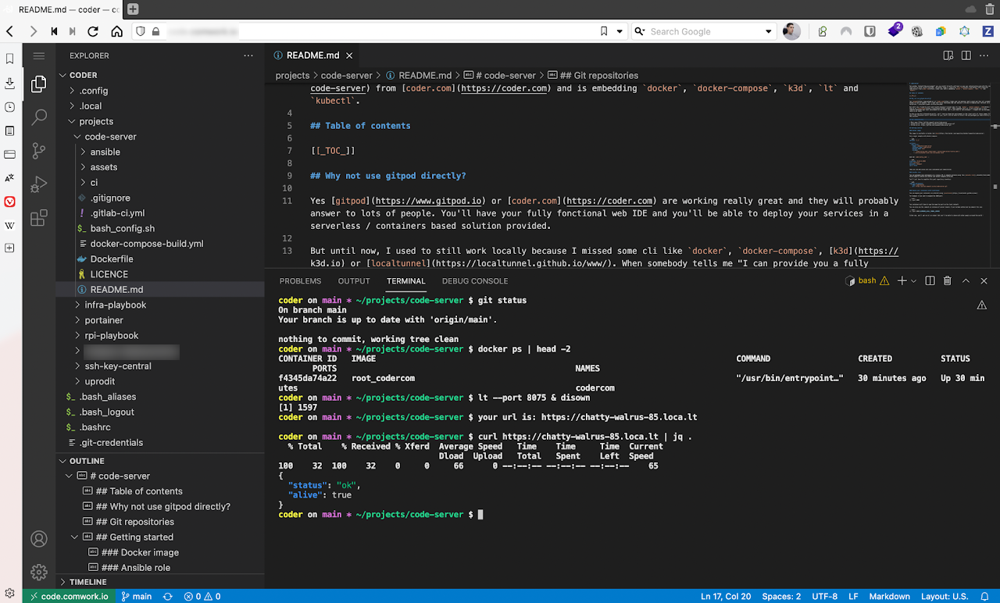
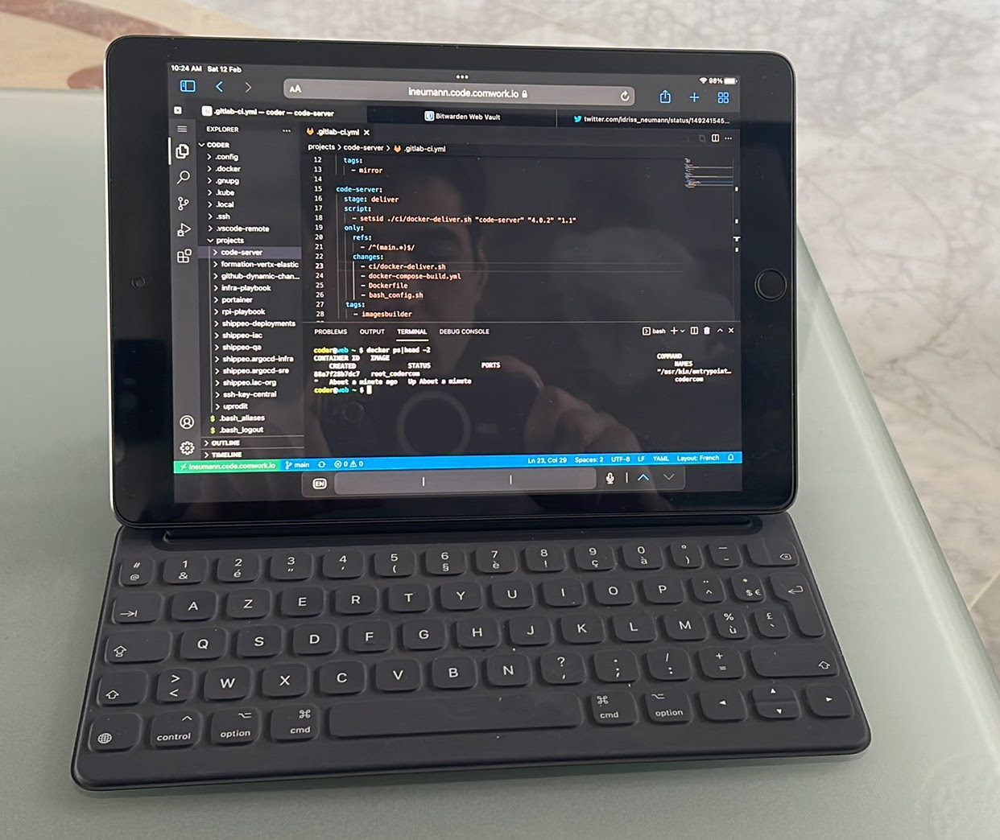

# VSCode - IDE as a service

A full dev|ops local environment on the cloud.

Yet another "_gitpod like environment_" with the real tools you're using locally everyday. 

It embed our every day tools and CLI like docker, docker-compose, k3d, k9s, kubectl, kubeseal, terraform, terragrunt, node, python, ansible, lt, gcloud, jq, yq and you'll be able to add more tools in your instance using the apt command directly on the terminal.

You've also got a fully access to the compute instance that are hosting this web IDE, like it's your own one.

## The differences with gitpod?

Of course [gitpod](https://www.gitpod.io), [coder](https://coder.com), [google cloud shell](https://cloud.google.com/shell), github codespaces are great and bring lots of value for a very large amount of users. But there's value we can bring comparing to those two :

* It's hosted in France 🇫🇷 (with [Scaleway](https://www.scaleway.com), a really beautiful French cloud provider)
* All those needed dependancies are already there: docker, docker-compose, k3d, k9s, kubectl, kubeseal, ansible, terraform, terragrunt, gcloud, jq, yq 
* Keep and store the state of your git repositories, oci registries credentials, ssh keys, gpg keys, etc
* It's like you own a VPS, it's your own instance with your chosen sizing: you'll not be limited by a number of hours, number of git workspaces, whatsoever 
* You'll be able to install and keep vscode extensions
* You'll have a dedicated link with our own tunnel server
* Lots of improvements are coming:  
  * a dedicated tunnel server with TLS and firewall you'll be able to associate your own DNS zone like any cloud provider
  * we'll provide an [API](https://cloud-api.comwork.io), a [web console](https://cloud.comwork.io) and a terraform module in order to give you : 
  * the ability to shutdown and restart your instances when your not using it in order to reduce the cost
  * the persistence of git repositories and docker registries from anywhere even after the destruction/recreation of your instance (based on top of a stored states/events architecture)
  * the rolling upgrades

Want a meeting or a quote? [Contact us](./subscription.md)

_Yeah you can use a dummy IPad to work as if you were on a powerfull laptop!_

## Demo and tutorials

You can find demo and tutorials [here](./tutorials/code/README.md)

## Minimal requirements

We advise to start with an instance >= [DEV1-M](./sizing_pricing.md)

## Sizing and pricing

Check it out [here](./sizing_pricing.md).

You can also choose to do it by yourself, it's completely free, enjoy [our repository](https://gitlab.comwork.io/oss/ansible-iac/code-server) with the docker image and ansible role in order to install it by yourself.
