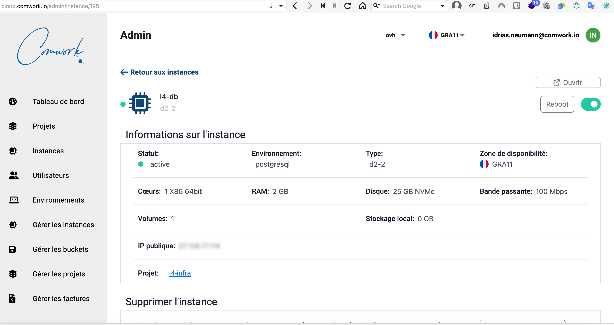

# Database as a service

We offer some low-cost database as a service you can manage as usual in a gitops way

## Disclaimer

There is managed services from Scaleway or OVH which are more suitable for high-availability needs. But it's a lot more expensive. You can start your test on our services than upgrade to the dbaas from those cloud providers once your application is worthy.

We do not handle point in time recovery but it's very easy to also handle backups on object storage. You'll find all you need to achieve that with [this tutorial](./tutorials/dbaas.md)

## Supported databases

* PostgreSQL
* MariaDB (MySQL)

## Demo and tutorial

You can find demo and tutorials [here](./tutorials/dbaas.md)

## Minimal requirements

We advise to start with an instance >= [DEV1-S](./sizing_pricing.md)

## Sizing and pricing

Check it out [here](./sizing_pricing.md).
