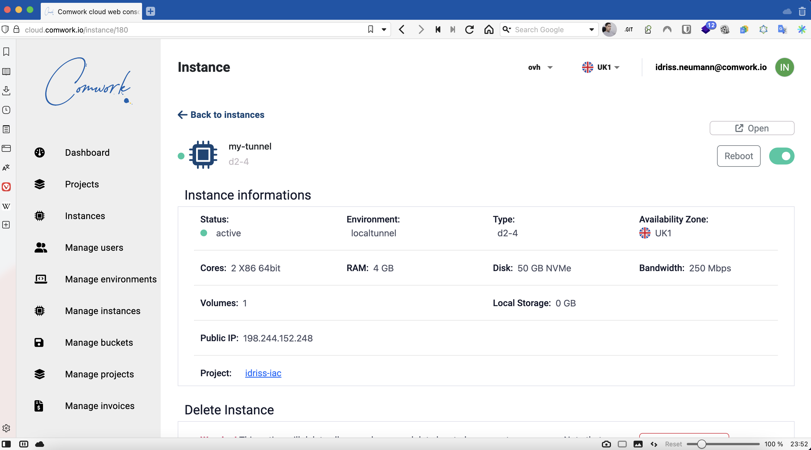
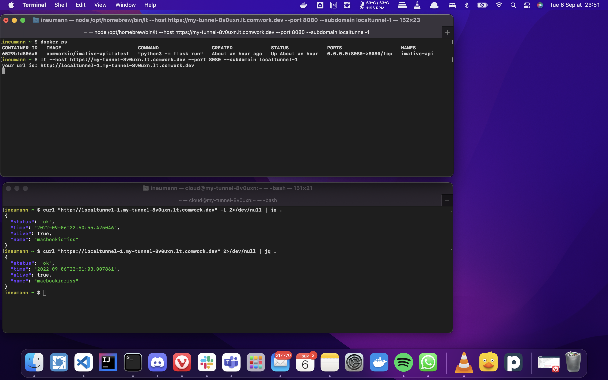

# Localtunnel server

Yet another http/https tunnel as service like [ngrok](https://ngrok.com) or [inlet](https://inlets.dev).

Unlike ngrok or inlet, you're creating your own instance:
* It can be hosted in the region you want (maybe this can help for IoT performances issues). It can be hosted in France 🇫🇷 with French providers (like Scaleway or OVH)
* You pay only for the sizing of the machines, not for a limited number of tunnels (a very small sizing can handle lot's of tunnel, probably more you'll ever use)
* This offer is build on top of [LocalTunnel Server](https://github.com/localtunnel/server) which is fully opensource (MIT licence). The CLI is available in any kind of devices including ARM/raspberrypi:



Very simple to use:

```shell
npm install -g localtunnel
lt --host https://yourinstance.lt.comwork.(cloud|dev|info) --port {the local port you want to expose} --subdomain localtunnel-1
```



As you can see, it's secured, it works with https and letsencrypt certificates

## Demo and tutorial

You can find demo and tutorials [here](./tutorials/localtunnel.md)

## Minimal requirements

We advise to start with an instance >= [DEV1-S](./sizing_pricing.md)

## Sizing and pricing

Check it out [here](./sizing_pricing.md).
