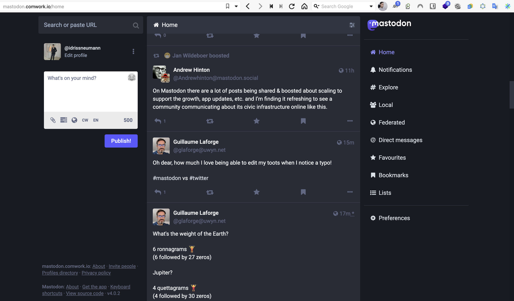

# Mastodon as a service

Mastodon is an OpenSource and Federated software which brings you the ability to provide microblogging features which are similar to Twitter or Reddit social networks.

Mastodon is also part of the Fediverse like PeerTube. So it makes more sens to add new instances instead of joining the existing big instances such as [mastodon.social](https://mastodon.social) or [fosstodon](https://fosstodon.org). Moreover, some of them are suffering big increase of charge and needs to scale up without having enough found.

## Demo and tutorial

You can find demo and tutorials [here](./tutorials/mastodon.md)

## Minimal requirements

We advise to start with an instance >= [DEV1-M](./sizing_pricing.md)

## Sizing and pricing

Check it out [here](./sizing_pricing.md).

You can also choose to do it by yourself, it's completely free, enjoy [our repository](https://gitlab.comwork.io/oss/ansible-iac/mastodon) with the docker images and ansible roles in order to install it by yourself.
