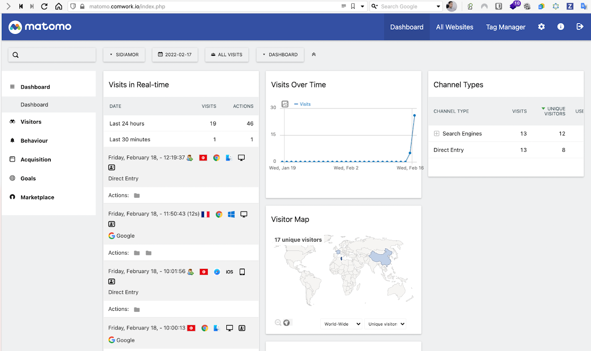

# Mastodon as a service

## Demo and tutorial

You can find demo and tutorials [here](./tutorials/mastodon.md)

## Minimal requirements

We advise to start with an instance >= [DEV1-M](./sizing_pricing.md)

## Sizing and pricing

Check it out [here](./sizing_pricing.md).

You can also choose to do it by yourself, it's completely free, enjoy [our repository](https://gitlab.comwork.io/oss/ansible-iac/mastodon) with the docker images and ansible roles in order to install it by yourself.
