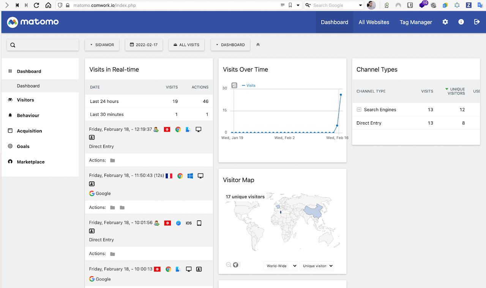

# Matomo as a service

Get your own insite with an opensource GDPR analytics compliant tool : __Matomo__!

## Demo and tutorial

You can find demo and tutorials [here](./tutorials/wpaas_matomo.md)

## Minimal requirements

We advise to start with an instance >= [DEV1-S](./sizing_pricing.md)

## Sizing and pricing

Check it out [here](./sizing_pricing.md).

You can also choose to do it by yourself, it's completely free, enjoy [our repository](https://gitlab.comwork.io/oss/ansible-iac/ansible-matomo) with the docker images and ansible roles in order to install it by yourself.
