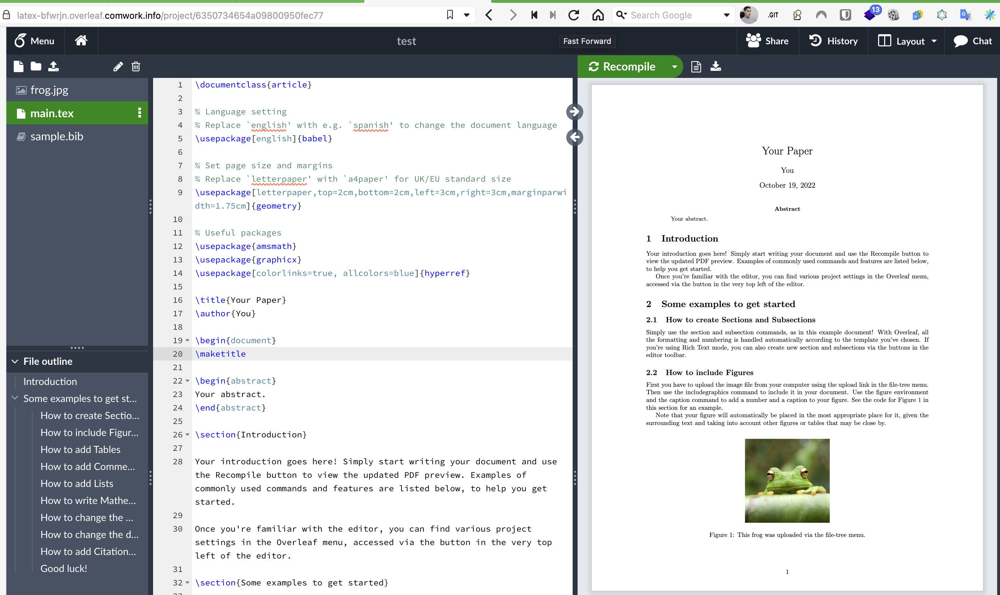

# Overleaf as a service

Get your research and development team to the next level using your instances of Overleaf.

[Overleaf](https://www.overleaf.com) is an opensource online platform for generating document from LaTeX inputs and work in a collaborative way similar to gitlab or github (realtime and collaborative mode, history and revisions, preview management, etc). Very suitable for a research and development team.

It's so far the better experience to work with LaTeX in a collaborative and modern way.

What's the difference with the overleaf SaaS version:
* It can be hosted in __Europe__ 🇪🇺 (including __France__ 🇫🇷) with French providers (like Scaleway or OVH)
* It's like you own a VPS, it's your own instance with your chosen sizing: you'll not be limited by a number of projects, whatsoever 
* You can backup the data on object storage easily using this [`backup-bucket`](https://gitlab.comwork.io/oss/bucket-backup) opensource project and [object storage](./storage.md)

## Demo and tutorials

You can find demo and tutorials [here](./tutorials/overleaf.md)

## Minimal requirements

We advise to start with an instance >= [DEV1-M](./sizing_pricing.md)

## Sizing and pricing

Check it out [here](./sizing_pricing.md).

You can also choose to do it by yourself, it's completely free, enjoy [our repository](https://gitlab.comwork.io/oss/ansible-iac/overleaf) with the ansible role in order to install it by yourself.
