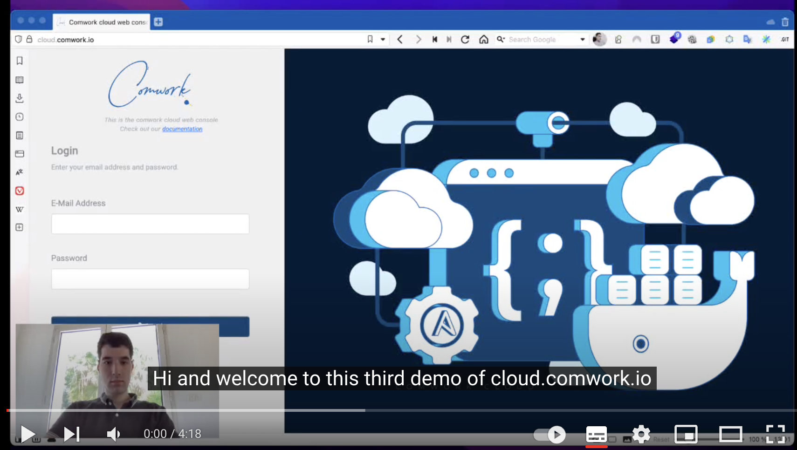
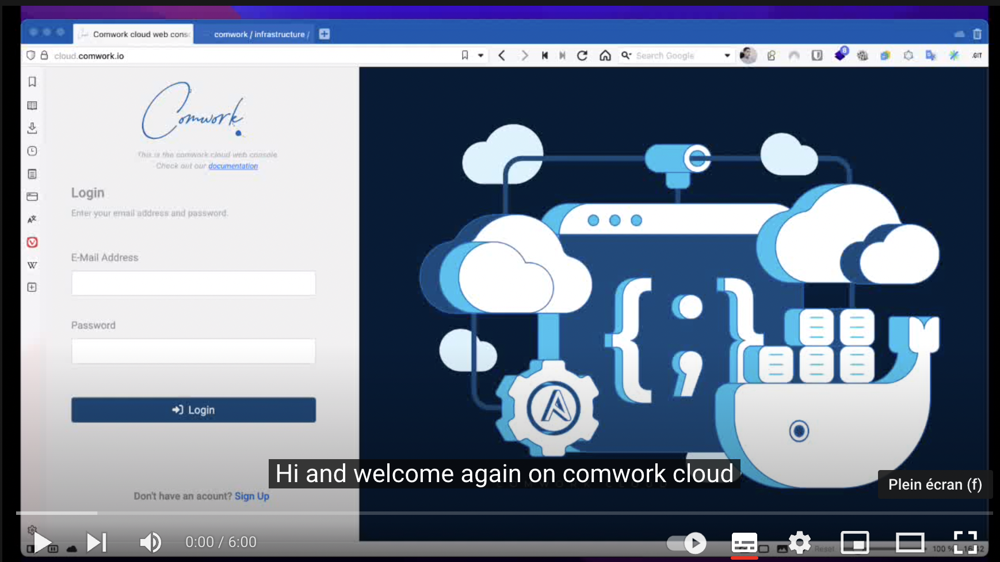
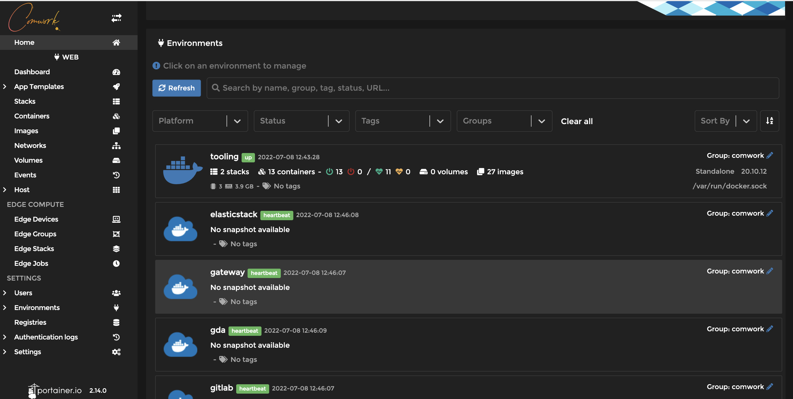
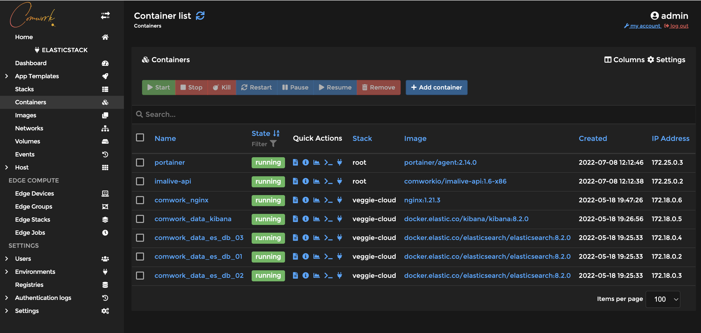
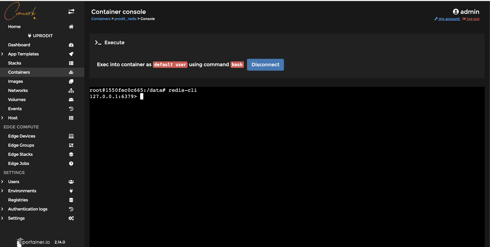
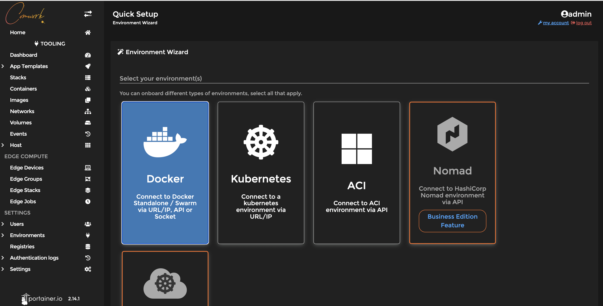
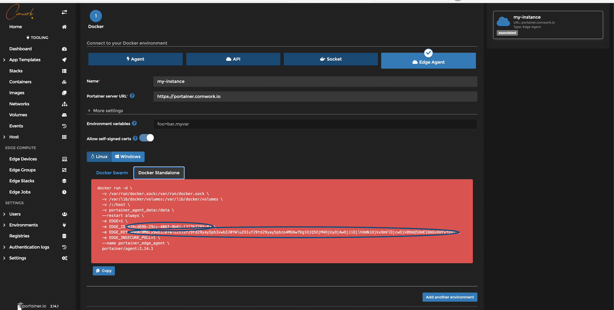

# Portainer as a service

Get your infrastructure to the next level using [portainer](https://www.portainer.io) on our cloud platform !

## Table of content

[[_TOC_]]

## Demo

Install a simple portainer server:

[](https://youtu.be/M29YE3w6NxA)

Install portainer with agents:

[](https://youtu.be/iYK2cwHQh1A)

## Usecases

Here is a non exhaustive list of portainer usecases we're enjoying the most:

1. You can manage you other environments/instances with a portainer agent and list them like that:



2. You can manage the containers that are deployed on the edge agents or directly on your portainer instance:



3. You can manage a container: see it's stdout/stderr output or connect directly with a shell session:



Multiple other actions:
* Clean the docker/OCI images
* Connect to a private docker/OCI registry
* Kubernetes integration
* Deploy directly your containers from a catalog or a docker-compose file you just have to upload like a real Heroku/Netlify like PaaS

## First connection

Beware: you have to set an admin password to the first connection and there is a portainer timeout, so do not wait to connect to your instance after creating it.

## Minimal requirements

We advise to start with an instance >= [DEV-M](./sizing_pricing.md)

## Add portainer agents on comwork cloud

4. You can install portainer edge agent this way:

1. Create "environment on your ansible role":



2. Keep the id and key values:



3. Install a [vps](./vps.md)
4. Add our [ansible role](https://gitlab.comwork.io/oss/ansible-iac/portainer/ansible-portainer-agent) in the vps playbook
5. Change the following ansible variables with the previous key and id:

```yaml
portainer_agent_id: changeit
portainer_agent_key: changeit
```

## Sizing and pricing

Check it out [here](./sizing_pricing.md).

You can also choose to do it by yourself, it's completely free, enjoy [our repositories](https://gitlab.comwork.io/oss/ansible-iac/portainer) with the docker images and ansible roles in order to install it by yourself.
