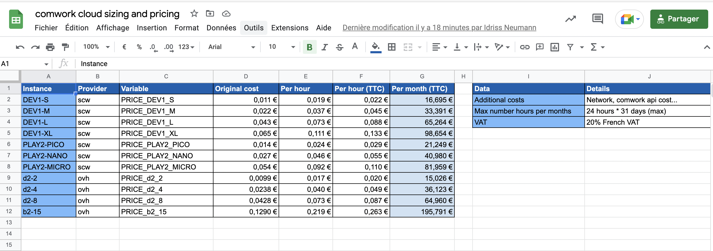

# Price calculator

If you want to update the prices:

1. Update this Google drive [speadsheet](https://docs.google.com/spreadsheets/d/1rfAaCrcGInxsGCkSZyrdo2W6gZDlLQCIqnz_5qF8gBY/edit?usp=sharing)

Notes: 
* There's a `Variable` column with the environment variable's names you need to use on the API.

1. Export into CSV and save the CSV in the [`data.csv`](./data.csv) file
2. Commit and push, a CI/CD pipeline will be triggered and take care of the rest

If you want to modify other informations in the [sizing pricing](../sizing_pricing.md) page:

1. update the [`sizing_pricing.tpl`](./sizing_pricing.tpl)
2. Commit and push, a CI/CD pipeline will be triggered and take care of the rest

Beware, this will also generating the [`prices_env.sh`](../prices_env.sh) which is used by the CwCloud API (you'll have to trigger a pipeline there to redeploy)
