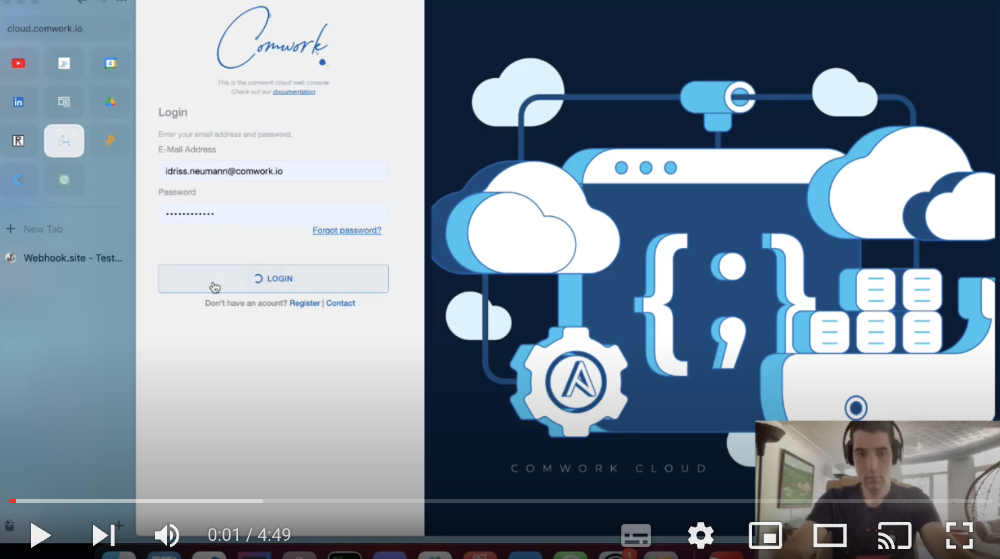
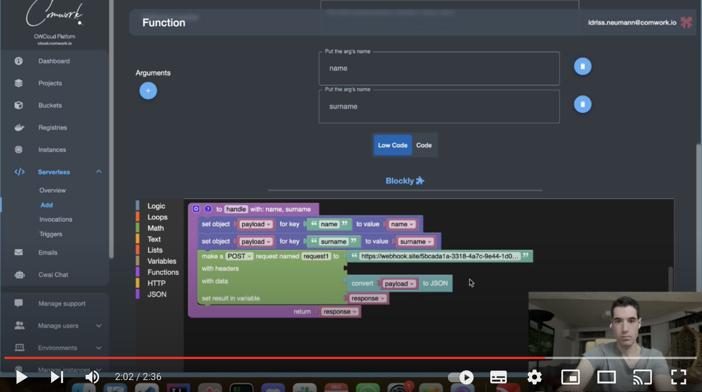
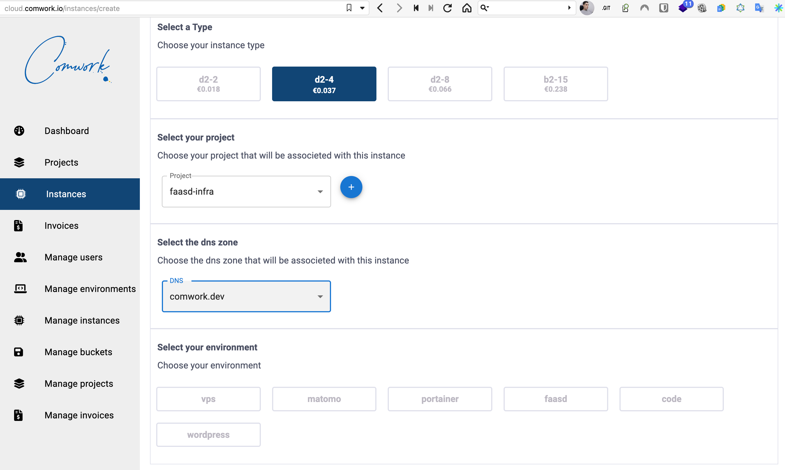
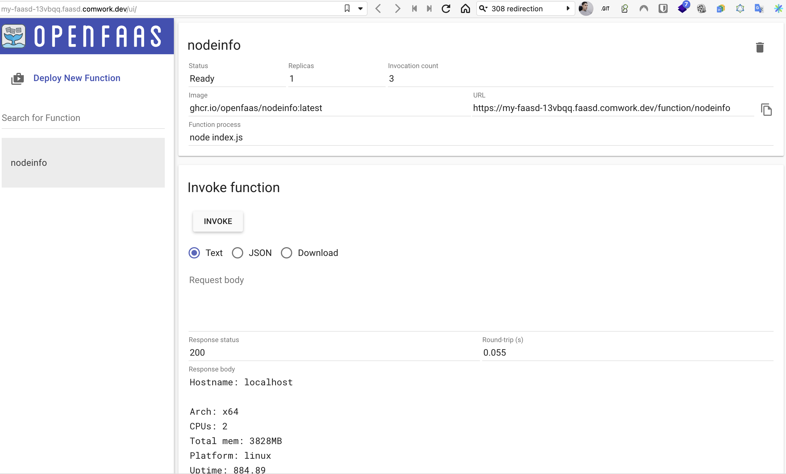
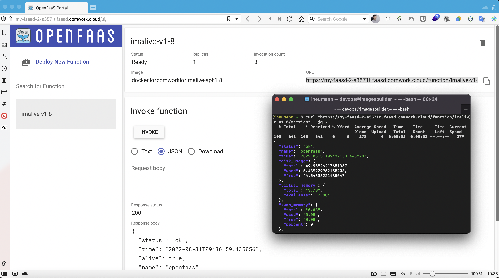

# Serverless

We're developing our own FaaS[^1] platform which is agnostic and API-centric. We're also proposing to deploy other FaaS platform such as [OpenFaaS / Faasd](https://www.openfaas.com/blog/introducing-faasd/).

[^1]: functions as a service

## Comwork cloud FaaS

Our FaaS engine is supporting the following languages:
* Python
* Go
* Javascript
* Bash

You can ask for this feature which is still in beta using the [support system](./tutorials/console/public/support.md).

### Demos

#### Supported programing languages

Here's a quick demo with the programing languages supported:

Note: beware of protecting your function's arguments with a validation regexp, especially for Bash ;-)

#### Lowcode with blockly

It's also possible to use Blockly as a graphical programing (a.k.a "_lowcode_") interface:

### Pricing

There's no pricing at this time, it's free and in beta. In the future, invocation execution time (in hours) will be billed.

## OpenFaas / Faasd

Deploy an OpenFaaS (faasd) instance and deploy a function "NodeInfo" which will print the instance sizing.

Then you can deploy ready to use functions from the marketplace:

You can also deploy your own functions or containers. Here's an example with our usual [imalive metrics exporter](./tutorials/imalive.md):

### Demo and tutorial

You can find demo and tutorials [here](./tutorials/faasd.md)

### Minimal requirements

We advise to start with an instance >= [DEV1-M](./sizing_pricing.md)

### Sizing and pricing

Check it out [here](./sizing_pricing.md).
