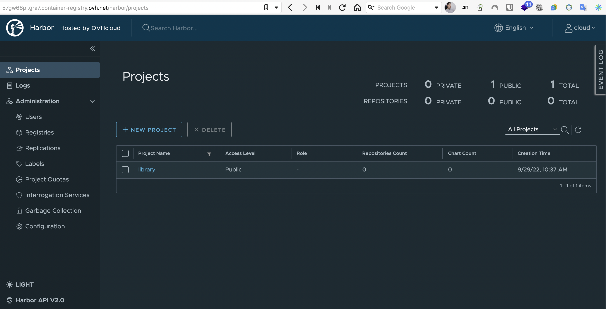

# Object storages and OCI registries

CwCloud allows us to create bucket object storages (S3-likes) and OCI/Docker registries either on [OVH cloud](https://www.ovhcloud.com) and [Scaleway](https://www.scaleway.com).

This feature is only available for CwCloud administrator (you can directly use it if you get your own self-hosted CwCloud instance).

For the SaaS version, you can ask the team to provide buckets or object storage via our [support system](./tutorials/console/public/support.md).

Even if you're not an admin, you'll be able to manage your object storage bucket and OCI registries when there are created and associated with your account.

## Object storage bucket

Either on OVHCloud and Scaleway, you'll get object storages buckets with an S3 compatible API (the OVH implementation is built on top of OpenStack swift implementation).

We also provide this [`backup-bucket`](https://gitlab.comwork.io/oss/bucket-backup) opensource project that will allow you to use those two implementations as storage backup for your databases (works with all databases, we gave a demo for PostgreSQL and MariaDB/MySQL in [this tutorial](./tutorials/dbaas/README.md)).

## OCI Registry

Slight differences between Scaleway and OVH cloud: 
* on scaleway you'll have pretty cheap OCI registry which is billed on hours of usages like every other resources (object storage, etc)
* on OVH you'll get a real dedicated [Harbor](https://goharbor.io) instance. It will be a heavier cost (on OVH the pricing is arround 16 euros without VAT per month for 200gb storage at least) but with a lot more features like : a real GUI you can manage real ACL on your images, helmchart repo support if you're working with Kubernetes deployments, vulnerability auto-scan with [trivy](https://trivy.dev), etc

