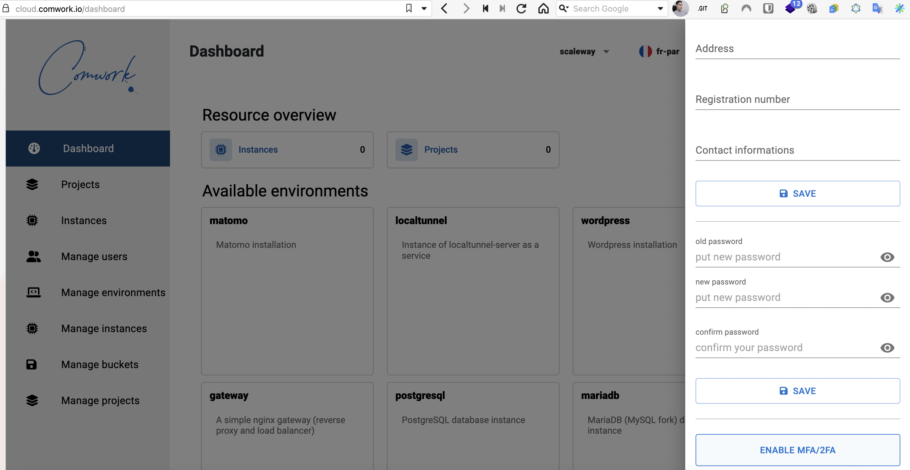
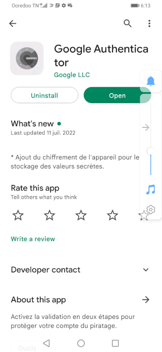

# Subscription procedure

Firstable, if you want a quote or subscribe, you can:
* Setup an appointment [here](https://calendly.com/idriss-neumann/intro-comwork-cloud)
* Send us an email us at `cloud@comwork.io`

Then, once you agree with us on contract terms (including the [sizing/pricing part](./sizing_pricing.md)):

1. Create your account [here](https://cloud.comwork.io/signup)
2. Send-us an email at `cloud@comwork.io` to notify the email of your account
3. An admin will enable your account

## 2FA / MFA (multiple factor authentication)

We **strongly** advise you to enable the 2FA/MFA. 

In order to do that, go to your settings:

Then:

You have to register an otp device with a 2FA application which is able to scan QR codes like Google authenticator which is available for Android and IOS/IpadOS:

Flash the QR code with this app (or the one you prefer) and write the otp code.

Then you'll have to write the 6 digits otp code printed on this application each time you sign-in.
