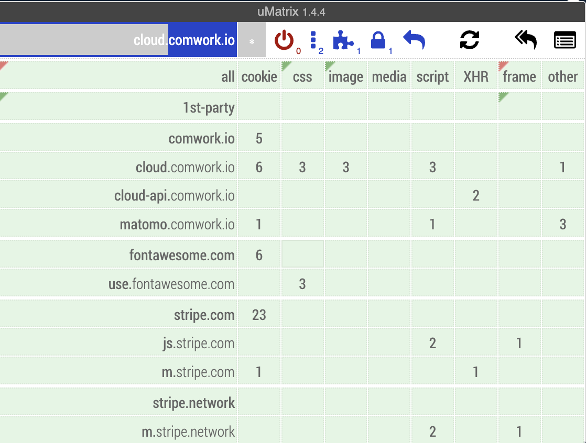

# Terms of service

Those are the terms of services for the [SaaS version of CwCloud](https://cloud.comwork.io).

## Where and by whom is hosted this service?

This instance is hosted in France by [COMWORKIO SASU](https://www.comwork.io) (R.C.S Paris 838 757 987) on [Scaleway](https://www.scaleway.com).

## What is the pricing model?

You'll find all the details about the sizing and pricing model [here](./sizing_pricing.md).

## How the secured payment is working?

The bill are monthly issued, you can find how to download and pay those bills with [this tutorial](./tutorials/console/public/billing.md).

The billing system is using [stripe](https://www.stripe.com) for secured payments.

You're not required to use it, you can ask to make classic transfers to the COMWORK SASU company (you can asks-us to provide the IBAN using the [support system](./terms.md)).

## What are the licences of each comwork's cloud components?

All the licences are detailed [here](./licences.md).

## What information do we collect?

* _Basic account information_: If you register on this service, you may be asked to enter a username, an e-mail address and a password. You may also enter additional profile information such as company references and payment credit card in order to be able to receive some bills. All those informations are only accessible by the COMWORKIO staff.

* _IPs and other metadata_: When you log in, we record the IP address you log in from, as well as the name of your browser application. All the logged in sessions are available for your review and revocation in the settings. The latest IP address used is stored for up to 12 months. We also may retain server logs which include the IP address of every request to our service.

## What do we use your information for?

Any of the information we collect from you may be used in the following ways:

* The email address you provide may be used to send you informations, generate a new password if needed, the monthly bills...
* The payment method you provide is not mandatory but allows you to make the payment easier

## What is our data retention policy?

We will make a good faith effort to:

* Retain server logs containing the IP address of all requests to this service, in so far as such logs are kept, no more than 90 days.
* Retain the IP addresses associated with registered users no more than 12 months.

## Do we use cookies?

Yes. Cookies are small files that a site or its service provider transfers to your computer's hard drive through your Web browser (if you allow). These cookies enable the site to recognize your browser and, if you have a registered account, associate it with your registered account.

We use cookies to understand and save your preferences for future visits.

## Do we disclose any information to outside parties?

We do not sell, trade, or otherwise transfer to outside parties your personally identifiable information. This does not include trusted third parties who assist us in operating our site, conducting our business, or servicing you, so long as those parties agree to keep this information confidential. We may also release your information when we believe release is appropriate to comply with the law, enforce our site policies, or protect ours or others rights, property, or safety.

## What are the 3rd parties used by CwCloud?

Our front page is using static assets from the outside. Those are coming from [stripe](https://stripe.com) in order to provide graphical component that allows you to record easily payment methods and process payment only if you want and [font-awesome](https://fontawesome.com) for UI icons and fonts.

Here's what you can see with uMatrix:

Those assets are hosts on the United States so we prefer let you know that they are able to store your IP adress in a country which is not following the same law as European-Union members even if those company are pretending they're comply with the GDPR[^1].

Also the DNS zone `comwork.click` is managed by [Cloudflare](https://www.cloudflare.com) so if you're choosing this one to expose your services, we inform you again that they will be able to get your IP adress.

And finally here's the CSP[^2] available for the deployment of instances, registry or object storages:
* [Scaleway](https://www.scaleway.com)
* [OVH](https://www.ovhcloud.com)

You'll be able to choose the CSP[^2] and the region each time you'll make a query to create instances, object storages or registries.

## What kind of services are forbidden on CwCloud?

We do not intend to host the following types of services:

* Illegal services regarding the member European Union's member countries's laws
* Crypto-currency mining on our servers[^3]
* Pornographic content
* Hate or harassment speech content

## What is the minimal age required for using CwCloud?

The [SaaS version of cwcloud](https://cloud.comwork.io) is hosted in the EU: Our site, products and services are all directed to people who are at least 16 years old. If you are under the age of 16, per the requirements of the GDPR[^1] do not use this site.

[^1]: [General Data Protection Regulation](https://en.wikipedia.org/wiki/General_Data_Protection_Regulation))
[^2]: Cloud service provider
[^3]: it's not forbidden to host websites or API related to a crypto-currency service, it's only the mining process that is forbidden on our servers and storage (because it's also forbidden on the cloud's provider we relied on)
