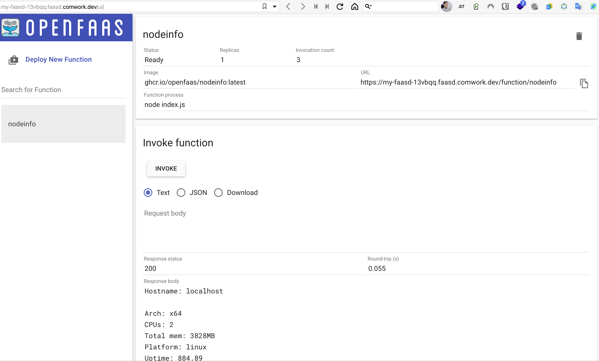

# Serverless

Nous développons notre propre plateforme FaaS[^1] qui est agnostique et centrée sur les API. Nous proposons également de déployer d'autres plateformes FaaS telles que [OpenFaaS / Faasd] (https://www.openfaas.com/blog/introducing-faasd/).

[^1] : fonctions en tant que service

## Traductions

Cette page est également disponible dans les langues suivantes :
* [English 🇬🇧](../../serverless.md)

## Comwork cloud FaaS

Notre moteur FaaS prend en charge les langages suivants :
* Python
* Go
* Javascript
* Bash

Vous pouvez demander cette fonctionnalité qui est encore en beta en utilisant le [système de support](./tutorials/console/public/support.md).

### Démonstrations

#### Langages de programmation supportés

Voici une démonstration rapide des langages de programmation pris en charge :

Note : attention à protéger les arguments de votre fonction avec une regexp de validation, surtout pour Bash ;-)

#### Lowcode avec blockly

Il est également possible d'utiliser Blockly comme interface de programmation graphique (a.k.a "_lowcode_") :

#### Tutoriels

- [Comment créer une fonction Serverless](./tutorials/faas/how_to_create_a_function.md)

### Tarification

Il n'y a pas de prix pour le moment, c'est gratuit et en beta. Dans le futur, le temps d'exécution de l'invocation (en heures) sera facturé.

## OpenFaas / Faasd

Vous pouvez déployer une instance légère OpenFaaS (Faasd) afin de déployer des fonctions et des conteneurs sans serveur.

### Démonstration et tutoriel

Vous pouvez trouver une démo et des tutoriels [ici](./tutorials/faasd.md)

### Exigences minimales

Nous conseillons de commencer avec une instance >= [DEV1-M](../../sizing_pricing.md)

### Dimensionnement et tarification

Vérifiez [ici](../../sizing_pricing.md).
