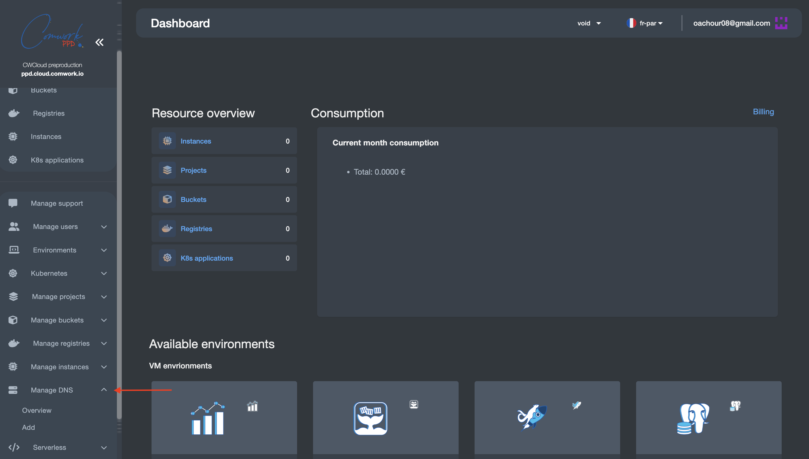
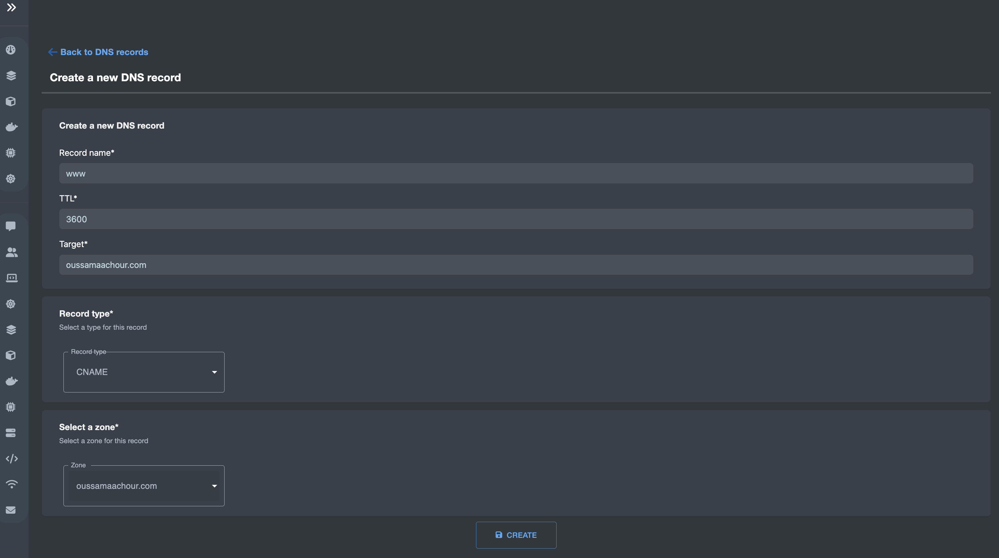
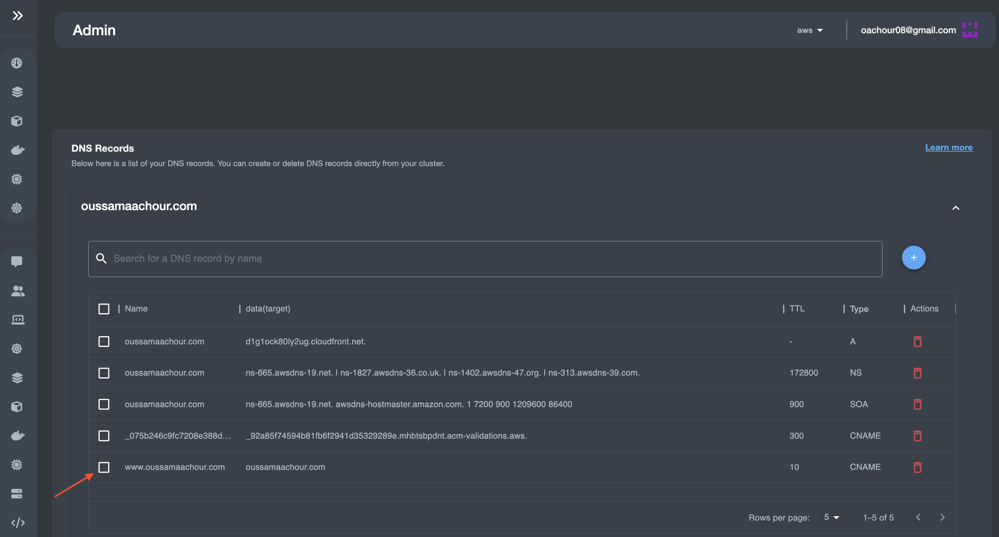
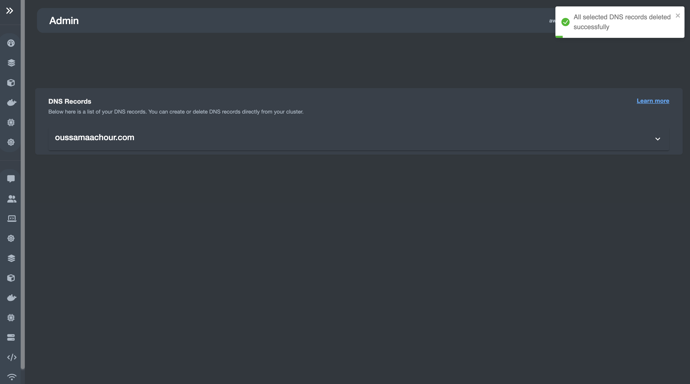
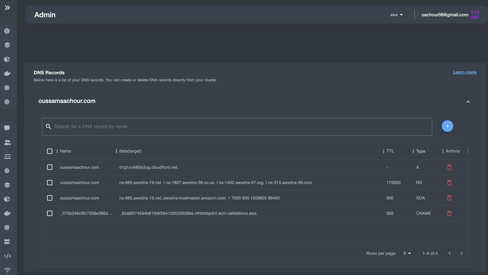

# Gestion des enregistrements DNS

## Traductions

Ce tutoriel est également disponible dans les langues suivantes :
* [English 🇬🇧](../../../../tutorials/api/DNS%20Management.md)
## À propos de la fonctionnalité :
Cette fonctionnalité offre à l'utilisateur (notamment, l'administrateur) la possibilité de gérer les enregistrements DNS pour une zone DNS sélectionnée. Cela comprend :
 - L'affichage de tous les enregistrements DNS
 - La création de nouveaux enregistrements DNS
 - La suppression des enregistrements DNS sélectionnés

Les fournisseurs de cloud avec lesquels cette fonctionnalité fonctionne dans sa version actuelle sont :
- [Amazon Web Services (AWS)](https://aws.amazon.com/)
- [Google Cloud Platform (GCP)](https://cloud.google.com/?hl=en)
- [Microsoft Azure](https://azure.microsoft.com/en-us) 
- [Scaleway](https://www.scaleway.com/en/) 
- [OVH](https://www.ovhcloud.com/fr/) 

## Exploration de la fonctionalité:
### Sélectionner le service et le fournisseur de cloud

- Dans le panneau de gauche de la page du tableau de bord, sélectionnez **Manage DNS**, puis **Overview**

- Dans la page **Overview**, sélectionnez le fournisseur de cloud dans lequel votre zone DNS est hébergée  
À gauche de votre adresse e-mail, vous trouverez une liste des fournisseurs de cloud.  
Dans cette démo, nous choisissons Amazon Web Services (AWS)  
Ici, toutes les zones DNS hébergées dans votre compte chez le fournisseur de cloud sélectionné seront listées, sélectionnez celle que vous souhaitez  
À ce stade, nous allons commencer à parcourir les différentes fonctionnalités une par une :
    - [ Affichage des enregistrements DNS](#affichage-des-enregistrements-dns)
    - [Création d'enregistrement(s) DNS](#création-denregistrements-dns)
    - [Suppression d'enregistrement(s) DNS](#suppression-denregistrements-dns)

## Affichage des enregistrements DNS

En tant qu'administrateur, vous pouvez gérer les enregistrements DNS de plusieurs fournisseurs.
En sélectionnant simplement votre zone DNS hébergée, tous les enregistrements DNS respectifs seront listés.  

Chaque ligne décrit un enregistrement unique incluant les informations suivantes (Nom de l'enregistrement, Cible/Valeur de l'enregistrement, Type d'enregistrement, TTL de l'enregistrement)  
Ces champs sont expliqués dans la prochaine section [Création d'enregistrement(s) DNS](#création-denregistrements-dns).

## Création d'enregistrement(s) DNS

Créer de nouveaux enregistrements DNS consiste à remplir ces valeurs :

- **Name:** Cela doit être le sous-domaine, qui sera ensuite concaténé avec le nom de domaine formant le nom de domaine complet *(sous-domaine*.*nom-de-domaine*).
Exemple : *foo*.*oussamaachour.com*
- **Target:**  Cela indique où le trafic sera acheminé lors de l'accès à l'URL respective.
Dans ce cas, l'enregistrement est un enregistrement CNAME (Canonical NAME) pointant vers le nom de domaine d'origine qui est *oussamaachour.com*.
- **TTL:** TTL signifie Time to Live. C'est le temps, en secondes, que prendront les modifications apportées à l'enregistrement DNS pour prendre effet.
Exemple : Avec un TTL de 3600, toutes les modifications de cet enregistrement devront être actualisées toutes les 3600 secondes (une heure).
- **Type:** Le type de l'enregistrement tel que les suivants (Enregistrement A, Enregistrement AAAA, Enregistrement CNAME, Serveur de noms (NS), Enregistrement d'échange de courrier (MX)).
- **DNS Zone:**: Il s'agit de la zone DNS hébergée où votre enregistrement sera créé.  
Dans cet exemple, nous souhaitons créer un enregistrement *CNAME* pour le nom de domaine d'origine *oussamaachour.com* afin que le trafic provenant de www.*oussamaachour.com* soit dirigé vers *oussamaachour.com*.

**Remarque :** Un enregistrement CNAME est comme un alias pour le nom de domaine cible.

Après avoir rempli tous les champs, cliquez sur le bouton `CREATE`.

## Suppression d'enregistrement(s) DNS

Sélectionnez votre ou vos enregistrement(s) souhaité(s) pour la suppression, puis cliquez sur l'icône `DELETE` à droite.

Comme nous pouvons le voir, l'enregistrement a été supprimé avec succès !  
**Remarque:** La suppression de l'enregistrement DNS entraîne la suppression de l'enregistrement lui-même, ainsi que de sa pile de l'état Pulumi.

## Créer des enregistrements DNS ne suffit pas !

Bien que cette fonctionnalité permette à l'utilisateur de gérer les enregistrements DNS dans différents environnements cloud, cela ne suffit pas pour que les enregistrements créés soient résolus et fonctionnels.  
En fait, **Le périmètre de la fonctionnalité se limite uniquement à cela**, fournir un point centralisé pour gérer les enregistrements DNS, de la même manière que vous le feriez dans chaque fournisseur de cloud individuel !

### Considerations :
- **Une zone DNS dans différents fournisseurs de cloud:** 
Dans notre cas, nous avons utilisé une seule zone dans les trois fournisseurs de cloud (AWS, GCP et Azure).
Utiliser une seule zone dans plusieurs environnements cloud, qui est en fait hébergée sur AWS, **est uniquement à des fins de test**.

Par conséquent, quelques configurations supplémentaires sont nécessaires.
Une solution pour ce scénario est d'activer la délégation DNS, où vous déléguez des domaines/sous-domaines DNS spécifiques à un autre cloud que celui dans lequel vous hébergez votre zone DNS.

- **Attachement des certificats SSL/TLS aux domaines/sous-domaines créés** 
Créer des enregistrements DNS ne suffit pas pour les rendre pleinement fonctionnels pour l'utilisateur final.  
En effet, de manière générale, tout domaine/sous-domaine a besoin d'un certificat SSL/TLS pour garantir une connexion sécurisée via Internet.  
Exemple: Dans la démonstration que nous avons faite, après avoir créé *www.oussamaachour.com*, nous devons aller sur AWS et créer un certificat SSL/TLS (cela peut être fait par AWS Certificate Manager ou une autre autorité). Nous pourrions également créer un seul certificat SSL/TLS pour le domaine et tous ses sous-domaines.