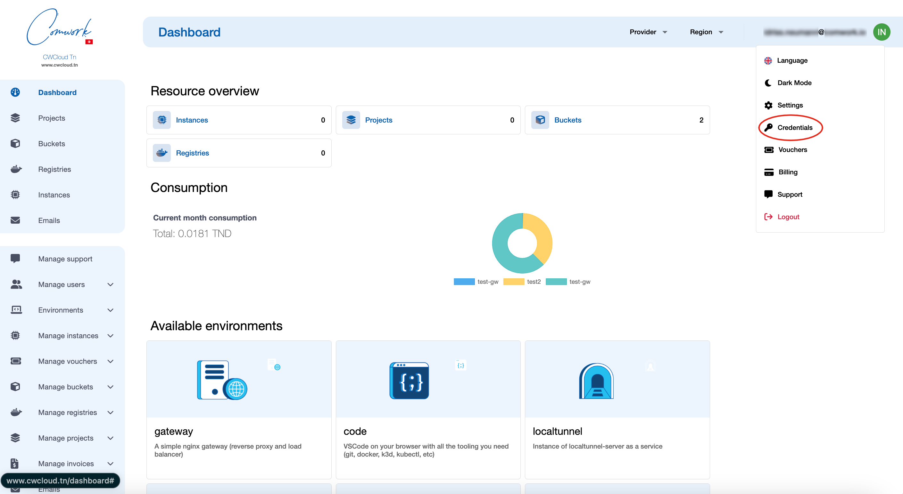
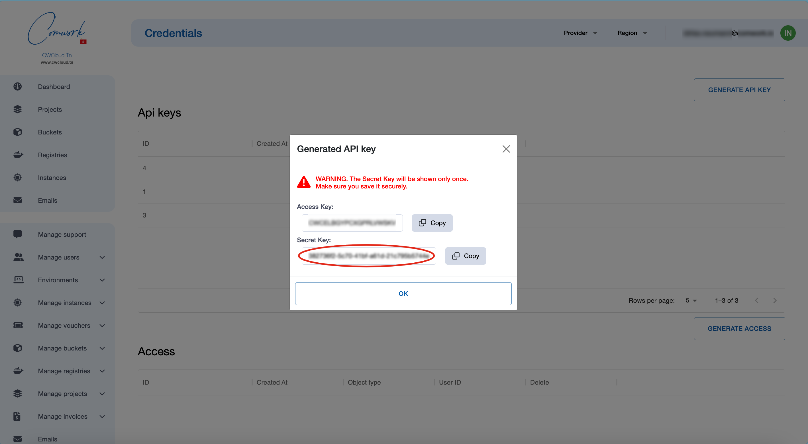

# API Credentials

## Traductions

Ce tutoriel est également disponible dans les langues suivantes :
* [English 🇬🇧](../../../../tutorials/api/api_credentials.md)

## Procédure

Dans le but de créer des clefs d'API, cliquez ici :

Puis créer le couple Api Key et Api Secret comme ceci :

Ensuite vous pourrez utiliser la clef secrète avec le header `X-Auth-Token` dans l'API Restful et le couple avec la [cli](../cli/README.md).

N'oubliez pas de conserver ces accès en lieu sûr !
