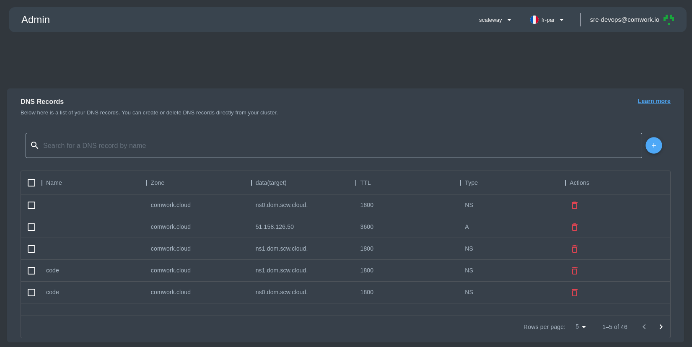
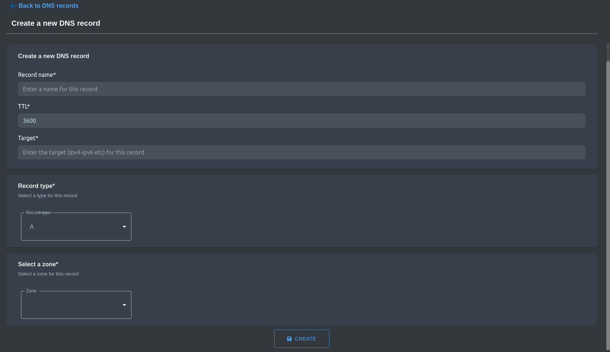

# Enregistrements DNS

## Traductions

Ce tutoriel est également disponible dans les langues suivantes :
* [English 🇬🇧](../../../../tutorials/api/dns_records.md)

## Liste des enregistrements DNS

En tant qu'administrateur, vous pouvez gérer les enregistrements DNS de plusieurs fournisseurs.

Vous pouvez voir la liste des enregistrements DNS avec des détails sur la zone, la cible, le TTL et le type.

Actuellement, les actions disponibles sont la création d'un nouvel enregistrement et la suppression (ou la suppression multiple en sélectionnant plusieurs enregistrements DNS).

## Création d'enregistrements DNS

Pour la création d'un enregistrement DNS, vous devez saisir le :

- le nom de l'enregistrement.
- TTL (ou Time To Live).
- Cible. <!-- TODO : la cible doit être expliquée -->

Choisissez ensuite le type d'enregistrement et sélectionnez la zone.

La création de votre nouvel enregistrement est terminée !

## Ce que vous devez savoir si vous hébergez vous-même Comwork Cloud
<!-- TODO : @oussama expliquer spécifiquement pour chaque fournisseur -->
