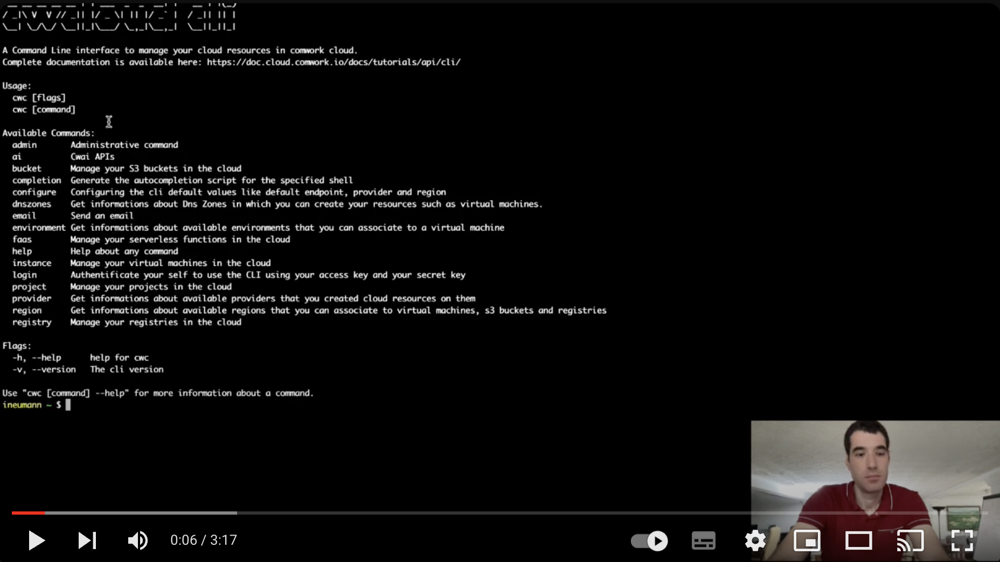

# Commandes publiques

Vous trouverez ici comment utiliser `cwc` afin d'effectuer en ligne de commande les actions que vous feriez habituellement avec la [console web](../console/README.md). Cela vous facilitera l'automatisation de vos scripts et pipelines IaC[^1] (par exemples avec des shells scripts, rôles ansible, terraform, etc).

Remarques :
* Pour installer ou mettre à jour la ligne de commande `cwc`, [rendez-vous ici](./install.md).
* Pour les commandes accessibles aux administrateurs, [rendez-vous là](./admin.md)

[^1]: infrastructure as code

## Traductions

Ce tutoriel est également disponible dans les langues suivantes :
* [English 🇬🇧](../../../../tutorials/cli/public.md)

## Obtenir de l'aide

```shell
cwc help # or -h or --help for getting help
cwc version # or -v or --version for getting the current version
```

## Authentification

### Login

```shell
cwc login -a <access_key> -s <secret_key>
```

Pour créer un couple `access_key` et `secret_key`, voir [ce tutoriel](../api/api_credentials.md).

## Configuration par défaut

### Lire la configuration courante

```shell
cwc configure get endpoint
cwc configure get provider
cwc configure get region
cwc configure get format

```

```shell
cwc configure ls
```

Cette commande listera les fichiers de configuration disponibles dans le dossier `.cwc` de votre machine.

### Configurer

Pour configurer l'url de l'API (default endpoint), la région, le format de sortie ou l'hébergeur (provider) :

```shell
cwc configure
```

Tapez sur ENTER si vous voulez conserver la valeur actuelle pour chacun des paramètres :

```shell
$ cwc configure
Default endpoint [https://cloud-api.comwork.io]: 
Default provider [ovh]: 
Default region [UK1]: 
Default format [json]: 
```

__Note :__ Après avoir configuré votre client, un fichier de configuration sera créé automatiquement dans le dossier `.cwc` du répertoire `home`.

Vous pouvez lister les providers ou régions disponibles avec ces commandes :

```shell
cwc provider ls
cwc region ls # vous devez avoir setté le paramètre "provider" au préalable
```

Vous pouvez enfin configurer les paramètres individuellement comme ceci :

```shell
cwc configure set endpoint https://cloud-api.comwork.io
cwc configure set provider ovh
cwc configure set region UK1
cwc configure set format json
```

Vous pouvez également créer un fichier de configuration à utiliser avec la configuration que vous avez faite :

```shell
cwc configure switch <nom_du_fichier_de_configuration>
```

Ceci prendra le fichier de configuration existant dans le dossier `cwc` que vous avez choisi et mettra en place la configuration.

Si vous voulez importer un fichier de configuration existant dans un autre répertoire, vous pouvez utiliser la commande suivante :

```shell
cwc configure import <chemin_du_fichier_de_configuration>
```

#### Format des sorties

Les formats de sorties interprétés sont:
* `plain`: sortie en colonnes facilement parsable via des shell scripts
* `json`: sortie au format JSON, facilement parsable par des langages de programmation plus haut niveau
* `pretty`: mise en forme plus lisible à la lecture mais plus difficilement parsable par des scripts ou programmes. Ce format peut-être aussi ponctuellement demandé sans être persisté en ajoutant l'option `-p` ou `--pretty` à votre commande

## Projets

### Lister

```shell
cwc project ls
```

__Note :__ Vous pouvez ajouter le flag `-t` (ou `--type`) pour filtrer les projets par type (vm ou k8s).

### Rechercher

#### Rechercher par ID

```shell
cwc project ls -p <project_id>
cwc project ls --id <project_id>
```

#### Rechercher par nom

```shell
cwc project ls -n <project_name>
cwc project ls --name <project_name>
```

#### Rechercher par URL

```shell
cwc project ls -u <project_url>
cwc project ls --url <project_url>
```

### Créer

```shell
cwc project create -n <project_name>
```

Remarques : 

* Si vous souhaitez changer d'instance gitlab ou de group ou de compte utilisateur, il faudra utiliser ces options :
  * `-h` ou `--host`: Instance de gitlab
  * `-t` ou `--token`: Access token de gitlab
  * `-g` ou `--git`: Votre nom d'utilisateur git
  * `-n` ou `--namespace`: le namespace ou group id ou le projet git sera stocké
  * `-p` ou `--type`: le type de projet (vm ou k8s)

### Supprimer

#### Supprimer par ID

```shell
cwc project delete -p <project_id>
cwc project delete --id <project_id>
```


#### Supprimer par nom

```shell
cwc project delete -n <project_name>
cwc project delete --name <project_name>
```


#### Supprimer par URL

```shell
cwc project delete -u <project_url>
cwc project delete --url <project_url>
```

## Zones DNS

### Lister

```shell
cwc dnszones ls
```

## Environnements

#### Lister

```shell
cwc environment ls
```

### Rechercher par ID

```shell
cwc environment ls -e <environment_id>
cwc environment ls --environment <environment_id>
```

## Instances

### Lister les types d'instances disponibles

```shell
cwc instance type ls
```

### Lister les instances

```shell
cwc instance ls
```

### Rechercher par ID

```shell
cwc instance ls -i <instance_id>
cwc instance ls --instance <instance_id>
```

### Créer

```shell
cwc instance create -n <instance_name> -e <environement> -t <instance_type> -p <project_name> -z <zone>
cwc instance create -n <instance_name> -e <environement> -t <instance_type> -i <project_id> -z <zone>
cwc instance create -n <instance_name> -e <environement> -t <instance_type> -u <project_url> -z <zone>
```

Remarques : 
* utiliser la zone `nova` pour ovh ou `1` ou `2` pour scaleway
* `instance_type` correspond à la taille de l'instance (ex: `DEV1-M` for Scaleway)
* utiliser `--dns_zone` ou `-d` pour choisir la zone dns dans laquelle l'instance sera créee (vous pouvez voir les zones disponibles avec `cwc dnszones ls`)

### Attacher

```shell
cwc instance attach -n <playbook_name> -t <instance_type> -p <project_name> -z <zone>
```

Remarques : 
* utiliser la zone `nova` pour ovh ou `1` ou `2` pour scaleway
* `instance_type` correspond à la taille de l'instance (ex: `DEV1-M` for Scaleway)

### Mettre à jour le status

```shell
cwc instance update -i <instance_id> -s <action>
```

Remarques :
* Le statut doit être `poweroff`, `poweron` or `reboot`

### Supprimer

```shell
cwc instance delete -i <instance_id>
cwc instance delete --instance <instance_id>
```    

## Buckets / object storage

### Lister

```shell
cwc bucket ls
```

### Rechercher par ID

```shell
cwc bucket ls -b <bucket_id>
cwc bucket ls --bucket <bucket_id>
```

### Renouveler les identifiants de connexion

```shell
cwc bucket renew -b <bucket_id>
cwc bucket renew --bucket <bucket_id>
```

### Supprimer

```shell
cwc bucket delete -b <bucket_id>
cwc bucket delete --bucket <bucket_id>
```    

## Registres OCI / Docker

### Lister

```shell
cwc registry ls
```

### Rechercher par ID

```shell
cwc registry ls -r <registry_id>
cwc registry ls --registry <registry_id>
```

### Renouveler les identifiants de connexion

```shell
cwc registry renouveler -r <registry_id>
cwc registry renouveler --registry <registry_id>
```

### Supprimer

```shell
cwc registry delete -r <registry_id>
cwc registry delete --registry <registry_id>
```

## FaaS / Serverless

### Démo

[](https://youtu.be/qZORLI73hok)

### Langages

#### Lister

```shell
cwc faas languages ls
```

### Fonctions serverless

#### Lister

```shell
cwc faas function ls
```

#### Rechercher par Id

```shell
cwc faas function ls -f <function_id>
cwc faas function ls --function <function_id>
```

#### Créer

```shell
cwc faas function create -n <function_name> -l <language_name>
cwc faas function create --name <function_name> --language <language_name>
```

* Par défaut, la fonction créée est privée. Si vous ajoutez le flag `-p` ou `--public`, la fonction devient publique.

* Il existe d'autres options facultatives pour la création immédiate :

```shell
-l # ou --language : pour le langage de programmation de la fonction
-r # ou --regexp : expression régulière pour sécuriser les arguments
-u # ou --callback-url : url de callback
-a # ou --callback-authorization-header : header d'authentification pour la callback
-g # ou --args : pour donner la valeur des arguments (option répétable pour chaque arguments)
-c # ou --code : code de la fonction
```

* Au lieu d'entrer les flags optionnels l'un derrière l'autre, vous pouvez entrer vos données avec le mode interactif en ajoutant `-i` ou `--interactive`.

#### Mettre à jour

```shell
cwc faas function update -f <function_id>
cwc faas function update --function <function_id>
```

Vous pouvez mettre à jour la fonction en passant par le mode interactif en ajoutant l'option `-i` ou `--interactive` avec laquelle vous pourrez passer vos données directement avec ces options facultatives :

```shell
-l # ou --language : pour le langage de programmation de la fonction
-r # ou --regexp : expression régulière pour sécuriser les arguments
-u # ou --callback-url : url de callback
-a # ou --callback-authorization-header : header d'authentification pour la callback
-g # ou --args : pour donner la valeur des arguments (option répétable pour chaque arguments)
-c # ou --code : code de la fonction
```

#### Supprimer

```shell
cwc faas function delete -f <function_id>
cwc faas function delete --function <function_id>
```

### Invocations

#### Lister

```shell
cwc faas invocation ls
```

#### Rechercher par Id

```shell
cwc faas invocation ls -i <invocation_id>
cwc faas invocation ls --invocation <invocation_id>
```

#### Créer

```shell
cwc faas invocation create -f <function_id>
cwc faas invocation create --function <function_id>
```

* Il existe une autre option facultative pour la création immédiate :

```shell
-a # ou --args : pour donner la valeur des arguments (option répétable pour chaque arguments)
-s # ou --synchronous : pour activer le mode synchrone
```

* Au lieu d'utiliser les options ci-dessus, vous pouvez aussi entrer vos données en mode interactif en ajoutant avec l'option `-i` ou `--interactive`.

#### Supprimer

```shell
cwc faas invocation delete -i <invocation_id>
cwc faas invocation delete --invocation <invocation_id>
```

#### Vider toutes les invocations

```shell
cwc faas invocation truncate
```

### Déclencheurs (triggers)

#### Lister

```shell
cwc faas trigger ls
```

#### Rechercher par Id

```shell
cwc faas trigger ls -t  <trigger_id>
cwc faas trigger ls --trigger  <trigger_id>
```

#### Lister les types

```shell
cwc faas trigger kinds
```

#### Créer

```shell
cwc faas trigger create -f <function_id>
cwc faas trigger create --function <function_id>
```

* Il existe un autre option facultative pour la création immédiate :  

```shell
-n # ou --name : pour le nom du trigger
-k # ou --kind : pour le type du trigger
-c # ou --cron_expr : pour l'expression cron
-a # ou --args pour : donner la valeur des arguments (option répétable pour chaque arguments)
```

* Au lieu d'utiliser les options ci-dessus, vous pouvez entrer vos données en mode interactif en utilisant l'option `-i` ou `--interactive` à la place.

#### Supprimer

```shell
cwc faas trigger delete -t  <trigger_id>
cwc faas trigger delete --trigger  <trigger_id>
```

#### Vider tous les triggers

```shell
cwc faas trigger truncate
```

## Kubernetes

### Déploiements

#### Liste des déploiements

```shell
cwc kubernetes deployment ls
```

#### Lister les déploiements par ID

```shell
cwc kubernetes deployment ls -d <id_de_deploiement>
## ou
cwc kubernetes deployment ls --id <id_de_deploiement>
``` 

#### Créer un déploiement

```shell
cwc kubernetes deployment create -n <nom_de_deploiement> -d <description_de_deploiement> -c <id_de_cluster> -i <id_de_projet> -e <id_de_environnement>
## ou
cwc kubernetes deployment create --name <nom_de_deploiement> --description <description_de_deploiement> --cluster <id_de_cluster> --project <id_de_projet> --environment <id_de_environnement>
```

#### Supprimer déploiement par ID

```shell
cwc kubernetes deployment delete -d <id_de_deploiement>
## ou
cwc kubernetes deployment delete --id <id_de_deploiement>
``` 

## Email

### Envoyer un email

Vous pouvez envoyer un email avec la commande suivante :

```shell
cwc email -t <recepient_email> -s <subject> -c <content>
```

Notes :
* Il existe d'autres options que vous pouvez ajouter :
  * `-f` pour ajouter une adresse email personnalisée de l'expéditeur
  * `-b` pour ajouter une adresse email bcc

## Moniteurs

### Lister

```shell
cwc monitor ls
```

### Obtenir par ID

```shell
cwc monitor ls -m <monitor_id>
cwc monitor ls --monitor <monitor_id>
```

Note : Vous pouvez ajouter le flag `-p` ou `--pretty` pour obtenir une sortie plus lisible

### Créer

```shell
cwc monitor create -n <monitor_name> -u <monitor_url>
```

Flags optionnels :
* `-y` ou `--type` : Type du monitor (http, tcp, icmp) - par défaut "http"
* `-f` ou `--family` : Famille du monitor
* `-m` ou `--method` : Méthode HTTP (GET, POST, PUT) - par défaut "GET"
* `-e` ou `--expected_http_code` : Code de réponse HTTP attendu (200, 201, 401...) - par défaut "20*"
* `-b` ou `--body` : Corps de la requête - par défaut "hello"
* `-c` ou `--expected_contain` : Contenu attendu dans la réponse
* `-t` ou `--timeout` : Délai d'expiration en secondes - par défaut 30
* `-s` ou `--username` : Nom d'utilisateur pour l'authentification basique
* `-p` ou `--password` : Mot de passe pour l'authentification basique
* `-H` ou `--headers` : En-têtes personnalisés au format "clé1:valeur1,clé2:valeur2"

### Mettre à jour

```shell
cwc monitor update -i <monitor_id>
```

* `-y` ou `--type` : Type du monitor (http, tcp, icmp)
* `-n` ou `--name` : Nom du monitor
* `-f` ou `--family` : Famille du monitor
* `-u` ou `--url` : URL à surveiller
* `-m` ou `--method` : Méthode HTTP (GET, POST, PUT)
* `-e` ou `--expected_http_code` : Code de réponse HTTP attendu
* `-b` ou `--body` : Corps de la requête
* `-c` ou `--expected_contain` : Contenu attendu dans la réponse
* `-t` ou `--timeout` : Délai d'expiration en secondes
* `-s` ou `--username` : Nom d'utilisateur pour l'authentification basique
* `-p` ou `--password` : Mot de passe pour l'authentification basique
* `-H` ou `--headers` : En-têtes personnalisés au format "clé1:valeur1,clé2:valeur2"

### Supprimer

```shell
cwc monitor delete -m <monitor_id>
cwc monitor delete --monitor <monitor_id>
```
