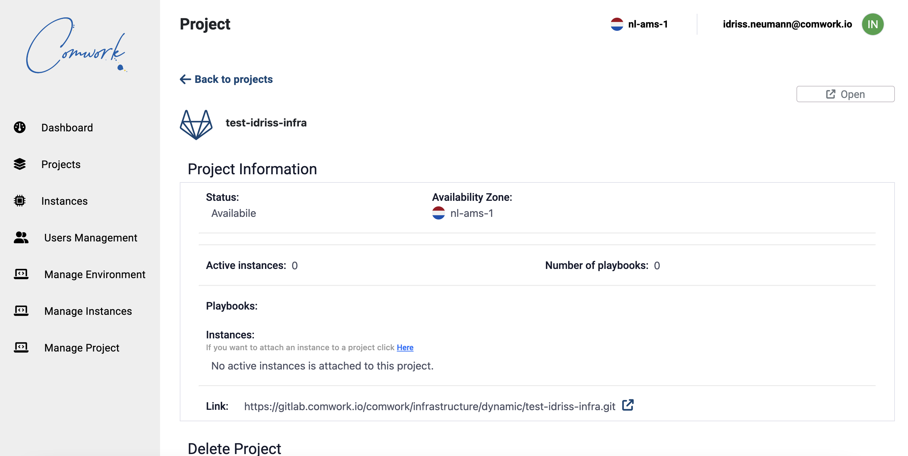

# Instances

## Traductions

Ce tutoriel est également disponible dans les langues suivantes :
* [English 🇬🇧](../../../../../tutorials/console/public/instances.md)

## Comment créer des instances et services

La console est ici: https://cloud.comwork.io

Tout d'abord vous devez vous [inscrire](../../../../../subscription.md) si ce n'est pas le cas,  ensuite vous serez en mesure de créer des projets gitlab:

Ensuite pour créer des instances:

Après la création d'instances, vous pourrez les gérer depuis la console web:

