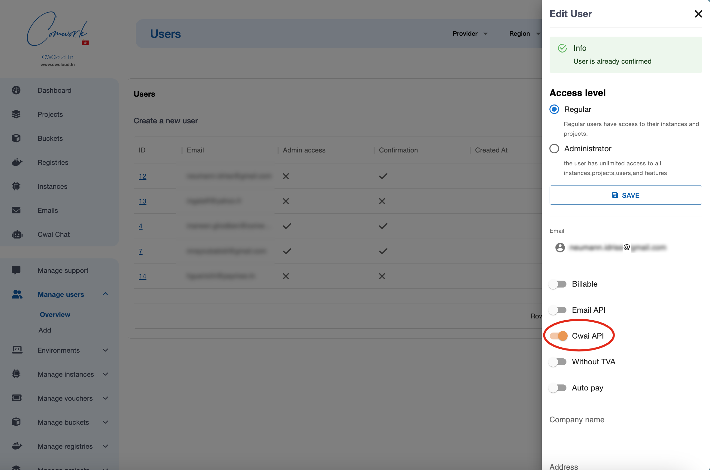
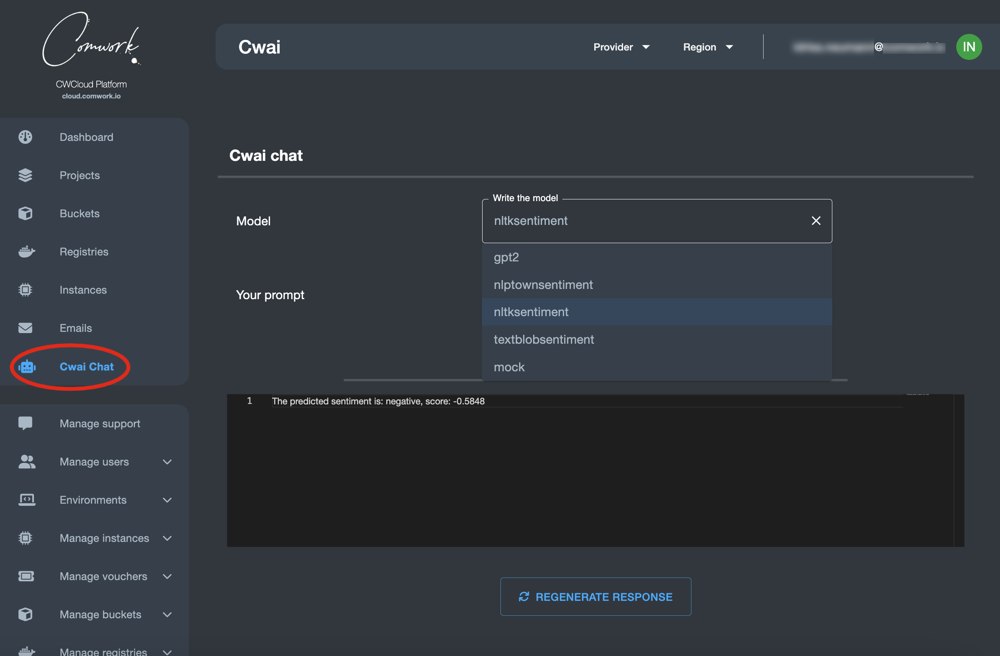
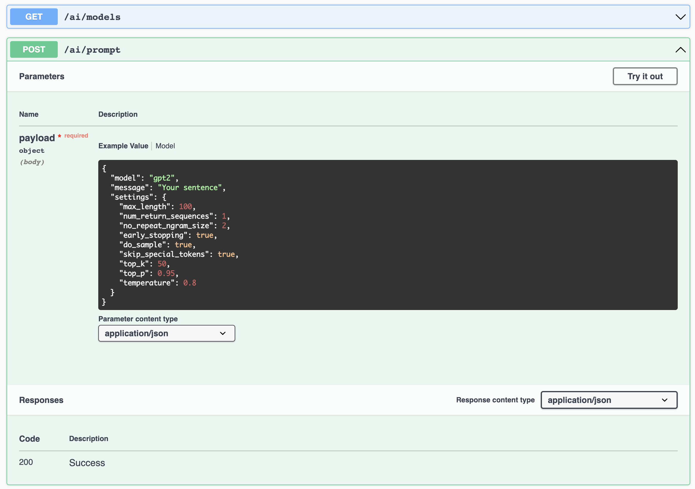

# Comwork AI

## Traductions

Ce tutoriel est également disponible dans les langues suivantes :
* [English 🇬🇧](../../cwai.md)

## Objectif

Cette fonctionalité a pour but d'exposer des modèle d'IA[^1] comme des NLP[^2] ou LLM[^3] afin d'être exposé sous forme d'API basé sur ce [projet open source](https://gitlab.comwork.io/oss/cwai/cwai-api).

[^1]: Intelligence artificielle
[^2]: _Natural language processing_ (traduit en _TAL_ pour _traitement automatique des langues_)
[^3]: _Large language model_ (traduit en _grand modèle liguistique_)

## Activer cette API

Dans la version SaaS, vous pouvez demander d'accéder à cette API en utilisant le [système de support](./console/public/support.md).

Si vous êtes administrateur de cette instance, vous pouvez autoriser les utilisateurs comme ceci :



## Chat

Une fois que vous êtes activé, vous pouvez utiliser l'API au travers de cette interface de chat :



## Utiliser l'API

Bien entendu, l'intérêt principal reste de pouvoir interagir avec ces modèles en utilisant un endpoint http très simple :



Voici comment lister tous les modèles disponibles :

```shell
$ curl -X 'GET' 'https://cloud-api.comwork.io/v1/ai/models' -H 'accept: application/json' -H 'X-Auth-Token: XXXXXX'
```

Résultat :

```json
{
  "models": [
    "gpt2",
    "nlptownsentiment",
    "mock"
  ],
  "status": "ok"
}
```

Vous pouvez ensuite envoyer des _prompts_ sur les modèles disponibles comme ceci :

```shell
curl -X 'POST' \
  'https://cloud-api.comwork.io/v1/ai/prompt' \
  -H 'accept: application/json' \
  -H 'Content-Type: application/json' \
  -H 'X-Auth-Token: XXXXXX' \
  -d '{
  "model": "nlptownsentiment",
  "message": "This is bad !",
  "settings": {}
}'
```

La réponse devrait ressembler à :

```json
{
  "response": [
    "The predicted emotion is: Anger"
  ],
  "score": 1,
  "status": "ok"
}
```

Notes :
* vous devez remplacer la valeur `XXXXXX` avec votre propre token généré via [cette procédure](./api/api_credentials.md).
* vous pouvez remplacer l'URL `https://cloud-api.comwork.io` avec celle que vous utilisez dans la variable d'environnement `CWAI_API_URL`. Pour la version tunisienne par exemple, la valeur serait `https://api.cwcloud.tn`.

## Utiliser la CLI

Vous pouvez utiliser la [CLI `cwc`](./cli/README.md) qui propose une commande `ai` :

```shell
$ cwc ai
This command lets you call the CWAI endpoints

Usage:
  cwc ai
  cwc ai [command]

Available Commands:
  models      Get the available models
  prompt      Send a prompt

Flags:
  -h, --help   help for ai

Use "cwc ai [command] --help" for more information about a command.
```

### Lister les modèles disponibles

```shell
$ cwc ai models
Models
[gpt2 nlptownsentiment nltksentiment textblobsentiment mock]
```

### Envoyer un prompt à un des modèles

```shell
$ cwc ai prompt
Error: required flag(s) "message", "model" not set
Usage:
  cwc ai prompt [flags]

Flags:
  -h, --help             help for prompt
  -m, --message string   The message input
  -t, --model string     The chosen model
$ cwc ai prompt --model nltksentiment --message "This is bad"
Status	Response	Score
ok	[The predicted sentiment is: negative, score: -0.5423]	-0.5423
```

## Interface de driver

Si vous forkez le projet de l'API cwai, vous pourrez implémenter vos propres drivers pour vos propres modèles et générer vos réponses en implémentant [cette abstract](https://gitlab.comwork.io/oss/cwai/cwai-api/-/blob/main/src/drivers/model_driver.py) :

```python
class ModelDriver(ABC):
    @abstractmethod
    def load_model(self):
        pass

    @abstractmethod
    def generate_response(self, prompt: Prompt):
        pass
```

Ensuite ajoute vos modèles en utilisant la variable d'environnement `ENABLED_MODELS`.

Dans le future, nous envisageons de proposer une interface graphique pour facilement déployer vos propres drivers comme des fonctions serverless. En attendant vous pouvez demander l'ajout de drivers via le [système de support](./console/public/support.md).
