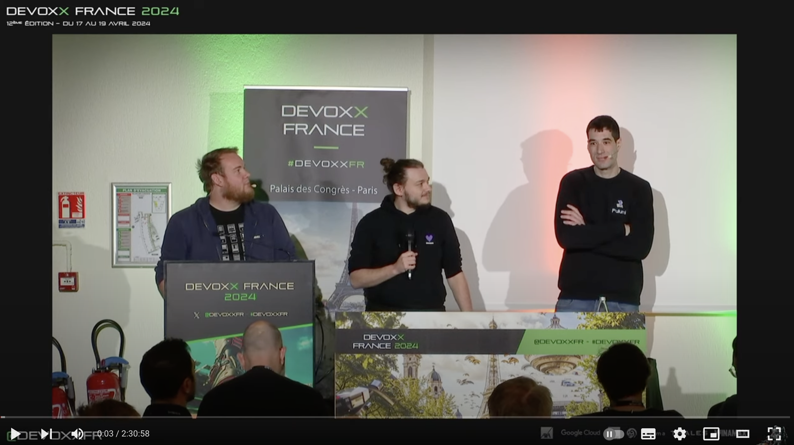
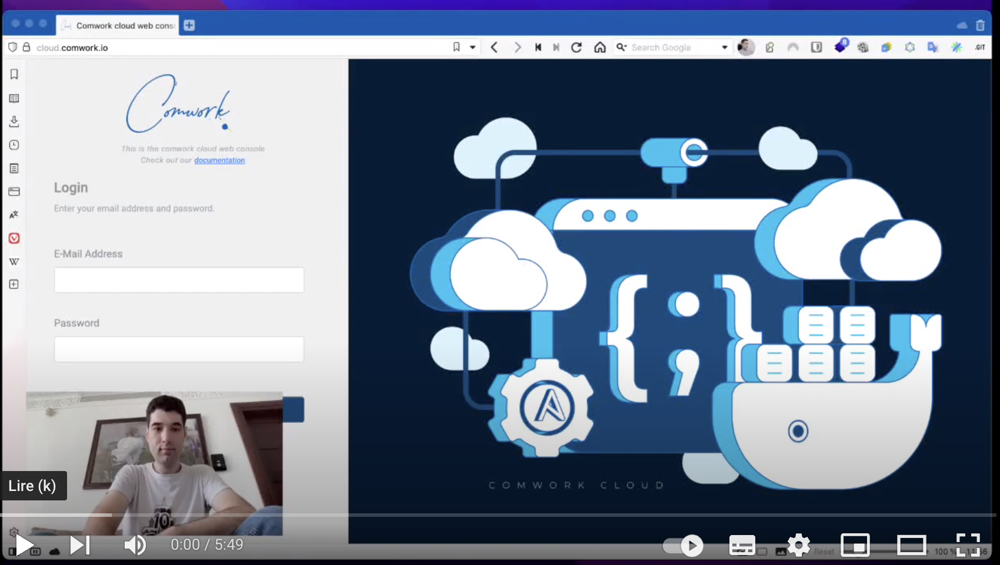

# Deployment as a Service

## Traductions

Ce tutoriel est également disponible dans les langues suivantes :
* [English 🇬🇧](../../../tutorials/daas.md)

## Définition

_DaaS_ for _Deployment as a service_ est un compromis entre l'_IaaS[^1]_ et le _PaaS[^2]_. Vous avez à la fois la possibilité :
* de provisionner des services managés prêts à l'emploi depuis une console web moderne (_PaaS_)
* de mettre à jour vos templates et scripts de déploiements[^3] de façon "gitops" (_IaaS_)
* d'orchestrer ces déploiements à partir d'une API ou CLI incluant d'autres composants communs du cloud tels que les registries OCI, les objects storages... (_IaaS_)

Si on devais résumer ce qui différencie un peu l'IaaS, du PaaS et du serverless et enfin le DaaS, voici ce que l'on dirait :
* L'_IaaS_ vous êtes propriétaire de votre infrastructure, on vous fournis l'eau, le gaz et l'électricité (ram, cpu, stockage, etc), vous n'êtes facturés que sur votre consommation de cette infrastructure et responsable de construire par dessus votre système
* Le _PaaS_ ou le serverless (_CaaS[^4]_, _FaaS[^5]_ et _DBaaS[^6]_): on vous fournis des services managés, vous n'êtes pas responsables de comment ils fonctionnent et êtes utilisateurs facturés sur votre utilisation de ces services
* Le _DaaS_ est comme l'_IaaS_, à savoir vous êtes facturés sur votre consommation d'infrastructure et en êtes le propriétaire et responsable mais vous avez une rapidité et automatisation déjà implémentée du déploiement proche de celle du _PaaS_

[^1]: _Infrastructure as a service_
[^2]: _Platform as a service_
[^3]: roles et playbooks ansible pour les VM, helm charts pour Kubernetes
[^4]: _Containers as a service_
[^5]: _Functions as a service_
[^6]: _Databases as a service_

## Comment ça fonctionne

Voici un schéma expliquant comment le DaaS fonctionne avec des machines virtuelles :

Et un autre expliquant comment ça fonctionne avec Kubernetes :

Vous pouvez aussi consulter cette université que nous avons donné à [DevoxxFR](https://www.devoxx.fr) qui explique comment le DaaS fonctionne avec cwcloud en détail :

## Exemples

Vous trouverez de nombreux exemples qui illustrent cette définition dans cette playliste de démos :

