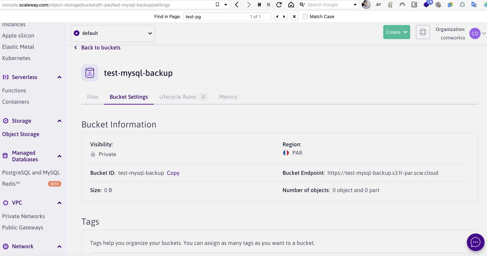
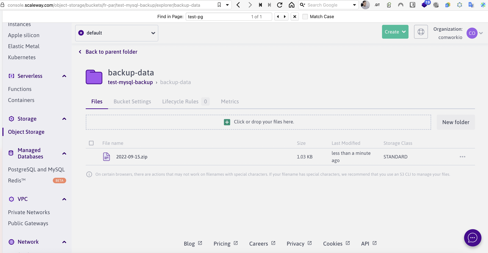

# Sauvegardes sur object storage

## Traductions

Ce tutoriel est également disponible dans les langues suivantes :
* [English 🇬🇧](../../../../tutorials/dbaas/backups.md)

## Procédure

Ce tutoriel vous montrera comment sauvegarder vos bases de données sur de l'object storage en ré-utilisant le role ansible [`backup-bucket`](https://gitlab.comwork.io/oss/bucket-backup) qu'on l'ont fournit en opensource pour cet usage.

1. Créer un bucket sur votre cloud provider favoris

Par exemple sur scaleway :



Vous pouvez demander à l'équipe de CwCloud l'accès à des buckets en suivant [cette procédure](../../../../storage.md)

2. Importez ce [role ansible](https://gitlab.comwork.io/oss/bucket-backup/-/tree/main/ansible-bucket-backup) dans le dossier `roles/` de votre projet gitlab IaC[^1] (nommez-le `bucket-backup` au lieu de `ansible-bucket-backup`)

3. Vous pouvez changer la fréquence de sauvegarde directement dans le fichier [`ansible-bucket-backup/tasks/main.yml`](https://gitlab.comwork.io/oss/bucket-backup/-/blob/main/ansible-bucket-backup/tasks/main.yml) :


```yaml
- name: Creates backup cron
  ansible.builtin.cron:
    name: backup cron
    minute: "0"
    hour: "3"
    user: root
    job: "bash {{ node_home }}/bucket-save.sh"
    cron_file: ansible_bucket_backup
```

Par défaut ce sera tous les jours à 3h00 du matin.

4. Si vous êtes sur MySQL/MariaDB, voici la configuration pour une base de données :

```yaml
backup_date_format: "+%Y%m%d"
bucket_endpoint: "https://s3.fr-par.scw.cloud" # changez pour votre provider
bucket_access_key: changeit
bucket_secret_key: changeit
bucket_name: test-mysql-backup # changez le nom du bucket
backup_folder: /home/backups
backup_inside_container: /db-data
backup_cmd: "mysqldump -h {your_instance_hash}.mariadb.comwork.(cloud|dev|info) -u your_user -p'your_password' --databases your_db > /home/backups/backup.sql"
zip_compress_backup_enable: true
backup_zip_file_folder: /home/backups/tmp
backup_src_file_to_clean: '*.sql'
backup_max_retention: 3 # nombre de jour de rétention que vous pouvez ajuster
```

Si vous êtes sur PostgreSQL :

```yaml
backup_date_format: "+%Y%m%d"
bucket_endpoint: "https://s3.fr-par.scw.cloud" # changez pour votre provider
bucket_access_key: changeit
bucket_secret_key: changeit
bucket_name: test-pgsql-backup # changez le nom du bucket
backup_folder: /home/backups
backup_inside_container: /db-data
backup_cmd: "pg_dumpall -U backup > /home/backups/backup.sql"
zip_compress_backup_enable: true
backup_zip_file_folder: /home/backups/tmp
backup_src_file_to_clean: '*.sql'
backup_max_retention: 3 # nombre de jour de rétention que vous pouvez ajuster

postgresql_roles:
  - username: backup
    password: changeit
```

1. Ajoutez le role dans le fichier `playbook-{instance_name}.yml` :

```yaml
- hosts: localhost
  roles:
   - common
   - fail2ban
   - sudo
   - ssh
   - cloud-instance-ssh-keys
   - firewall
   - kinsing
   - docker
   - imalive
   - mariadb # cet exemple est pour MySQL/MariaDB, mettez le rôle de la sauvegarde après l'installation du serveur de bdd
   - bucket-backup # ici !
   - gw-letsencrypt
   - nginx
   - gitlab-runner
```

1. Ajoutez les rôle dans le fichier `.gitlab-ci.yml` :

```yaml
mysql:
  stage: deploy
  script:
    - chmod +x ./install.sh
    - ./install.sh -e mysql
  only:
    refs:
      - /^(main.*)$/
    changes:
      - env/mysql.yml
      - roles/common/**/*
      - roles/ssh/**/*
      - roles/cloud-instance-ssh-keys/**/*
      - roles/fail2ban/**/*
      - roles/sudo/**/*
      - roles/firewall/**/*
      - roles/kinsing/**/*
      - roles/docker/**/*
      - roles/imalive/**/*
      - roles/mariadb/**/* # cet exemple est pour MySQL/MariaDB, mettez le rôle de la sauvegarde après l'installation du serveur de bdd
      - roles/bucket-backup/**/* # ici !
      - roles/gw-letsencrypt/**/*
      - roles/gw-nginx/**/*
      - roles/gitlab-runner/**/*
      - install.sh
      - playbook-mysql.yml
  tags:
    - mysql-hmcffu
```

Pushez et puis c'est finit.

Vous pouvez aussi exécuter la sauvegarde comme ceci (en vous connectant avec [ssh](../ssh.md)):

```shell
$ sudo su -
$ /root/bucket-save.sh
```

Vous verrez le résultat sur votre bucket :



[^1]: infrastructure as code
