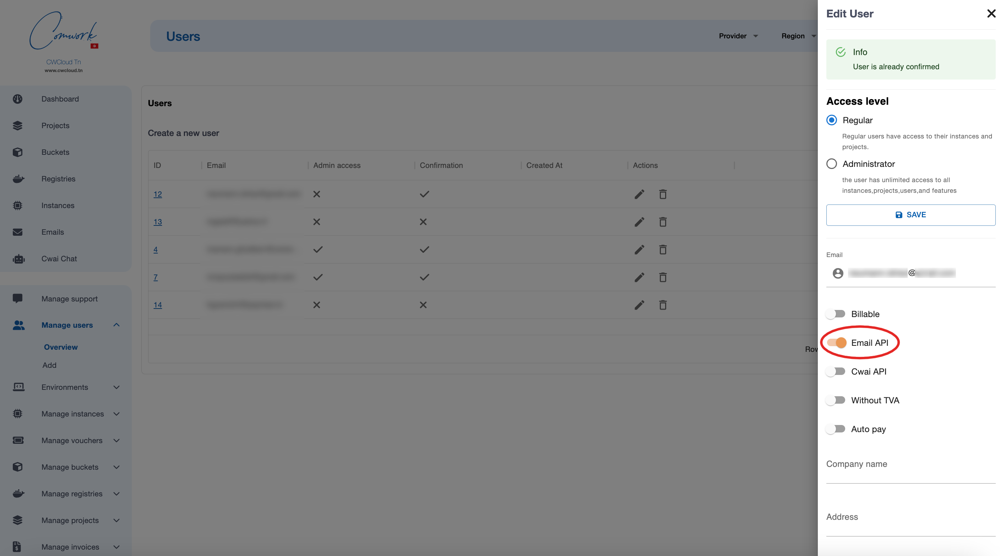
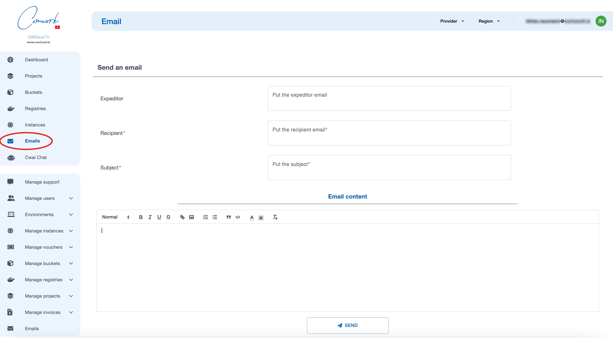
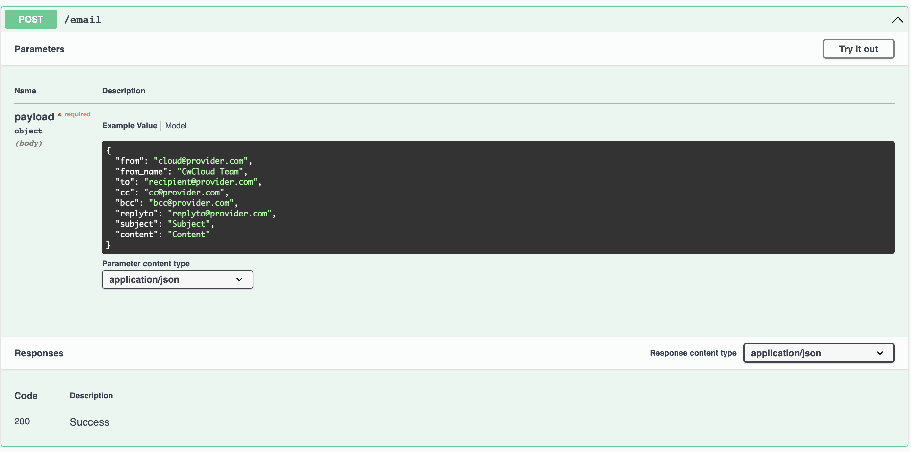
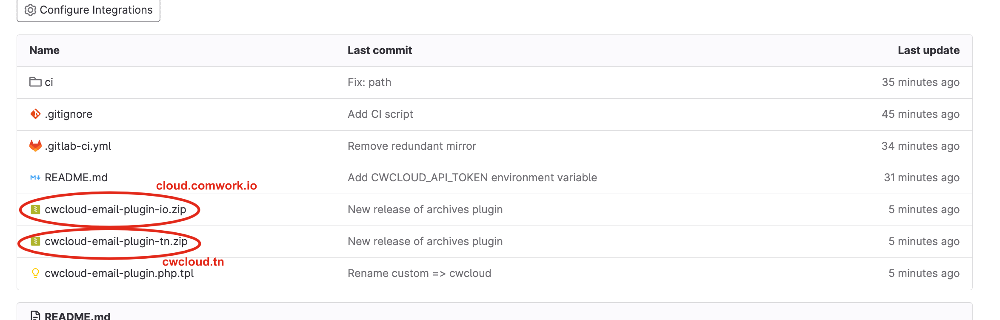
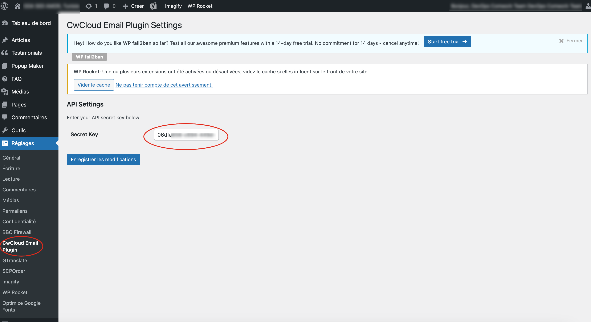
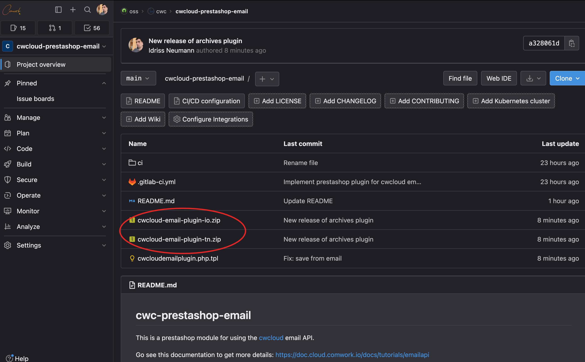
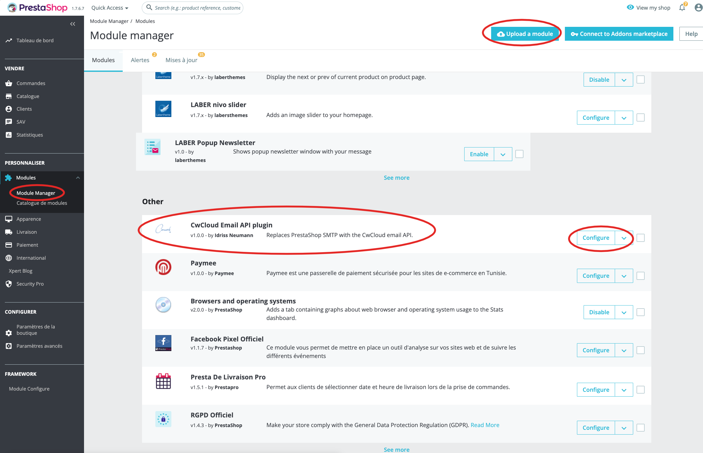
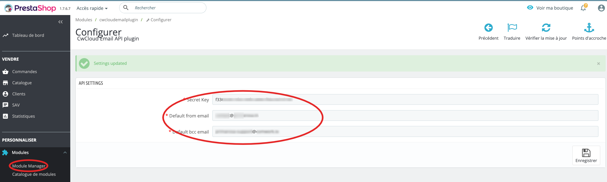

# Email API

## Traductions

Ce tutoriel est également disponible dans les langues suivantes :
* [English 🇬🇧](../../../tutorials/emailapi.md)

## Activer cette API

Dans la version SaaS, vous pouvez demander d'accéder à cette API en utilisant le [système de support](./console/public/support.md).

Si vous êtes administrateur de cette instance, vous pouvez autoriser les utilisateurs comme ceci :



## Formulaire

Une fois que vous êtes activé, vous pouvez utiliser l'API au travers de cette interface :



## Utiliser l'API

Vous pouvez utiliser cet endpoint dans vos applications pour envoyer des emails :



Voici ce que cela donne avec `curl` :

```shell
curl -X 'POST' \
  'https://cloud-api.comwork.io/v1/email' \
  -H 'accept: application/json' \
  -H 'Content-Type: application/json' \
  -H 'X-Auth-Token: XXXXXX' \
  -d '{
    "from": "cloud@provider.com",
    "to": "recipient@provider.com",
    "bcc": "bcc@provider.com",
    "subject": "Subject",
    "content": "Content"
  }'
```

Notes :
* Si vous êtes sur la version Tunisienne, remplacer `cloud-api.comwork.io` par `api.cwcloud.tn`
* Vous devez remplacer la valeur `XXXXXX` avec votre propre token généré via [cette procédure](./api/api_credentials.md)

# Pièces jointes

Il est possible de passer une pièce jointe aux emails avec le bloc optionnel `attachment`:

```shell
curl -X 'POST' \
  'https://cloud-api.comwork.io/v1/email' \
  -H 'accept: application/json' \
  -H 'Content-Type: application/json' \
  -H 'X-Auth-Token: XXXXXX' \
  -d '{
    "from": "cloud@provider.com",
    "to": "recipient@provider.com",
    "bcc": "bcc@provider.com",
    "subject": "Subject",
    "content": "Content",
    "attachment": {
      "mime_type": "application/pdf",
      "file_name": "invoice.pdf",
      "b64": "base64content"
    }
  }'
```

Notes :
* Vous devrez encoder en base64 le contenu du fichier à envoyer en pièce jointe avant de le mettre dans le champs `b64`. Sous Linux ou mac, vous pouvez utiliser la commande `base64 -i invoice.pdf` et récupérer la sortie.

## Plugins pour CMS

### Plugin pour wordpress

#### Installation et configuration

Vous pouvez télécharger ce [plugin](https://gitlab.comwork.io/oss/cwc/cwcloud-wordpress-email):

**1/** Télécharger la bonne extension (soit la `-io` si vous utilisez l'instance [cloud.comwork.io](https://cloud.comwork.io), soit la `-tn` si vous utilisez l'instance [cwcloud.tn](https://www.cwcloud.tn))



**2/** Configurer l'extension :

Générer des clefs d'API. Vous pouvez aller voir [ce tutoriel](./api/api_credentials.md)

Ensuite copier/coller la clef secrète ici :



#### Debogage

Se connecter au conteneur wordpress, installer `vim` et ouvrir le fichier `cwcloud-email-plugin.php`

```shell
$ docker exec -it wp_app /bin/bash
root@4d9443458fed$ apt update -y
root@4d9443458fed$ apt install -y vim
root@4d9443458fed$ vim wp-content/plugins/cwcloud-email-plugin-tn/cwcloud-email-plugin.php
```

Ajouter la ligne suivante :

```php
// ...

function cwcloud_email_send($phpmailer) {
    $api_endpoint = 'https://api.cwcloud.tn/v1/email';

    $from_addr = $phpmailer->From;
    $to_addr = $phpmailer->AddAddress ? $phpmailer->AddAddress : $from_addr;
    $bcc_addr = $phpmailer->AddBCC ? $phpmailer->AddBCC : null;

    # Cette ligne
    error_log(sprintf("from = %s, to = %s, bcc = %s", $from_addr, $to_addr, $bcc_addr))

    // ...
}

// ...
```

Puis sortir et monitorer les logs du conteneur en re-jouant le scénario d'envoi de mail qui ne fonctionne pas. Cela vous indiquera s'il manque des infos obligatoire voire même si le `phpmailer` de wordpress a été invoqué.

```shell
docker logs -f wp_app
```

### Prestashop

Vous pouvez utiliser ce [plugin](https://gitlab.comwork.io/oss/cwc/cwcloud-prestashop-email):

**1/** Télécharger la bonne extension (soit la `-io` si vous utilisez l'instance [cloud.comwork.io](https://cloud.comwork.io), soit la `-tn` si vous utilisez l'instance [cwcloud.tn](https://www.cwcloud.tn))



Ensuite l'uploader, vous pourrez alors la voir et la configurer ici :



**2/** Configurer l'extension :

Générer des clefs d'API. Vous pouvez aller voir [ce tutoriel](./api/api_credentials.md)

Ensuite copier/coller la clef secrète ici :



Vous aurez aussi à choisir une adresse email d'envoi et de copie cachée depuis cette interface de configuration.
