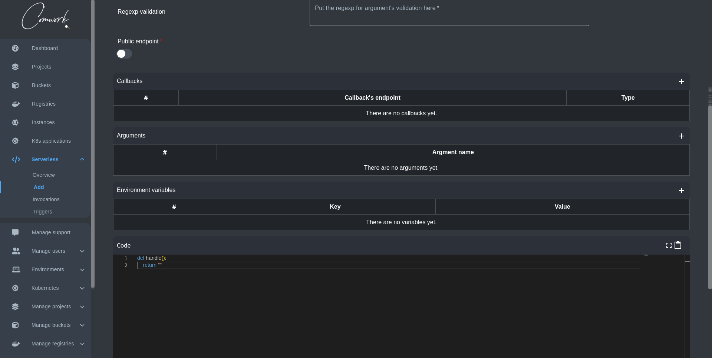
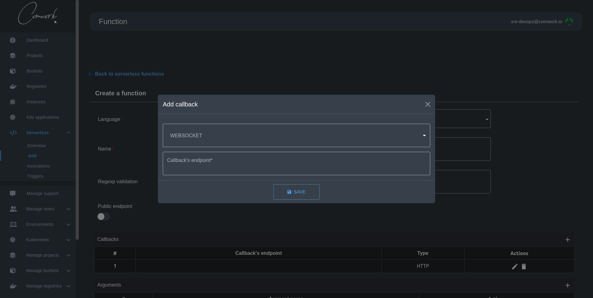
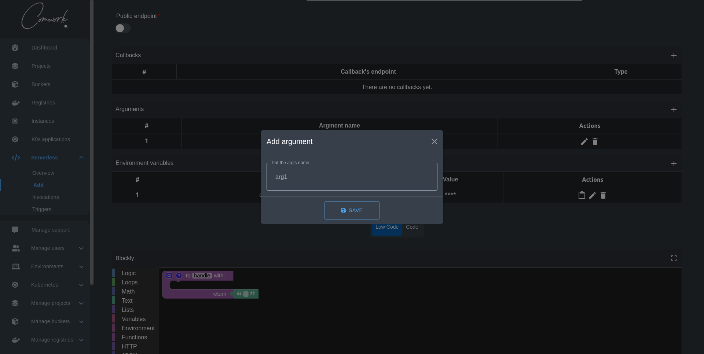
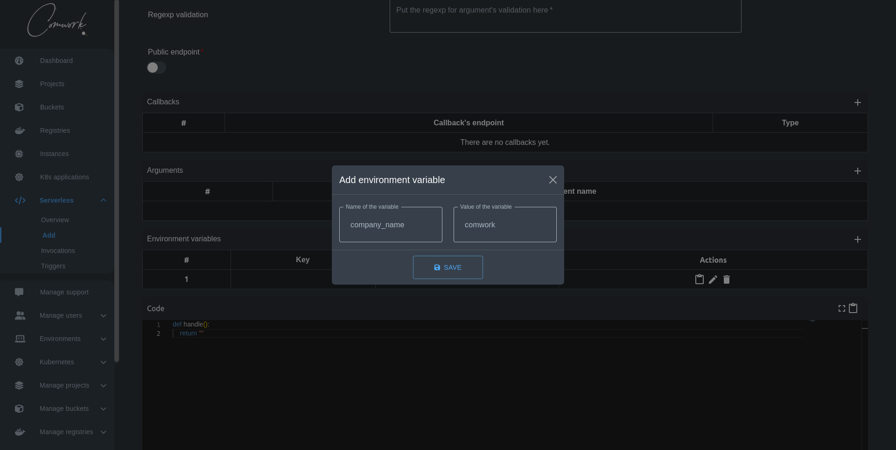
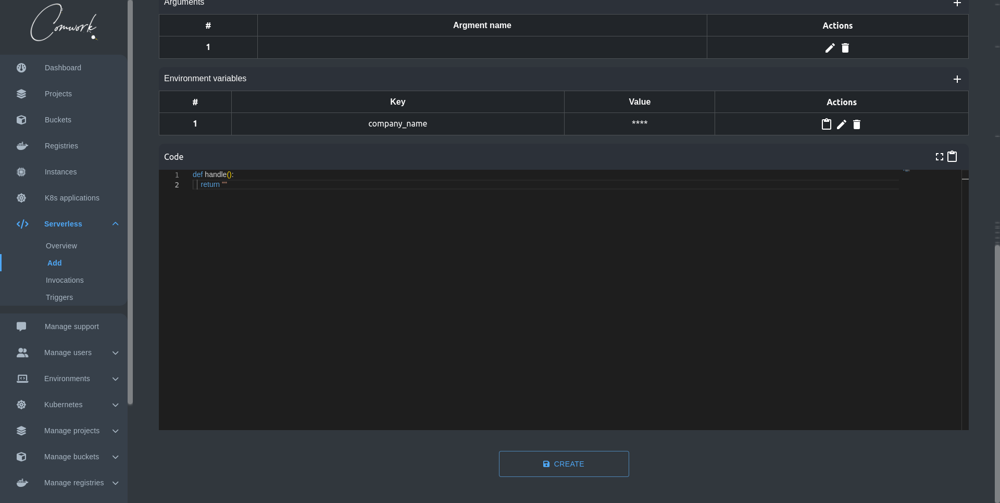

# Comment créer une fonction serverless

Une fonction serverless, est un morceau de code qui est exécuté en réponse à un événement, comme une action de l'utilisateur ou une mise à jour de la base de données. Elle est __"serverless"__ parce que l'infrastructure sur laquelle elle s'exécute est gérée par un fournisseur de cloud, abstrayant le développeur de la nécessité de gérer le serveur.

## Démo

Voici notre dernière démo montrant comment créer une fonction serverless imbriquée avec des variables d'environnement (nous en parlerons dans les sections suivantes):

[](https://www.youtube.com/watch?v=J6t95NXQGnM)

## Étape 1 : Choisissez votre langage de programmation et nommez votre fonction


Tout d'abord, vous devez choisir le langage de programmation avec lequel vous êtes le plus à l'aise pour écrire votre fonction serverless. Actuellement, les langages pris en charge sont :

- Python
- Go
- JavaScript
- bash
- [blockly](#Blockly)

Deuxièmement, vous devez entrer le nom de votre fonction, et c'est tout ! Vous pouvez passer directement à l'écriture de votre fonction maintenant.

### Blockly

Vous pouvez accéder à notre fonctionnalité Blockly en choisissant blockly dans la liste déroulante des langages de programmation.

Blockly est un éditeur de programmation visuel développé par Google, qui utilise des blocs à glisser-déposer pour représenter les concepts de code. Il est à l'origine de nombreux programmes d'enseignement du codage et de projets IoT.

### Démonstration

Voici notre dernière démo montrant comment vous pouvez créer une fonction serverless low-code à l'aide de l'éditeur Blockly.

[ ](https://youtu.be/ikBNQmlXJY8)

## Étape 2 : Configurer les paramètres de votre fonction (Optionnel)



Avant de commencer à écrire votre fonction, vous pouvez avoir besoin d'ajouter quelques configurations qui peuvent vous aider dans la création de votre fonction.

### Validation de l'expression rationnelle

Cette entrée est pour la regexp pour la validation de l'argument.

### Endpoint public

Par défaut, la fonction est privée mais vous pouvez la rendre publique afin que d'autres utilisateurs puissent l'utiliser également.

### Callbacks

Vous pouvez ajouter un callback pour envoyer la charge utile contenant les données relatives à la fonction et son résultat au point de terminaison du callback.

Les types de rappels actuellement disponibles sont les suivants

- HTTP
- Websocket
- MQTT

### HTTP


### WebSocket



### MQTT


[Comment créer un callback MQTT avec Hive MQ](./how_to_create_mqtt_hive_mq.md)
[Comment créer un callback MQTT avec Scaleway IoT Hub](./how_to_create_mqtt_scaleway.md)

### Arguments



Vous pouvez ajouter un argument en cliquant sur l'icône + où une fenêtre modale s'affichera pour vous permettre d'ajouter votre nom d'argument.

Les arguments seront ajoutés automatiquement à la fonction handle sur votre éditeur.

### Variables d'environnement



Vous pouvez ajouter une variable d'environnement en cliquant sur l'icône + où une fenêtre modale s'affichera pour ajouter la clé et la valeur de votre variable d'environnement. Vous pouvez ensuite les utiliser dans votre code en les écrivant sous la forme suivante :

```shell
"{{ env['key'] }}"
```

Bien sûr, vous pouvez les éditer, les supprimer et les copier sous la forme `key=value`

## Etape 3 : Ecrire votre fonction !



Nous vous fournissons un éditeur moderne qui met en évidence votre code en fonction du langage de programmation que vous avez choisi plus tôt. Vous pouvez également copier le code écrit ou passer en mode plein écran pour une meilleure concentration.

Une fois que vous avez fini d'écrire votre fonction, cliquez sur create et vous avez terminé :) .
