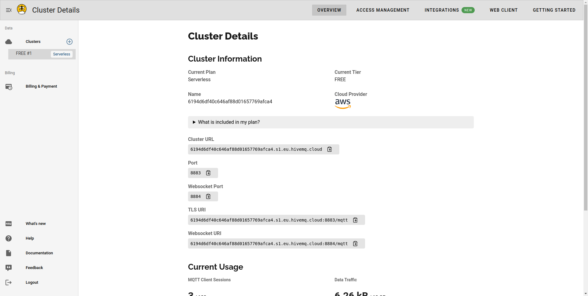
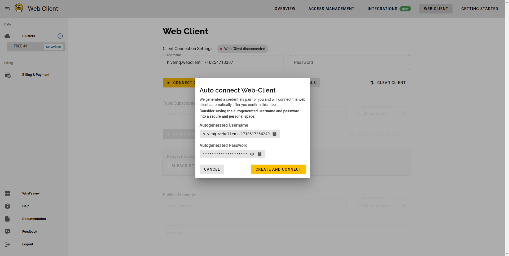
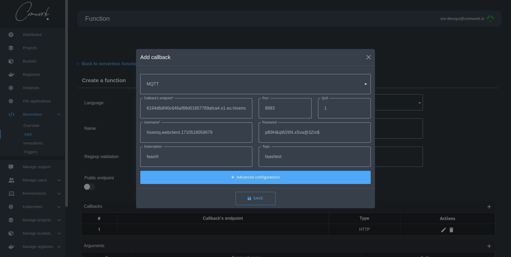

# Comment créer un callback MQTT pour se connecter au cluster Hive MQ

Lors de la création de votre fonction serverless, vous pourriez vouloir créer un callback de type MQTT pour envoyer vos données payload en temps réel.

Dans ce tutoriel, nous allons créer une fonction serverless simple où nous allons envoyer le résultat de son invocation à un cluster Hive MQ.

## Étape 1 : Créer un cluster Hive MQ

Hive MQ fournit un cluster gratuit à utiliser pour les POC et les tutoriels. Après sa création, il devrait ressembler à l'image suivante :

A partir de cette page, vous devez prendre l'URL du cluster pour l'utiliser comme point de terminaison dans l'étape suivante.

Allez dans la section Web client et cliquez sur le bouton `Connect with generated credentials`. Une fenêtre modale s'affichera pour créer un client.

A partir de cette page, vous devez prendre le nom d'utilisateur et le mot de passe pour les utiliser comme nom d'utilisateur et mot de passe dans la page suivante.

## Etape 2 : Ajouter un callback MQTT et créer votre fonction

Allez dans le menu FaaS et cliquez sur le bouton add pour créer une fonction. Ensuite, allez dans le tableau des callbacks et cliquez sur le bouton d'ajout pour ouvrir la fenêtre modale de callback, puis choisissez le type MQTT.

Comme dans l'image suivante, mettez les données que nous avons prises à l'étape précédente pour remplir les entrées nécessaires et choisissez le port, la QoS et, le sujet d'abonnement, et le sujet :

## Etape 3 : Invoquer votre fonction

Allez dans votre liste de fonctions et cliquez sur le bouton invoke. Il naviguera automatiquement vers la page des invocations montrant le résultat de votre fonction.
