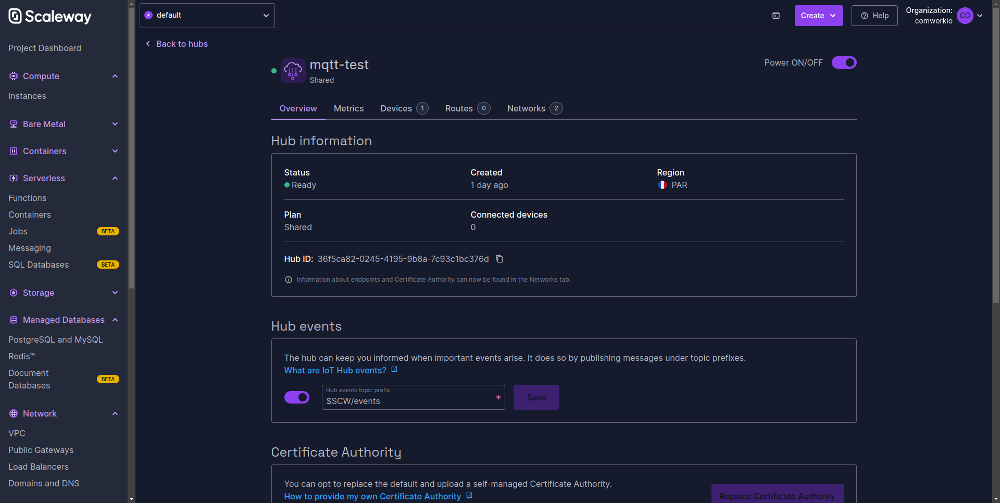
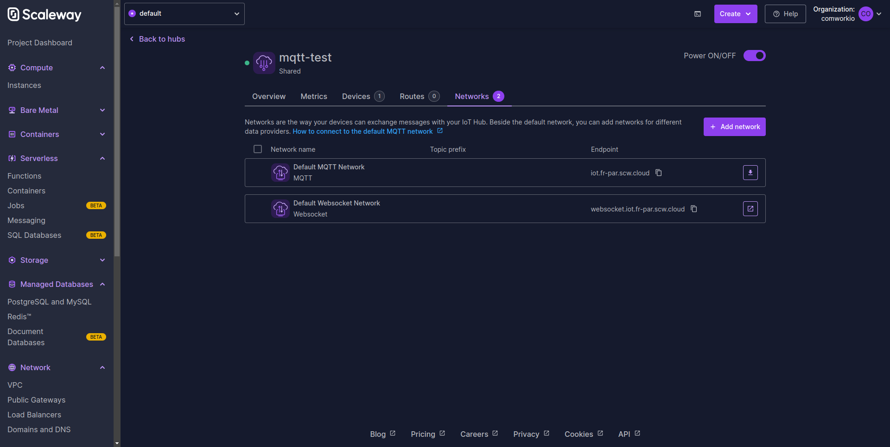
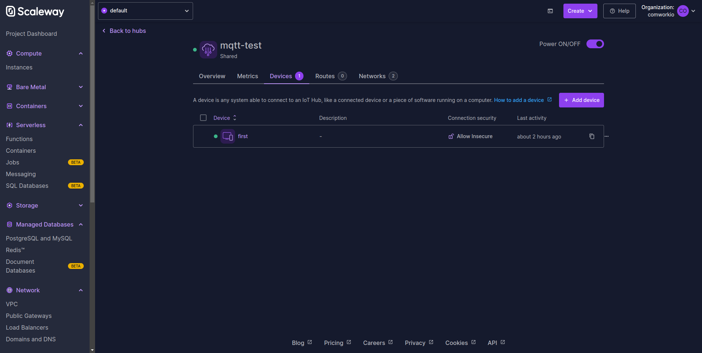
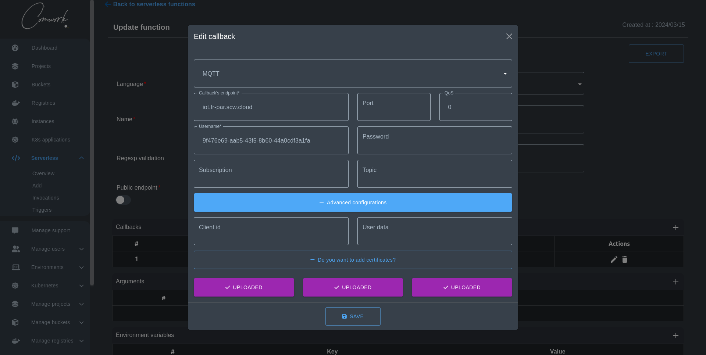

# Comment créer un callback MQTT pour se connecter à l'appareil Scaleway IoT Hub

Lors de la création de votre fonction serverless, vous pourriez vouloir créer un callback de type MQTT pour envoyer vos données payload en temps réel.

Dans ce tutoriel, nous allons créer une fonction serverless simple où nous allons envoyer le résultat de son invocation à un appareil Scaleway IoT Hub.

## Étape 1 : Créer un IoT Hub et un appareil

Hive MQ fournit un IoT Hub à plan partagé à utiliser pour les POC et les tutoriels. Après sa création, il devrait ressembler à l'image suivante :

Allez dans la section Neworks et prenez le `endpoint` et téléchargez son certificat pour les utiliser dans l'étape suivante.

Allez dans la section Devices, créez un device et prenez le `device ID` et téléchargez les deux `Device certificate` et `Device private key certificate` pour les utiliser dans l'étape suivante. 

## Étape 2 : Ajouter un callback MQTT et créer votre fonction

Allez dans le menu FaaS et cliquez sur le bouton add pour créer une fonction. Ensuite, allez dans le tableau des callbacks et cliquez sur le bouton d'ajout pour ouvrir la fenêtre modale de callback, puis choisissez le type MQTT.

Comme dans l'image suivante, mettez les données que nous avons prises à l'étape précédente pour remplir les entrées nécessaires et choisissez le port, la QoS et, le sujet d'abonnement, et le sujet. Cliquez sur le bouton "advanced options" puis sur le bouton "certificates" pour faire apparaître les certificats à télécharger :

## Étape 3 : Invoquer votre fonction

Allez dans votre liste de fonctions et cliquez sur le bouton invoke. Il naviguera automatiquement vers la page des invocations montrant le résultat de votre fonction.
