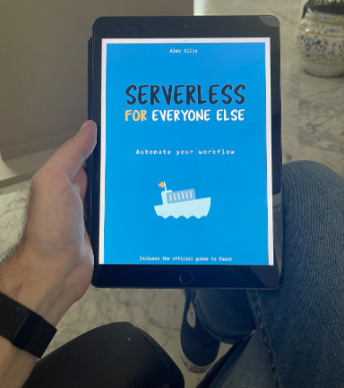
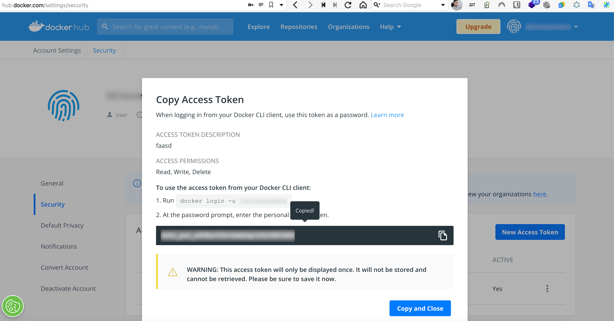

# OpenFaaS / Faasd

## Traductions

Ce tutoriel est également disponible dans les langues suivantes :
* [English 🇬🇧](../../../tutorials/faasd.md)

## A propos

Dans ce tutoriel, nous allons vous fournir des indications sur comment :
* déployer un serveur faasd avec CwCloud
* comment déployer une fonction simple dans ce context

Nous ne souhaitons pas remplacer le travail exceptionnel effectué par l'équipe d'OpenFaaS. Si vous souhaitez utiliser faasd dans un contexte de production, nous vous recommandons fortement de consulter :

* Le [livre "Serverless for everyone else"](https://openfaas.gumroad.com/l/serverless-for-everyone-else) d'Alex Ellis (fondateur d'OpenFaaS et faasd) qui explique tout ce qu'il faut savoir pour utiliser la ligne de commande d'OpenFaaS (`faas-cli`) et configurer un serveur faasd par vous même. Il n'est pas couteux du tout et il vaut vraiment le coup, faites-nous confiance !
* La [documentation de la ligne de commande d'OpenFaaS](https://docs.openfaas.com) qui est également très complète.



_Vous verrez s'est très rapide et très plaisant à lire sur n'importe quel support_

## Tutoriel vidéo

[](https://youtu.be/ttwhWnbmfa8)

Vous pouvez activer les sous-titres en Anglais ou Français.

## La ligne de commande d'OpenFaaS (faas-cli)

Imaginons que vous ayez déployé une instance de serveur faasd qui a pour url publique : `https://pmy-faasd-628ufo.faasd.comwork.info`

### Installation et connexion au serveur

Installer la ligne de commande faas-cli si ce n'est pas déjà fait :

```shell
curl -sSL https://cli.openfaas.com | sudo sh
```

### Authentification du serveur faasd

```shell
export OPENFAAS_URL=https://my-faasd-628ufo.faasd.comwork.info # remplacer l'url publique par la votre
faas-cli login --username cloud --password YOUR_PASSWORD
```

Vous pourrez ensuite trouver le mot de passe dans le fichier d'environnement ansible (`env/{ instance_hash }.yml`) :

```yaml
faasd_user: cloud
faasd_password: YOUR_PASSWORD
```

### Authentificiation au registre de conteneur docker hub

Dans le but de déployer vos fonctions (qui sont construite sous forme de conteneurs), vous aurez besoin d'un registre de conteneur OCI tel que [docker hub](https://hub.docker.com).

Vous pouvez créer gratuitement un compte et un access token :




Ensuite :

```shell
faas-cli registry-login --username YOUR_DOCKERHUB_USERNAME --password YOUR_DOCKERHUB_ACCESS_TOKEN
```

Remarque : vous pouvez aussi utiliser les registry de Scaleway ou OVH avec [CwCloud](../../../storage.md)

### Déployer une fonction avec faas-cli

Voici un exemple de fonction créer à partir d'un template Python3 :

```shell
$ faas-cli new hello --lang python3
$ ls -l hello*
-rw------- 1 ineumann staff 157 Sep  3 10:05 hello.yml

hello:
total 4
-rw-r--r-- 1 ineumann staff   0 Sep  3 10:05 __init__.py
-rw-r--r-- 1 ineumann staff 123 Sep  3 10:05 handler.py
-rw-r--r-- 1 ineumann staff   0 Sep  3 10:05 requirements.txt
```

Changer le fichier `hello/handler.py` :

```python
def handle(req):
    """handle a request to the function
    Args:
        req (str): request body
    """

    return "Hello {}!".format(req)
```

Changer le fichier `hello.yml` pour ajouter le chemin complet de l'image et l'url du serveur faasd dans les champs `image` et `gateway` :

```yaml
version: 1.0
provider:
  name: openfaas
  gateway: https://my-faasd-628ufo.faasd.comwork.info
functions:
  hello:
    lang: python3
    handler: ./hello
    image: comworkio/faasd-hello:latest
```

Ensuite builder et déployer :

```shell
$ faas-cli up -f ./hello.yml
```

Si vous n'êtes pas sur une machine x86/amd64 (par exemple un mac ayant un processeur Apple Silicon[^1]), vous pouvez utiliser ces commandes à la place :

```shell
$ faas-cli publish -f ./hello.yml --platforms linux/amd64
$ faas-cli deploy -f ./hello.yml
```

Vous pourrez ensuite invoquer votre fonction :

```shell
$ curl -X POST "https://my-faasd-628ufo.faasd.comwork.info/function/hello" -d "Idriss"
Hello Idriss!
```

Et observer le résultat de l'invocation depuis l'interface web :


[^1]: processeurs M1, M2, etc
