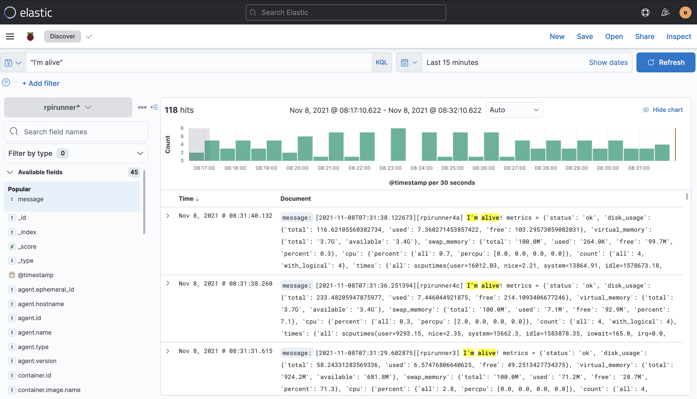

# Imalive API / metrics exporter

Laissez vos instances chanter comme Céline Dion `I'm alive!` ("Je suis vivante").


Il s'agit d'une simple API de healthcheck pour vos instances (supporte les machines x86 et armhf comme les raspberrypi).

Ce projet fournit un endpoint HTTP/Restful que vous pourrez utiliser comme règle ou "ligne de vie" dans votre loadbalancer et publie également un "heartbit[^1]" sur la sortie standard `stdout` (utile si vous collectez les logs dans un système de log management tel que Elasticstack).



## Traductions

Ce tutoriel est également disponible dans les langues suivantes :
* [English 🇬🇧](../../../tutorials/imalive.md)

## Dépôt git

* Dépôt principal: https://gitlab.comwork.io/oss/imalive
* Mirroir Github: https://github.com/idrissneumann/imalive.git
* Mirroir Gitlab: https://gitlab.com/ineumann/imalive.git

## Image sur dockerhub

Les images docker sont versionnées et disponibles ici : https://hub.docker.com/r/comworkio/imalive-api

Un exemple d'instance : https://imalive.comwork.io

## Comment déployer Imalive

### Installation avec ansible

Certains environnements comme le [vps[^2]](../../../vps.md) installent déjà imalive en utilisant ce rôle. Toutefois, même quand c'est pas le cas, vous pouvez ajouter ce [rôle ansible](https://gitlab.comwork.io/oss/imalive/-/tree/main/ansible-imalive) dans votre repo de déploiement et l'invocation du rôle dans votre playbook.

### Installation avec docker-compose

Récupérer ce [fichier docker-compose](https://gitlab.comwork.io/oss/imalive/-/blob/main/docker-compose.yml).

Ensuite, créer votre fichier `.env` à partir du fichier `.env.example` :

```shell
cp .env.example .env
```

Ensuite remplacez les valeurs dans ce fichier (comme par exemple la variable `IMALIVE_NODE_NAME` avec le nom de votre instance pour différencier la provenance des logs). Ensuite :

```shell
$ docker-compose up
```

Si vous souhaitez le déployer sur un appareil ARM tel qu'un raspberrypi, lancez cette commande à la place :

```shell
$ docker-compose -f docker-compose-arm.yml up
```

### Installation sur K3D (Kubernetes/Helm)

Vous pouvez utiliser notre [helm chart](https://gitlab.comwork.io/oss/imalive/-/tree/main/helm)

#### Tester avec K3D (initialisation du cluster)

```shell
k3d cluster create localdev --api-port 6550 -p "8089:80@loadbalancer"
sudo k3d kubeconfig get localdev > ~/.kube/config 
```

Continuez avec le chapitre suivant

#### Installation du helmchart

```shell
cd helm # toutes les commandes ci-dessous doivent être lancée depuis le répertoire imalive/helm
kubectl create ns imalive
helm dependency update
helm -n imalive install . -f values.yaml --generate-name
```

#### Vérifier le déploiement et les ingress

```shell
kubectl -n imalive get deployments
kubectl -n imalive get pods
kubectl -n imalive get svc
kubectl -n imalive get ingress
curl localhost:8089 -v
```

## Endpoints

### Healthcheck

```shell
$ curl localhost:8080/v1/health
{"status": "ok", "time": "2021-11-05T06:55:28.274736", "alive": true, "name": "anode"}
```

### Manifests

```shell
$ curl localhost:8080/v1/manifest 
{"version": "1.0", "sha": "1c7cb1f", "arch": "x86"}
```

### Metrics

```shell
$ curl localhost:8080/v1/metrics
{"status": "ok", "disk_usage": {"total": 102.11687469482422, "used": 22.499202728271484, "free": 74.402099609375}, "virtual_memory": {"total": "1.9G", "available": "984.7M"}, "swap_memory": {"total": "1024.0M", "used": "493.1M", "free": "530.9M", "percent": 48.2}, "cpu": {"percent": {"all": 2.8, "percpu": [5.0, 4.0, 3.0, 2.0]}, "count": {"all": 4, "with_logical": 4}, "times": {"all": [10665.39, 7.0, 4718.91, 400345.0, 156.08, 0.0, 226.8, 0.0, 0.0, 0.0], "percpu": [[2488.92, 1.24, 1196.15, 100191.67, 38.08, 0.0, 82.3, 0.0, 0.0, 0.0], [2757.78, 1.63, 1196.16, 99992.0, 37.88, 0.0, 55.78, 0.0, 0.0, 0.0], [2704.56, 2.05, 1162.12, 100082.77, 40.01, 0.0, 47.75, 0.0, 0.0, 0.0], [2714.11, 2.06, 1164.46, 100078.54, 40.1, 0.0, 40.96, 0.0, 0.0, 0.0]]}}}
```

## Heartbit

Vous pouvez changer la fréquence entre deux heartbits avec la variable d'environnement `WAIT_TIME` (en secondes).

Voici un exemple de sortie standard du heartbit :

```shell
[2021-11-06T14:45:33.902885][anode] I'm alive! metrics = {'status': 'ok', 'disk_usage': {'total': 102.11687469482422, 'used': 22.521244049072266, 'free': 74.38005828857422}, 'virtual_memory': {'total': '1.9G', 'available': '959.0M'}, 'swap_memory': {'total': '1024.0M', 'used': '493.1M', 'free': '530.9M', 'percent': 48.2}, 'cpu': {'percent': {'all': 3.5, 'percpu': [8.0, 5.0, 6.1, 11.0]}, 'count': {'all': 4, 'with_logical': 4}, 'times': {'all': scputimes(user=10679.53, nice=7.01, system=4727.11, idle=401080.72, iowait=156.27, irq=0.0, softirq=227.12, steal=0.0, guest=0.0, guest_nice=0.0), 'percpu': [scputimes(user=2492.49, nice=1.24, system=1198.2, idle=100375.46, iowait=38.16, irq=0.0, softirq=82.38, steal=0.0, guest=0.0, guest_nice=0.0), scputimes(user=2760.93, nice=1.64, system=1198.27, idle=100176.24, iowait=37.93, irq=0.0, softirq=55.87, steal=0.0, guest=0.0, guest_nice=0.0), scputimes(user=2708.45, nice=2.06, system=1164.18, idle=100266.4, iowait=40.04, irq=0.0, softirq=47.82, steal=0.0, guest=0.0, guest_nice=0.0), scputimes(user=2717.65, nice=2.06, system=1166.46, idle=100262.62, iowait=40.12, irq=0.0, softirq=41.03, steal=0.0, guest=0.0, guest_nice=0.0)]}}}
[2021-11-06T14:45:45.914750][anode] I'm alive! metrics = {'status': 'ok', 'disk_usage': {'total': 102.11687469482422, 'used': 22.52124786376953, 'free': 74.38005447387695}, 'virtual_memory': {'total': '1.9G', 'available': '959.8M'}, 'swap_memory': {'total': '1024.0M', 'used': '493.1M', 'free': '530.9M', 'percent': 48.2}, 'cpu': {'percent': {'all': 2.0, 'percpu': [2.0, 3.0, 2.0, 4.0]}, 'count': {'all': 4, 'with_logical': 4}, 'times': {'all': scputimes(user=10680.4, nice=7.01, system=4727.63, idle=401126.91, iowait=156.28, irq=0.0, softirq=227.13, steal=0.0, guest=0.0, guest_nice=0.0), 'percpu': [scputimes(user=2492.68, nice=1.24, system=1198.34, idle=100387.01, iowait=38.17, irq=0.0, softirq=82.38, steal=0.0, guest=0.0, guest_nice=0.0), scputimes(user=2761.19, nice=1.64, system=1198.36, idle=100187.77, iowait=37.93, irq=0.0, softirq=55.87, steal=0.0, guest=0.0, guest_nice=0.0), scputimes(user=2708.66, nice=2.06, system=1164.31, idle=100277.96, iowait=40.04, irq=0.0, softirq=47.83, steal=0.0, guest=0.0, guest_nice=0.0), scputimes(user=2717.86, nice=2.06, system=1166.61, idle=100274.16, iowait=40.12, irq=0.0, softirq=41.03, steal=0.0, guest=0.0, guest_nice=0.0)]}}}
[2021-11-06T14:45:57.924797][anode] I'm alive! metrics = {'status': 'ok', 'disk_usage': {'total': 102.11687469482422, 'used': 22.52124786376953, 'free': 74.38005447387695}, 'virtual_memory': {'total': '1.9G', 'available': '963.0M'}, 'swap_memory': {'total': '1024.0M', 'used': '493.1M', 'free': '530.9M', 'percent': 48.2}, 'cpu': {'percent': {'all': 2.5, 'percpu': [4.0, 3.0, 2.0, 4.0]}, 'count': {'all': 4, 'with_logical': 4}, 'times': {'all': scputimes(user=10681.23, nice=7.01, system=4728.14, idle=401173.13, iowait=156.28, irq=0.0, softirq=227.15, steal=0.0, guest=0.0, guest_nice=0.0), 'percpu': [scputimes(user=2492.87, nice=1.24, system=1198.47, idle=100398.59, iowait=38.17, irq=0.0, softirq=82.39, steal=0.0, guest=0.0, guest_nice=0.0), scputimes(user=2761.37, nice=1.64, system=1198.5, idle=100199.34, iowait=37.93, irq=0.0, softirq=55.88, steal=0.0, guest=0.0, guest_nice=0.0), scputimes(user=2708.91, nice=2.06, system=1164.42, idle=100289.48, iowait=40.04, irq=0.0, softirq=47.83, steal=0.0, guest=0.0, guest_nice=0.0), scputimes(user=2718.07, nice=2.06, system=1166.75, idle=100285.71, iowait=40.12, irq=0.0, softirq=41.04, steal=0.0, guest=0.0, guest_nice=0.0)]}}}
```

Vous pouvez changer la valeur `anode` par le nom de votre instance avec la variable d'environnement `IMALIVE_NODE_NAME`.

Vous pouvez également indiquer de produire le log du heartbit au format 100% json avec la variable d'environnement `HEART_BIT_LOG_JSON` (valeurs acceptées: `yes` ou `true`).

[^1]: battement de coeur (log écrit en boucle pour informer sur l'état de santé de l'instance)
[^2]: virtual private server (simple serveur virtuel / compute instance)
