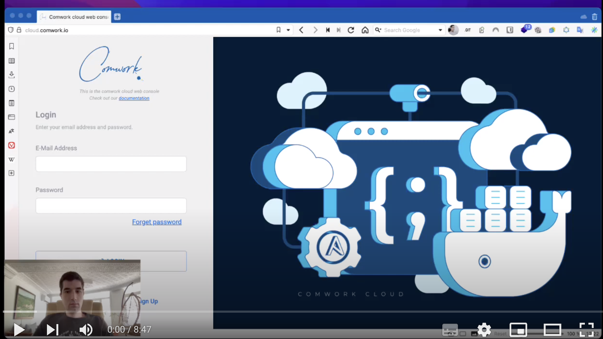

# Serveur Localtunnel

## Traductions

Ce tutoriel est également disponible dans les langues suivantes :
* [English 🇬🇧](../../localtunnel.md)

## Tutoriel vidéo

[](https://youtu.be/2BZHMYcPfiY)

Vous pouvez activer les sous-titres en Anglais ou Français.

## Utilisation de la ligne de commande

### Autoriser votre réseau privé dans pare-feu de tunnelserver

Vous devez autoriser vos ips publiques sur lesquelles vous souhaitez exposer un port sur internet via un tunnel.

Récupérer votre ip publique :

```shell
curl -L ip.comwork.io
```

Ensuite ajouter la valeurs retournée dans cette commande dans le fichier d'environnement ansible (`env/{ instance_hash }.yml`) :

```yaml
firewall_allow:
  # ...
  - ip: YOUR_PUBLIC_IP # à remplacer par la valeur retournée par le curl précédent
    cidr: 24
```

### Exposer votre service avec la ligne de commande lt

Vous pouvez installer cette ligne de commande comme ceci :

```shell
npm install -g localtunnel
```

Et l'utiliser de cette façon :

```shell
lt --host https://{your_instance_hash}.lt.comwork.(cloud|dev|info) --port {the port you want to expose} --subdomain localtunnel-1
```

### Travailler avec plusieurs tunnels


Vous pouvez utiliser plusieurs tunnels, vous avez juste à ajouter les sous-domaines de vos tunnels dans votre fichier d'environnement ansible (`env/{ instance_hash }.yml`):

```yaml
gw_proxies:
  # ...
  - domain: localtunnel-1.{your_instance_hash}.lt.comwork.(cloud|dev|info)
    target: localtunnel-1.{your_instance_hash}.lt.comwork.(cloud|dev|info):3200
  - domain: localtunnel-2.{your_instance_hash}.lt.comwork.(cloud|dev|info)
    target: localtunnel-2.{your_instance_hash}.lt.comwork.(cloud|dev|info):3200
  - domain: localtunnel-3.{your_instance_hash}.lt.comwork.(cloud|dev|info)
    target: localtunnel-3.{your_instance_hash}.lt.comwork.(cloud|dev|info):3200
```

Vous pourrez ensuite créer ces tunnels avec la ligne de commande lt :

```shell
lt --host https://localtunnel-1.{your_instance_hash}.lt.comwork.(cloud|dev|info) --port 8080 --subdomain localtunnel-1
lt --host https://localtunnel-2.{your_instance_hash}.lt.comwork.(cloud|dev|info) --port 8081 --subdomain localtunnel-2
lt --host https://localtunnel-3.{your_instance_hash}.lt.comwork.(cloud|dev|info) --port 8082 --subdomain localtunnel-3
```

Et partager ces URLs :

```shell
https://localtunnel-1.{your_instance_hash}.lt.comwork.(cloud|dev|info)
https://localtunnel-2.{your_instance_hash}.lt.comwork.(cloud|dev|info)
https://localtunnel-3.{your_instance_hash}.lt.comwork.(cloud|dev|info)
```
