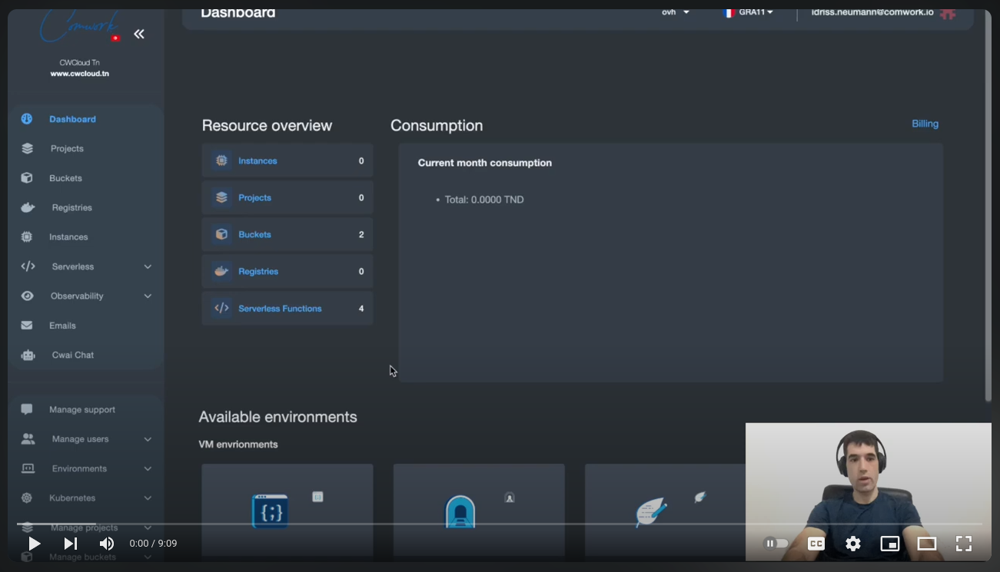
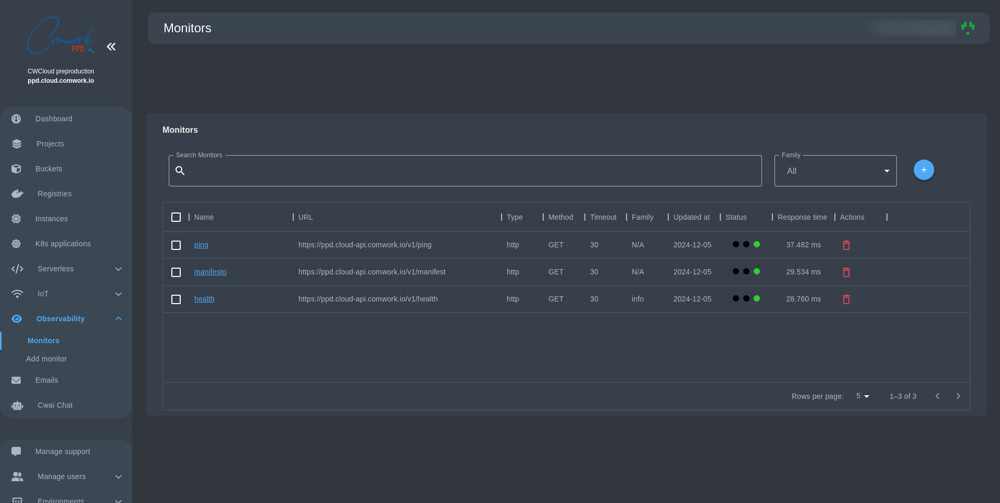

# Système de Gestion de Moniteurs - Guide Utilisateur

Un moniteur est un outil qui vous aide à suivre la santé et les performances de vos services web. Pensez-le comme un chien de garde qui vérifie régulièrement si vos sites web, API ou services web fonctionnent correctement. Chaque moniteur envoie périodiquement des requêtes à une URL spécifiée et rapporte :
- Si le service est accessible
- Combien de temps il met pour répondre
- S'il renvoie les résultats attendus

## Pourquoi Avez-Vous Besoin de Moniteurs ?
- **Suivi de Disponibilité** : Sachez immédiatement si vos services sont en panne
- **Surveillance des Performances** : Suivez les temps de réponse pour identifier les ralentissements
- **Gestion Proactive** : Traitez les problèmes avant qu'ils n'affectent vos utilisateurs
- **Conformité aux Accords de Niveau de Service (SLA)** : Assurez-vous que vos services respectent les standards de disponibilité convenus

Voici un tutoriel de 10 minutes qui vous montrera comment utiliser notre système de gestion des moniteurs :

## Visualisation de Vos 

1. Naviguez vers la page Moniteurs
2. Vous verrez un tableau présentant tous vos moniteurs actuels avec des détails tels que :
   - Nom du moniteur
   - URL surveillée
   - Statut actuel (Succès/Échec/En attente)
   - Temps de réponse
   - Heure de dernière mise à jour

#### Gestion de Vos Moniteurs
- **Recherche** : Utilisez la barre de recherche pour filtrer les moniteurs par nom
- **Filtre Famille** : Utilisez la liste déroulante pour voir les moniteurs d'une famille spécifique
- **Ajouter** : Cliquez sur le bouton "+" en haut à droite pour accéder à une nouvelle interface et créer un moniteur
- **Supprimer** : Cliquez sur l'icône de corbeille pour supprimer un moniteur
- **Modifier** : Cliquez sur le nom d'un moniteur pour modifier ses paramètres

#### Comprendre le Statut des Moniteurs
Les indicateurs de statut montrent trois points colorés :
- 🔴 Rouge : Échec - Le moniteur a détecté un problème
- 🟡 Jaune : En attente - En attente de la prochaine vérification
- 🟢 Vert : Succès - Tout fonctionne correctement

## Création d'un Nouveau Moniteur : Guide de Configuration Détaillé

### Configuration de Base

#### 1. Méthode de Requête
Choisissez parmi trois méthodes HTTP :
- **GET** : Récupérer des informations (par défaut)
- **POST** : Soumettre des données à traiter
- **PUT** : Mettre à jour des ressources existantes

#### 2. Nom du Moniteur (Obligatoire)
- Fournissez un nom clair et descriptif
- Aide à identifier rapidement le service surveillé
- Exemple : "Point de Terminaison API de Production" ou "Service d'Inscription Utilisateur"

#### 3. URL (Obligatoire)
- Adresse web complète du service à surveiller
- Doit être un point de terminaison valide et accessible
- Exemples : 
  - `https://api.votreentreprise.com/sante`
  - `https://www.votresite.com/connexion`

#### 4. Famille (Optionnel)
- Regroupez des moniteurs liés
- Utile pour organiser les moniteurs par projet, département ou type de service
- Exemple : "Services d'Authentification", "Passerelles de Paiement"

#### 5. Corps (Optionnel)
- Apparaît lorsque vous choisissez POST/PUT

#### 6. Propriétaire (Obligatoire - administrateurs uniquement)
- Apparaît dans l'interface administrateur
- Choisissez le propriétaire du moniteur par e-mail parmi les options suggérées

### Configuration Avancée

#### Configuration de la Requête
1. **Code HTTP Attendu**
   - Défaut : `20*` (correspond à la plage 200-209)
   - Personnalisez pour correspondre à la réponse de succès de votre service spécifique
   - Exemples : 
     - `200` : Statut OK strict
     - `20*` : Autorise la plage 200-209
     - `404` : Pour les points de terminaison renvoyant intentionnellement "non trouvé"

2. **Contenu Attendu**
   - Texte optionnel que la réponse doit contenir
   - Valide non seulement la connectivité, mais aussi la réponse correcte
   - Exemples :
     - `"succès"` : Vérifie un texte spécifique
     - Mots-clés de validation JSON
     - Messages de confirmation de vérification de santé

3. **Délai d'Attente**
   - Durée (en secondes) d'attente d'une réponse
   - Défaut : 30 secondes
   - Ajustez selon le temps de réponse prévu du service
   - Plus court pour les services critiques et rapides
   - Plus long pour les appels API complexes

### Options d'Authentification

#### Authentification Basique
- **Nom d'Utilisateur** : Identifiant de connexion optionnel
- **Mot de Passe** : Stockage sécurisé des identifiants
- Fonctionnalité d'affichage/masquage du mot de passe
- Supporte divers scénarios d'authentification :
  - API publiques
  - Points de terminaison de service internes
  - Ressources protégées

### En-Têtes de Requête
- Ajoutez des en-têtes HTTP personnalisés
- Utile pour :
  - Transmission de clé API
  - Spécification du type de contenu
  - Authentification personnalisée
  - Exigences API spécifiques

#### Gestion des En-Têtes
- **Ajouter un En-Tête** : Cliquez pour introduire de nouveaux en-têtes personnalisés
- **Modifier un En-Tête** : Modifiez les en-têtes existants
- **Supprimer un En-Tête** : Supprimez les en-têtes inutiles

### Pour les Utilisateurs Administrateurs : Attribution de Propriétaire Supplémentaire
- Attribuez des moniteurs à des utilisateurs spécifiques
- Sélectionnez l'utilisateur via l'auto-complétion d'e-mail
- Permet un suivi granulaire des accès et des responsabilités

## Soumission et Validation

### Avant de Créer un Moniteur
Champs Obligatoires :
- Nom du Moniteur
- URL
- (Pour Administrateur) Attribution de Propriétaire/Utilisateur

### Bouton de Création
- Sauvegarde et active le moniteur
- Validation immédiate de la configuration
- Fournit des notifications de succès/erreur

## Bonnes Pratiques et Recommandations

1. **Précision dans la Configuration**
   - Utilisez des URL exactes
   - Définissez des valeurs de délai d'attente réalistes
   - Choisissez des méthodes HTTP appropriées

2. **Considérations de Sécurité**
   - Utilisez des points de terminaison HTTPS
   - Faites tourner régulièrement les identifiants
   - Minimisez les informations sensibles exposées

3. **Surveillance des Performances**
   - Configurez des moniteurs pour les chemins de service critiques
   - Utilisez des vérifications de contenu attendu pour une validation plus approfondie
   - Regroupez les services connexes dans des familles

4. **Maintenance**
   - Examinez et mettez à jour régulièrement les configurations de moniteurs
   - Supprimez les moniteurs obsolètes ou redondants
   - Ajustez le délai d'attente et les attentes à mesure que les services évoluent

## Dépannage

### Problèmes Courants
- URL incorrecte
- Configuration d'authentification erronée
- Paramètres de délai d'attente trop stricts
- Codes HTTP attendus non concordants

### Actions Recommandées
1. Vérifiez l'accessibilité du service
2. Vérifiez les configurations réseau
3. Validez les paramètres du moniteur
4. Consultez l'administrateur système pour les problèmes persistants

### Obtenir de l'Aide
Si vous rencontrez des problèmes ou avez besoin d'assistance :
1. Vérifiez que la configuration du moniteur correspond aux exigences de votre service
2. Assurez-vous que l'URL est accessible depuis votre réseau
3. Contactez le support si vous continuez à rencontrer des problèmes

Rappelez-vous : Un système bien surveillé aide à maintenir une haute qualité de service et la satisfaction des utilisateurs. Une surveillance régulière vous permet de détecter et de corriger les problèmes avant qu'ils n'impactent vos utilisateurs.
