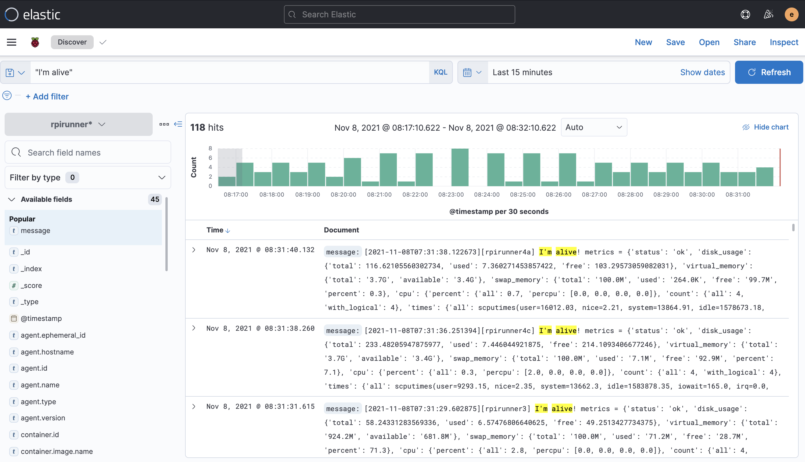

# Imalive API / metrics exporter

Laissez vos instances chanter comme Céline Dion `I'm alive!` ("Je suis vivante").


Il s'agit d'une simple API de healthcheck pour vos instances (supporte les machines x86 et armhf comme les raspberrypi).

Ce projet fournit un endpoint HTTP/Restful que vous pourrez utiliser comme règle ou "ligne de vie" dans votre loadbalancer et publie également un "heartbit[^1]" sur la sortie standard `stdout` (utile si vous collectez les logs dans un système de log management tel que Elasticstack).



## Traductions

Ce tutoriel est également disponible dans les langues suivantes :
* [English 🇬🇧](../../../../tutorials/observability/imalive.md)

## Dépôt git

* Dépôt principal: https://gitlab.comwork.io/oss/imalive
* Mirroir Github: https://github.com/comworkio/imalive.git
* Mirroir Gitlab: https://gitlab.com/ineumann/imalive.git

## Image sur dockerhub

Les images docker sont versionnées et disponibles ici : https://hub.docker.com/r/comworkio/imalive-api

Un exemple d'instance : https://imalive.comwork.io

## Comment déployer Imalive

### Installation avec ansible

Certains environnements comme le [vps[^2]](../../../../vps.md) installent déjà imalive en utilisant ce rôle. Toutefois, même quand c'est pas le cas, vous pouvez ajouter ce [rôle ansible](https://gitlab.comwork.io/oss/imalive/-/tree/main/ansible-imalive) dans votre repo de déploiement et l'invocation du rôle dans votre playbook.

### Installation avec docker-compose

Récupérer ce [fichier docker-compose](https://gitlab.comwork.io/oss/imalive/-/blob/main/docker-compose.yml).

Ensuite, créer votre fichier `.env` à partir du fichier `.env.example` :

```shell
cp .env.example .env
```

Ensuite remplacez les valeurs dans ce fichier (comme par exemple la variable `IMALIVE_NODE_NAME` avec le nom de votre instance pour différencier la provenance des logs). Ensuite :

```shell
docker-compose up
```

Si vous souhaitez le déployer sur un appareil ARM tel qu'un raspberrypi, lancez cette commande à la place :

```shell
docker-compose -f docker-compose-arm.yml up
```

### Installation sur K3D (Kubernetes/Helm)

Vous pouvez utiliser notre [helm chart](https://gitlab.comwork.io/oss/imalive/-/tree/main/helm)

#### Tester avec K3D (initialisation du cluster)

```shell
k3d cluster create localdev --api-port 6550 -p "8089:80@loadbalancer"
sudo k3d kubeconfig get localdev > ~/.kube/config 
```

Continuez avec le chapitre suivant

#### Installation du helmchart

```shell
cd helm # toutes les commandes ci-dessous doivent être lancée depuis le répertoire imalive/helm
kubectl create ns imalive
helm dependency update
helm -n imalive install . -f values.yaml --generate-name
```

#### Vérifier le déploiement et les ingress

```shell
kubectl -n imalive get deployments
kubectl -n imalive get pods
kubectl -n imalive get svc
kubectl -n imalive get ingress
curl localhost:8089 -v
```

## Endpoints

### Healthcheck

```shell
curl localhost:8080/v1/health
{"status": "ok", "time": "2021-11-05T06:55:28.274736", "alive": true, "name": "anode"}
```

### Manifests

```shell
curl localhost:8080/v1/manifest 
{"version": "1.0", "sha": "1c7cb1f", "arch": "x86"}
```

### Metrics

```shell
curl localhost:8080/v1/metrics
{"status": "ok", "disk_usage": {"total": 102.11687469482422, "used": 22.499202728271484, "free": 74.402099609375}, "virtual_memory": {"total": "1.9G", "available": "984.7M"}, "swap_memory": {"total": "1024.0M", "used": "493.1M", "free": "530.9M", "percent": 48.2}, "cpu": {"percent": {"all": 2.8, "percpu": [5.0, 4.0, 3.0, 2.0]}, "count": {"all": 4, "with_logical": 4}, "times": {"all": [10665.39, 7.0, 4718.91, 400345.0, 156.08, 0.0, 226.8, 0.0, 0.0, 0.0], "percpu": [[2488.92, 1.24, 1196.15, 100191.67, 38.08, 0.0, 82.3, 0.0, 0.0, 0.0], [2757.78, 1.63, 1196.16, 99992.0, 37.88, 0.0, 55.78, 0.0, 0.0, 0.0], [2704.56, 2.05, 1162.12, 100082.77, 40.01, 0.0, 47.75, 0.0, 0.0, 0.0], [2714.11, 2.06, 1164.46, 100078.54, 40.1, 0.0, 40.96, 0.0, 0.0, 0.0]]}}}
```

## Heartbit

Vous pouvez changer la fréquence entre deux heartbits avec la variable d'environnement `WAIT_TIME` (en secondes).

Voici un exemple de sortie standard du heartbit :

```shell
[2021-11-06T14:45:33.902885][anode] I'm alive! metrics = {'status': 'ok', 'disk_usage': {'total': 102.11687469482422, 'used': 22.521244049072266, 'free': 74.38005828857422}, 'virtual_memory': {'total': '1.9G', 'available': '959.0M'}, 'swap_memory': {'total': '1024.0M', 'used': '493.1M', 'free': '530.9M', 'percent': 48.2}, 'cpu': {'percent': {'all': 3.5, 'percpu': [8.0, 5.0, 6.1, 11.0]}, 'count': {'all': 4, 'with_logical': 4}, 'times': {'all': scputimes(user=10679.53, nice=7.01, system=4727.11, idle=401080.72, iowait=156.27, irq=0.0, softirq=227.12, steal=0.0, guest=0.0, guest_nice=0.0), 'percpu': [scputimes(user=2492.49, nice=1.24, system=1198.2, idle=100375.46, iowait=38.16, irq=0.0, softirq=82.38, steal=0.0, guest=0.0, guest_nice=0.0), scputimes(user=2760.93, nice=1.64, system=1198.27, idle=100176.24, iowait=37.93, irq=0.0, softirq=55.87, steal=0.0, guest=0.0, guest_nice=0.0), scputimes(user=2708.45, nice=2.06, system=1164.18, idle=100266.4, iowait=40.04, irq=0.0, softirq=47.82, steal=0.0, guest=0.0, guest_nice=0.0), scputimes(user=2717.65, nice=2.06, system=1166.46, idle=100262.62, iowait=40.12, irq=0.0, softirq=41.03, steal=0.0, guest=0.0, guest_nice=0.0)]}}}
[2021-11-06T14:45:45.914750][anode] I'm alive! metrics = {'status': 'ok', 'disk_usage': {'total': 102.11687469482422, 'used': 22.52124786376953, 'free': 74.38005447387695}, 'virtual_memory': {'total': '1.9G', 'available': '959.8M'}, 'swap_memory': {'total': '1024.0M', 'used': '493.1M', 'free': '530.9M', 'percent': 48.2}, 'cpu': {'percent': {'all': 2.0, 'percpu': [2.0, 3.0, 2.0, 4.0]}, 'count': {'all': 4, 'with_logical': 4}, 'times': {'all': scputimes(user=10680.4, nice=7.01, system=4727.63, idle=401126.91, iowait=156.28, irq=0.0, softirq=227.13, steal=0.0, guest=0.0, guest_nice=0.0), 'percpu': [scputimes(user=2492.68, nice=1.24, system=1198.34, idle=100387.01, iowait=38.17, irq=0.0, softirq=82.38, steal=0.0, guest=0.0, guest_nice=0.0), scputimes(user=2761.19, nice=1.64, system=1198.36, idle=100187.77, iowait=37.93, irq=0.0, softirq=55.87, steal=0.0, guest=0.0, guest_nice=0.0), scputimes(user=2708.66, nice=2.06, system=1164.31, idle=100277.96, iowait=40.04, irq=0.0, softirq=47.83, steal=0.0, guest=0.0, guest_nice=0.0), scputimes(user=2717.86, nice=2.06, system=1166.61, idle=100274.16, iowait=40.12, irq=0.0, softirq=41.03, steal=0.0, guest=0.0, guest_nice=0.0)]}}}
[2021-11-06T14:45:57.924797][anode] I'm alive! metrics = {'status': 'ok', 'disk_usage': {'total': 102.11687469482422, 'used': 22.52124786376953, 'free': 74.38005447387695}, 'virtual_memory': {'total': '1.9G', 'available': '963.0M'}, 'swap_memory': {'total': '1024.0M', 'used': '493.1M', 'free': '530.9M', 'percent': 48.2}, 'cpu': {'percent': {'all': 2.5, 'percpu': [4.0, 3.0, 2.0, 4.0]}, 'count': {'all': 4, 'with_logical': 4}, 'times': {'all': scputimes(user=10681.23, nice=7.01, system=4728.14, idle=401173.13, iowait=156.28, irq=0.0, softirq=227.15, steal=0.0, guest=0.0, guest_nice=0.0), 'percpu': [scputimes(user=2492.87, nice=1.24, system=1198.47, idle=100398.59, iowait=38.17, irq=0.0, softirq=82.39, steal=0.0, guest=0.0, guest_nice=0.0), scputimes(user=2761.37, nice=1.64, system=1198.5, idle=100199.34, iowait=37.93, irq=0.0, softirq=55.88, steal=0.0, guest=0.0, guest_nice=0.0), scputimes(user=2708.91, nice=2.06, system=1164.42, idle=100289.48, iowait=40.04, irq=0.0, softirq=47.83, steal=0.0, guest=0.0, guest_nice=0.0), scputimes(user=2718.07, nice=2.06, system=1166.75, idle=100285.71, iowait=40.12, irq=0.0, softirq=41.04, steal=0.0, guest=0.0, guest_nice=0.0)]}}}
```

Vous pouvez changer la valeur `anode` par le nom de votre instance avec la variable d'environnement `IMALIVE_NODE_NAME`.

Vous pouvez également indiquer de produire le log du heartbit au format 100% json avec la variable d'environnement `HEART_BIT_LOG_JSON` (valeurs acceptées: `yes` ou `true`).

## OpenTelemetry

Vous pouvez également configurer un endpoint OTLP[^3]/grpc en utilisant la variable d'environnement `OTEL_COLLECTOR_ENDPOINT`.

Voici un exemple de configuration de Prometheus pour scrapper le collecteur opentelemetry (otel-collector) :

```yaml
global:
  scrape_interval: 10s

scrape_configs:
  - job_name: 'opentelemetry'
    static_configs:
      - targets: ['otel-collector:8889']
```

Et la configuration du collecteur pour recevoir les métriques, logs et traces de imalive :

```yaml
receivers:
  otlp:
    protocols:
      grpc:
      http:

exporters:
  logging:
  prometheus:
    endpoint: "0.0.0.0:8889"
    const_labels:
      otel: otel
  otlp:
    endpoint: "jaeger:4317"
    tls:
      insecure: true

processors:
  batch:

service:
  pipelines:
    metrics:
      receivers: [otlp]
      exporters: [prometheus]
    traces:
      receivers: [otlp]
      exporters: [otlp]
    logs:
      receivers: [otlp]
      processors: [batch]
      exporters: [logging]
```

## Moniteur

Imalive est également capable de vérifier si des URLs http sont en bonne santé et exporte le résultat sous forme de métriques et de logs (le statut et la durée des requêtes).

Cette fonctionalité est similaire aux [monitors](./monitor.md) de CWCloud mais peut servir si vous voulez faire ces contrôles depuis une instance qui n'héberge pas CWCloud pour différentes raisons comme par exemple depuis un réseau privé, etc.

Pour cela, il suffit de remplacer le fichier `/app/imalive.yml` avec le contenu si dessous :

```yaml
---
monitors:
  - type: http
    name: imalive
    url: http://localhost:8081
    method: POST # optionnel (GET par défaut, pour l'instant seul POST et GET sont supportés)
    body: '{"foo": "bar"}' # optionel (ignoré si la méthode est GET)
    check_tls: false # optionel (true par défaut)
    expected_http_code: "20*" # optionnel (20* par défaut), le wildcard signifie "commence par"
    expected_contain: "\"status\":\"ok\"" # optionnel (pas de check sur le body si pas présent)
    timeout: 30 # optionnel (30 secondes par défaut)
    username: changeit # optionnel (pas d'authentification par défaut)
    password: changerit # optionnel (pas d'authentification par défaut)
    headers: # optionnel (pas de header si vide)
      - name: Accept
        value: application/json
```

[^1]: battement de coeur (log écrit en boucle pour informer sur l'état de santé de l'instance)
[^2]: virtual private server (simple serveur virtuel / compute instance)
[^3]: OpenTelemetry protocol
