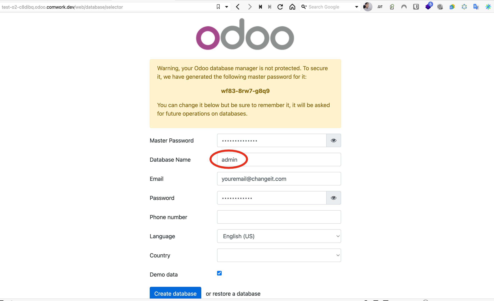

# Odoo

## Traductions

Ce tutoriel est également disponible dans les langues suivantes :
* [English 🇬🇧](../../../tutorials/odoo.md)

## Initialiser votre environnement Odoo

Une fois que vous avez provisionné vos instances odoo, vous pourrez accéder à cet écran en cliquant sur `open` :

Notes:
* Utilisez `admin` comme nom de base de donnée
* Conservez le mot de passe du `master` dans un endroit sûr
