# Configurations OIDC

## Comment obtenir l'ID Client et le Secret Client Google pour la configuration OIDC Google

1. Accédez à la Console Google Cloud (https://console.cloud.google.com)

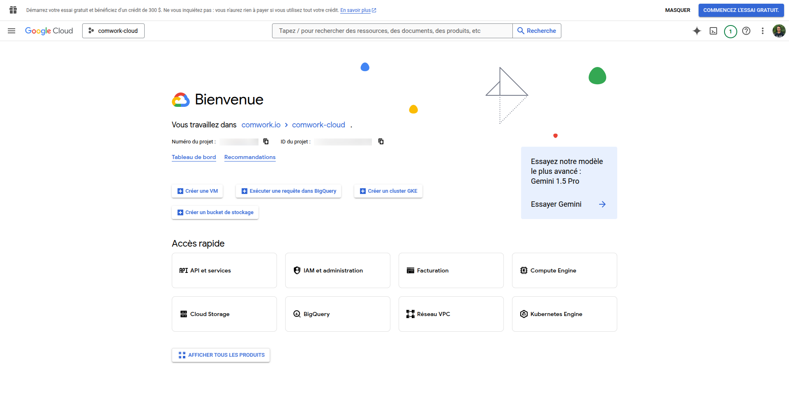

2. Créez un nouveau projet ou sélectionnez un projet existant
   - Cliquez sur la liste déroulante du projet en haut
   - Cliquez sur "Nouveau Projet" ou sélectionnez un existant
   - Si vous créez un nouveau, entrez le nom et cliquez sur "Créer"

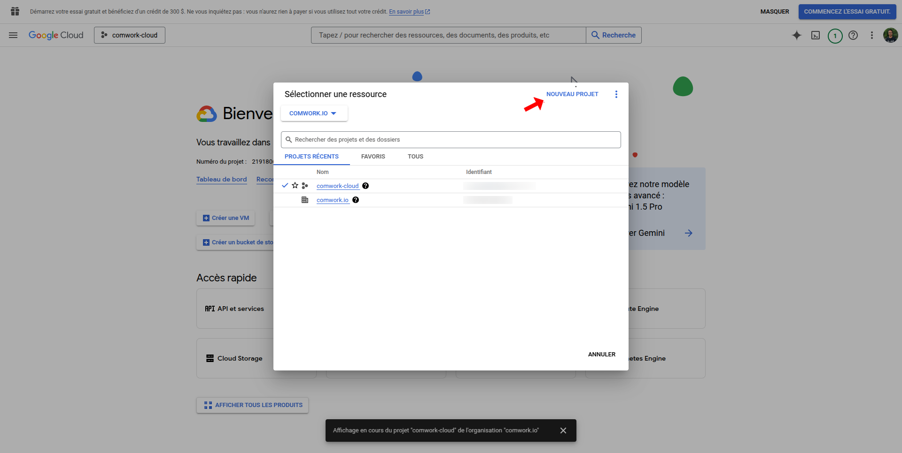

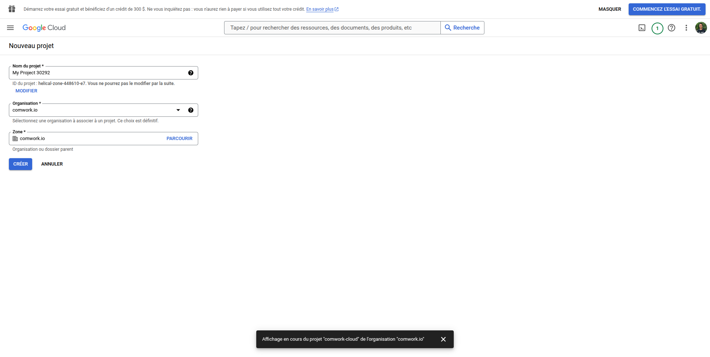

3. Activez l'écran de consentement OAuth
   - Allez dans "APIs & Services" > "Écran de consentement OAuth"
   - Choisissez le type d'utilisateur "Externe"
   - Remplissez les champs requis (nom de l'application, email de support utilisateur, contact développeur)
   - Sous "Écran de consentement OAuth", ajoutez des utilisateurs test si vous êtes en mode test pour permettre à des utilisateurs spécifiques d'utiliser la nouvelle fonctionnalité OIDC.
   - Ajoutez les domaines autorisés incluant le domaine de votre plateforme
   - Activez les APIs Google requises (comme userinfo.email, userinfo.profile, et openid) si nécessaire
   - Sauvegardez et continuez

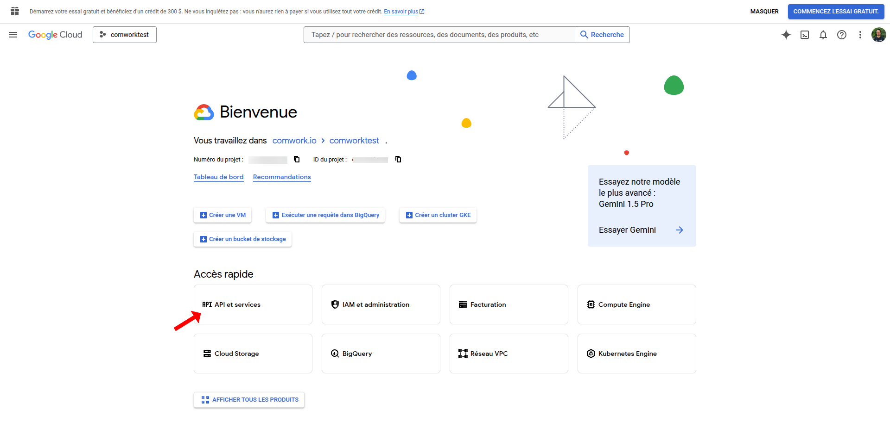

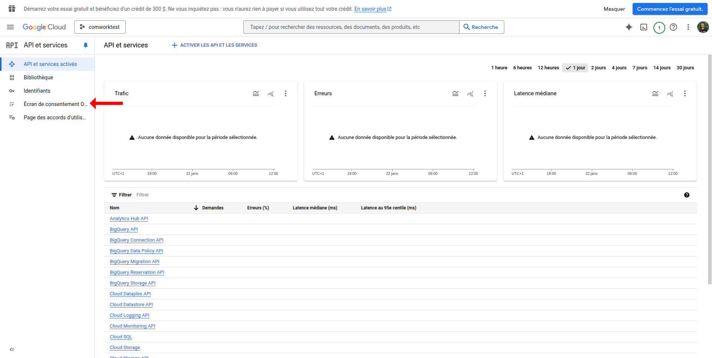

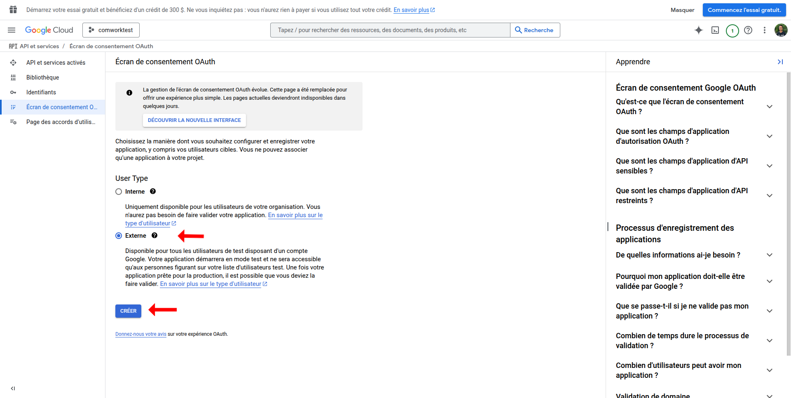

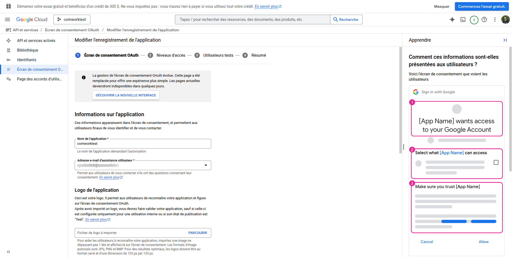

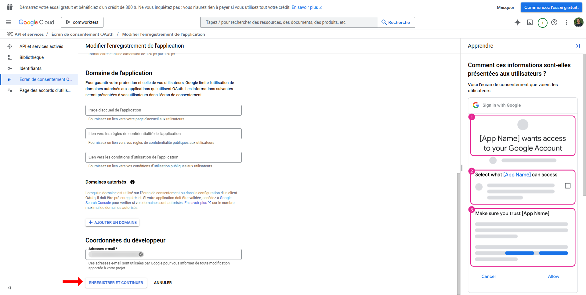

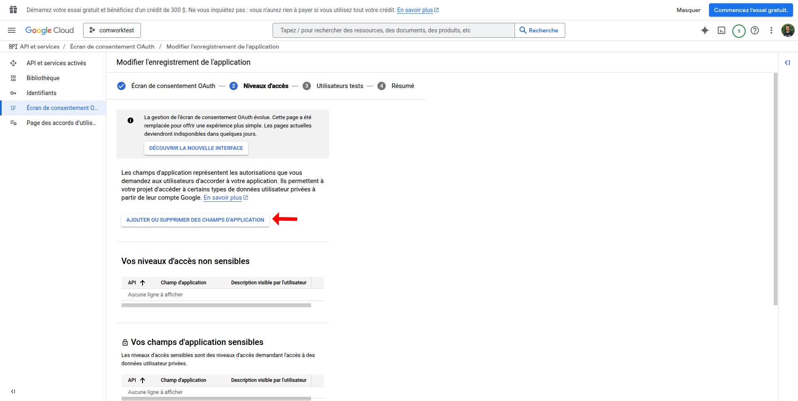

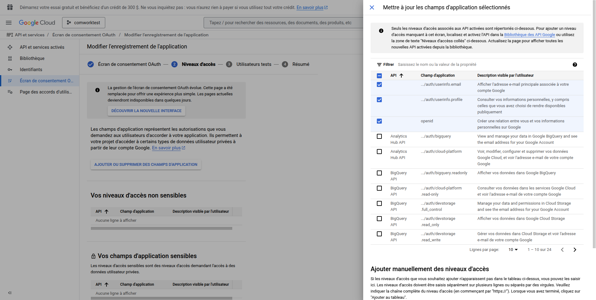

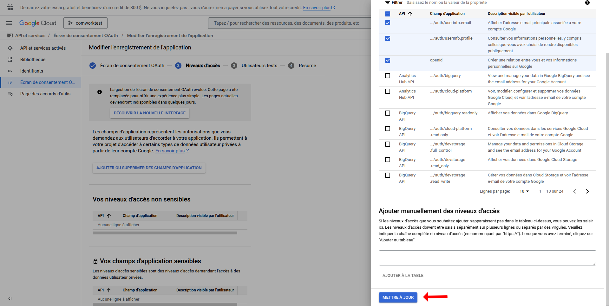

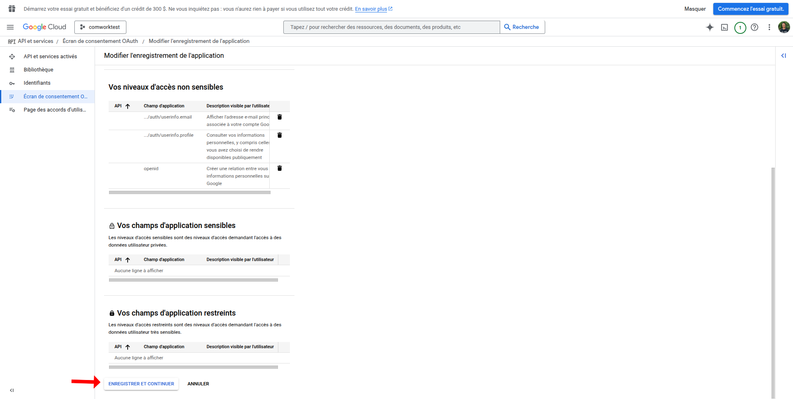

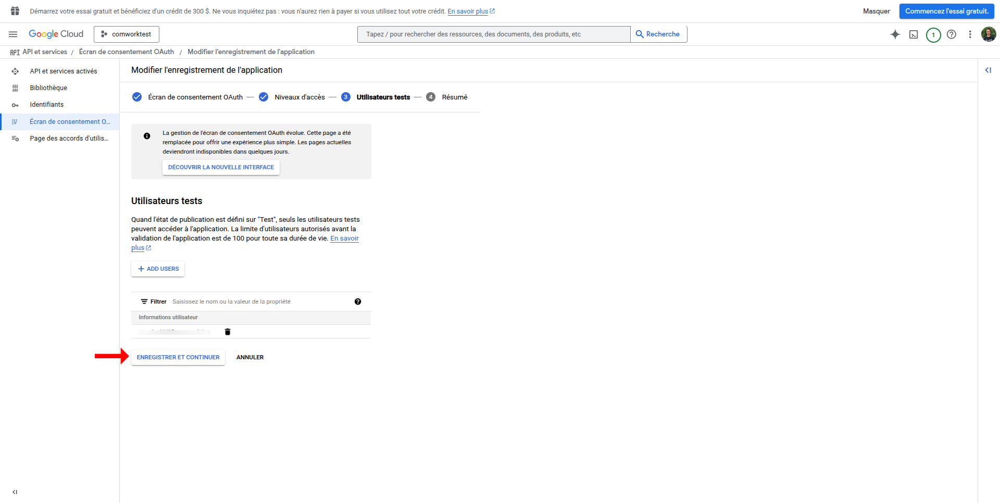

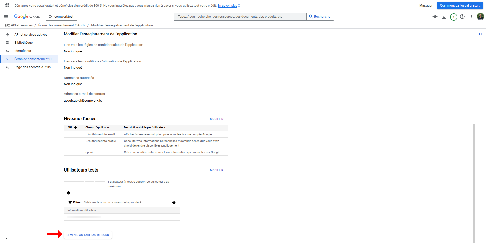

4. Configurez les identifiants OAuth
   - Allez dans "APIs & Services" > "Identifiants"
   - Cliquez sur "Créer des identifiants" > "ID Client OAuth"
   - Sélectionnez "Application Web" comme type d'application
   - Ajoutez un nom pour le client OAuth
   - Ajoutez les origines JavaScript autorisées et les URIs de redirection si nécessaire
   - Cliquez sur "Créer"

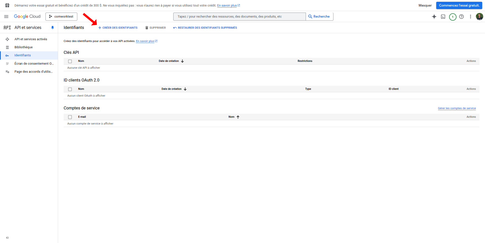

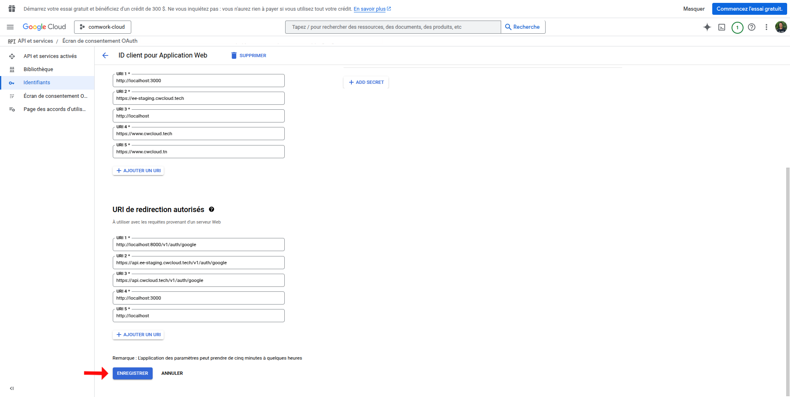

5. Obtenez les identifiants
   - Après la création, vous verrez l'ID Client et le Secret Client
   - Le Secret Client n'est montré qu'une seule fois, stockez-le en sécurité

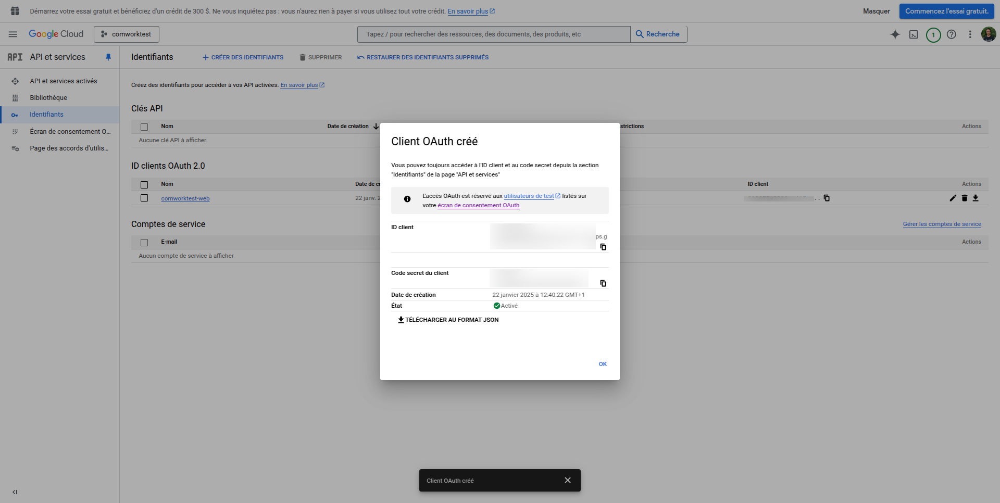

