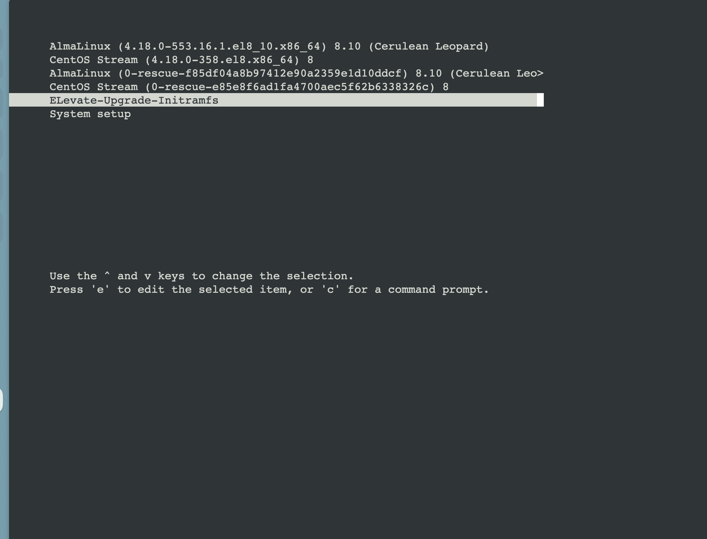

# Migrations des OS

## Traductions

Ce tutoriel est également disponible dans les langues suivantes :
* [English 🇬🇧](../../../tutorials/os_migrations.md)

## Vérifier la version

```shell
$ cat /etc/os-release
$ cat /etc/redhat-release
```

## CentOS 8 Stream vers Almalinux 8

_Comptez entre 30min et 1h._

Chaque étape dois être jouée avec le user `root`.

```shell
$ curl -O https://raw.githubusercontent.com/AlmaLinux/almalinux-deploy/master/almalinux-deploy.sh
$ sudo bash almalinux-deploy.sh
```

Une fois terminé, vous devriez avoir ce message :

```shell
The new EFI boot record for AlmaLinux is added                        OK

Migration to AlmaLinux is completed
```

Ensuite redémarrez :

```shell
$ reboot
```

Ensuite vérifier le résultat et mettre à jour :

```shell
$ cat /etc/redhat-release
AlmaLinux release 8.10 (Cerulean Leopard)
$ dnf update -y
$ dnf upgrade -y
```

## AlmaLinux 8 vers AlmaLinux 9

_Comptez entre 1h et 2h._

Chaque étape dois être jouée avec le user `root`.

```shell
$ curl https://repo.almalinux.org/elevate/testing/elevate-testing.repo -o /etc/yum.repos.d/elevate-testing.repo
$ rpm --import https://repo.almalinux.org/elevate/RPM-GPG-KEY-ELevate
$ dnf install -y leapp-upgrade leapp-data-almalinux
```

Vérifiez si la mise à jour va bien se passer :

```shell
$ leapp preupgrade
$ cat /var/log/leapp/leapp-report.txt # vérifier ce rapport
```

Si vous trouvez un problème marqué comme `high (inhibitor)`, par exemple :

```
Risk Factor: high (inhibitor)
Title: Upgrade requires links in root directory to be relative
Summary: After rebooting, parts of the upgrade process can fail if symbolic links in / point to absolute paths.
Please change these links to relative ones.
Remediation: [command] sh -c ln -snf var/lib/snapd/snap /snap
Key: XXXXX
```

Vous devez le corriger, en reprenant l'exemple, voici la correction :

```shell
cd /
ln -snf var/lib/snapd/snap /snap
```

Puis, lancer la mise à jour :

```shell
$ leapp upgrade
```

Si vous rencontrez un soucis d'espace disque avec comme erreur :

```
2024-08-20 09:38:32.570 ERROR    PID: 43069 leapp.workflow.Download.dnf_package_download: Cannot calculate, check, test, or perform the upgrade transaction.

============================================================
                           ERRORS
============================================================

2024-08-20 09:38:33.171673 [ERROR] Actor: dnf_package_download
Message: There is not enough space on some file systems to perform the upgrade transaction.
Summary:
    Hint: Increase the free space on listed filesystems. Presented values are required minimum calculated by RPM and it is suggested to provide reasonably more free space (e.g. when 200 MB is missing on /usr, add 1200MB or more).
    Disk requirements: At least 1120MB more space needed on the / filesystem.
```

Faites de la place sur le disque, souvent nettoyer les volumes et layers non utilisés de de coker suffit :

```shell
docker system prune -a
```

Puis, relancer la mise à jour :

```shell
$ leapp upgrade
```

Ensuite vous aurez un résultat comme ceci :

```shell
============================================================
                      REPORT OVERVIEW
============================================================

HIGH and MEDIUM severity reports:
    1. Leapp detected loaded kernel drivers which are no longer maintained in RHEL 9.
    2. Packages not signed by Red Hat found on the system

Reports summary:
    Errors:                      0
    Inhibitors:                  0
    HIGH severity reports:       2
    MEDIUM severity reports:     0
    LOW severity reports:        3
    INFO severity reports:       2

Before continuing consult the full report:
    A report has been generated at /var/log/leapp/leapp-report.json
    A report has been generated at /var/log/leapp/leapp-report.txt

============================================================
                   END OF REPORT OVERVIEW
============================================================
```

Ouvrez une console web/kvm de votre machine virtuelle pour avoir accès graphiquement au grub au rédémarrage puis lancer cette commande :

```shell
$ reboot
```

Puis __rapidement__ sélectionner l'entrée `ELevate-Upgrade-Initramfs` dans les choix de boot:



Laissez ensuite l'upgrade se poursuivre sur la console web/kvm.

Ensuite vérifier le résultat et mettre à jour :

```shell
$ cat /etc/redhat-release
AlmaLinux release 9.3 (Shamrock Pampas Cat)
$ dnf update -y
$ dnf upgrade -y
```

Lancez ensuite ces commandes pour corriger le pipeline ansible :

```shell
$ pip install hvac
$ dnf install snapd -y
```

[^1]: une fois que toutes les instances sont à jour, vous devriez mettre à jour le role `common` pour automatiser cela.

Et enfin dans la configuration ansible, mettez à jour les variables suivantes comme ceci et relancer un pipeline :

```shell
centos_version: 9
docker_legacy_repo_install: false
docker_repo_install: true
```

Vous devrez aussi potentiellement remplacer la commande `docker-compose` par `docker compose` dans certains roles ansible.
