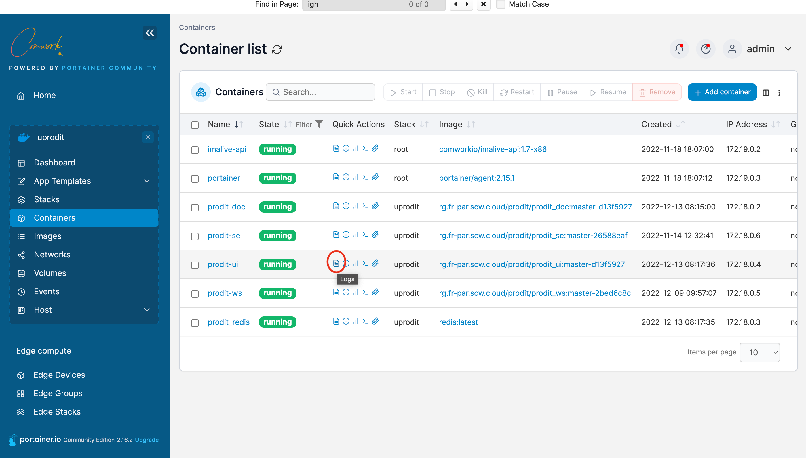
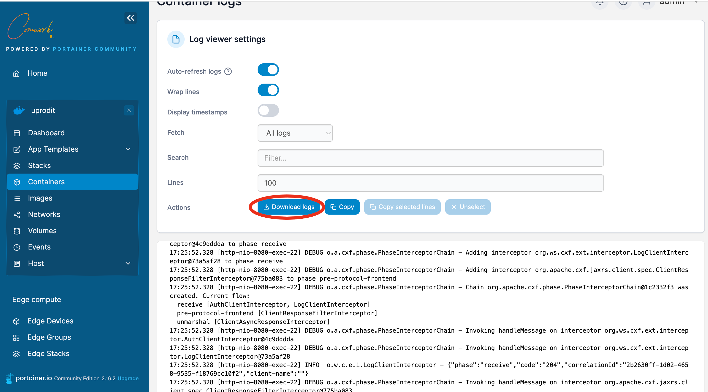
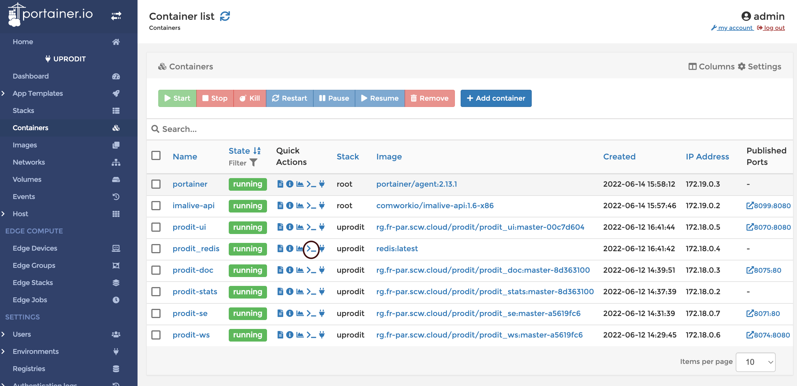

# Monitorer et gérer vos conteneurs docker

Vous pouvez monitorer et gérer l'ensemble de vos conteneurs déployés via docker (ou kubernetes) avec portainer :

## Traductions

Ce tutoriel est également disponible dans les langues suivantes :
* [English 🇬🇧](../../../../tutorials/portainer/containers.md)

## Monitorer les logs des conteneurs

Vous pouvez observer les logs en cliquant sur cet icône :

Vous pourrez lire les logs en temps réel ou bien les télécharger afin de pouvoir les ouvrir dans un éditeur de texte plus confortable pour pouvoir faire des recherches :

## Ouvrir une session shell dans un conteneur

Par exemple, ouvrir une ligne de commande redis sur un conteneur redis :

Vous devez choisir un shell qui est disponible et installé sur votre conteneur (par exemple `#!/bin/bash` ici) :

Vous pourrez ensuite lancer vos commandes (on utilise `redis-cli` ici afin de monitorer ce qui est stocké dans redis) :

