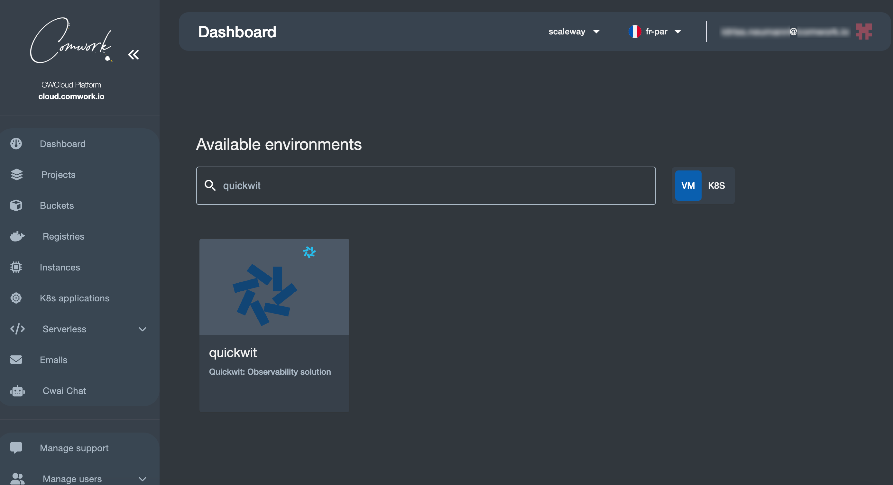
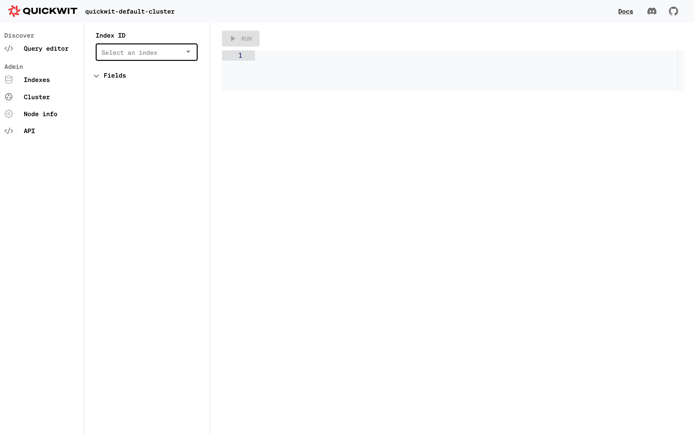
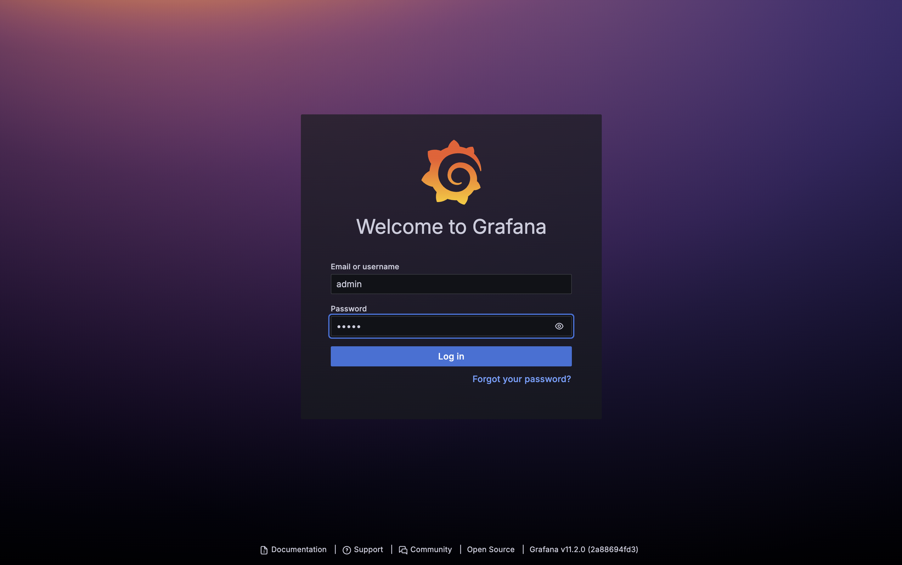
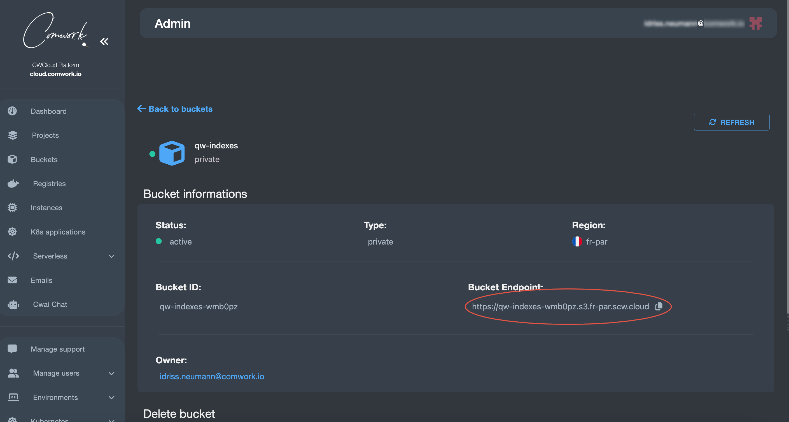
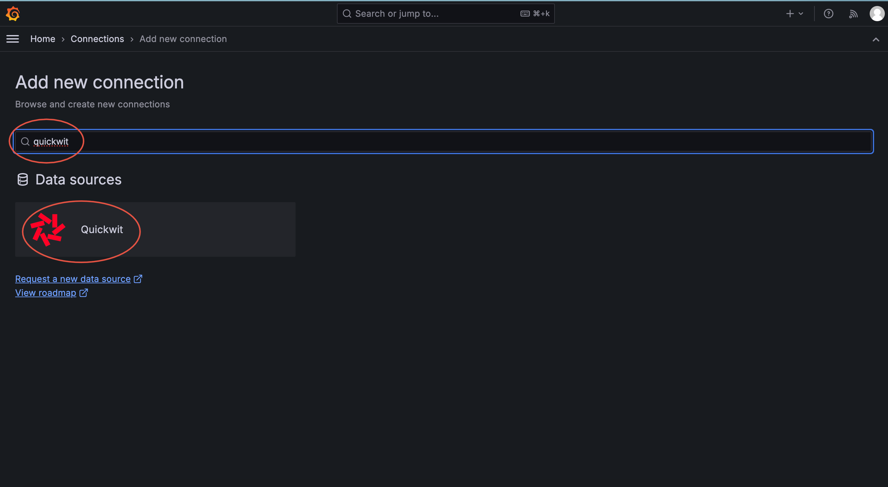
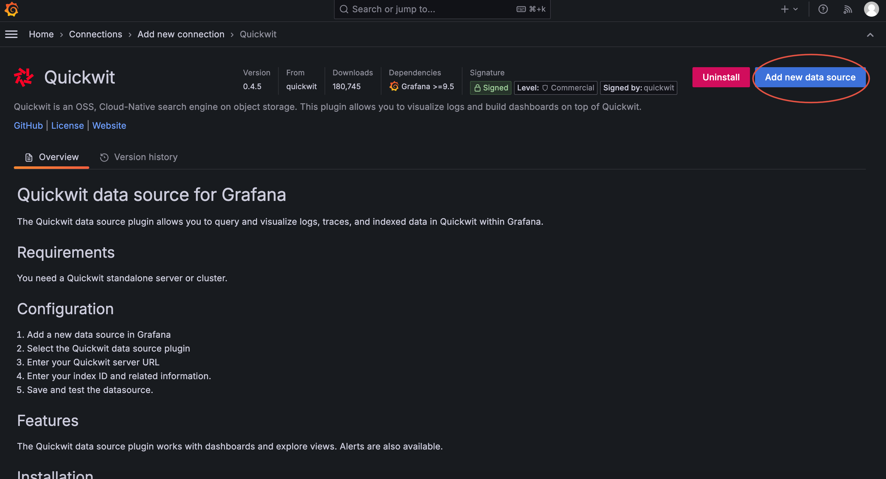
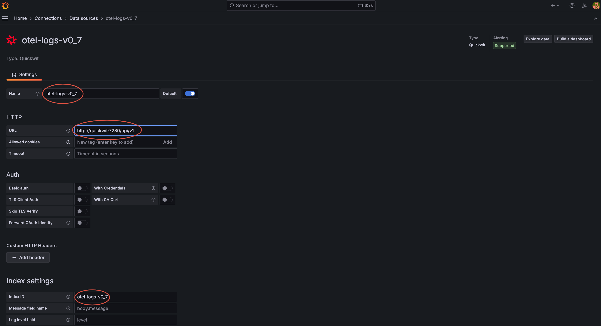
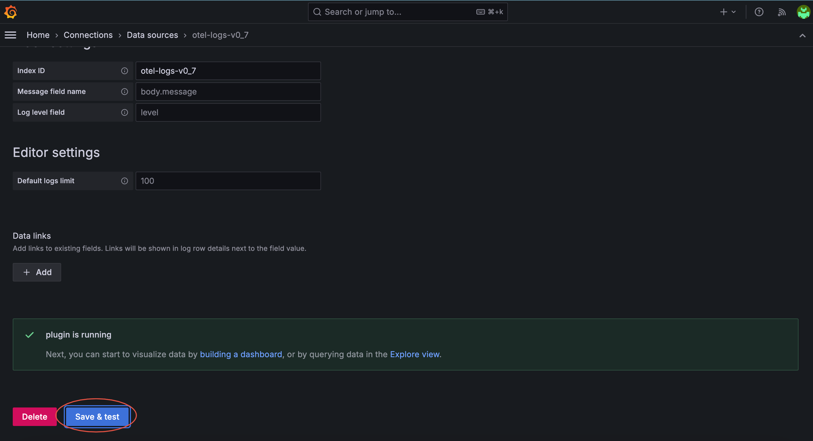
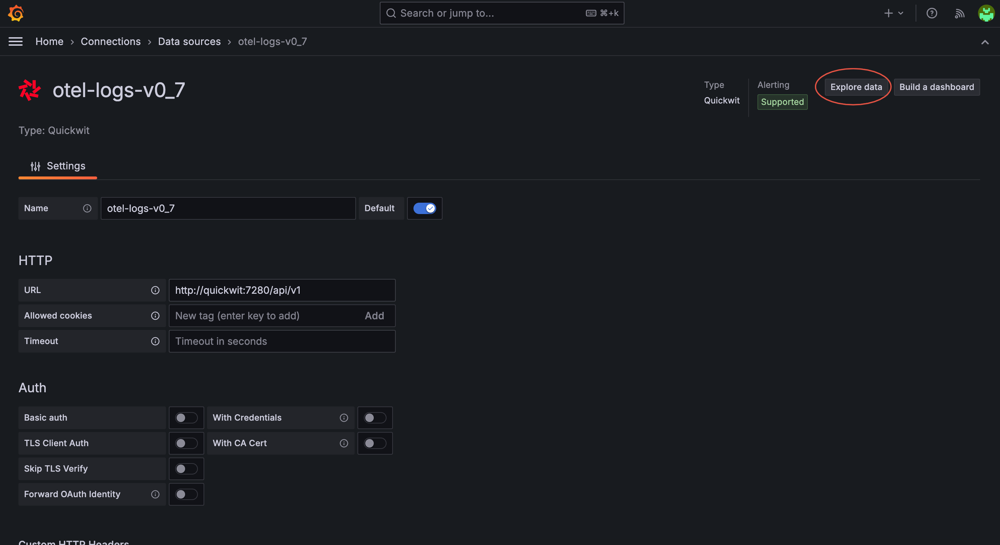
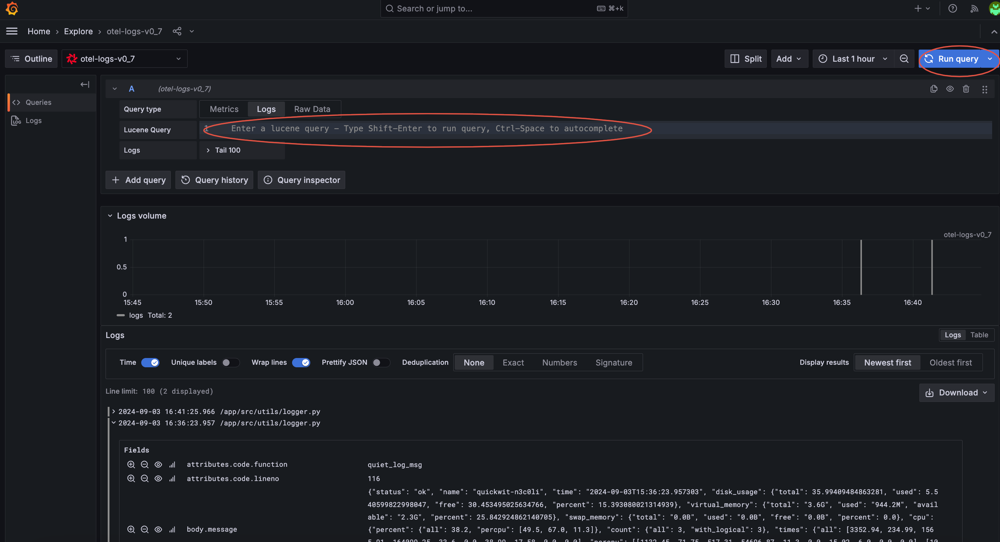

# Quickwit as a service

[Quickwit](https://www.quickwit.io) est une solution d'observabilité compatible avec Grafana, Jaegger et OpenTelemetry.

Pour le moment cela gère les logs et les traces et dispose d'un moteur de recherche très puissant écris en Rust (comparable à Apache Lucene utilisé par Elasticsearch et SolR) et cela permet également de stocker les documents indexés sur de l'object storage afin de réduire les coûts.

## Traductions

Ce tutoriel est également disponible dans les langues suivantes :
* [English 🇬🇧](../../../tutorials/quickwit.md)

## Installation et tests

Choisir l'environnement quickwit :



Une fois installé tester l'accès à Quickwit qui sera accessible à l'adresse `https://{your_instance_hash}.quickwit.comwork.(cloud|dev|info)`. Les identifiants par défaut sont:

* Login: `quickwit`
* Mot de passe: `changeit`



Testez également avec les mêmes accès, Grafana qui sera accessible à l'adresse `https://grafana.{your_instance_hash}.quickwit.comwork.(cloud|dev|info)`



Les identifiants par défaut sont les suivants :
* Username: `admin`
* Password: `admin`

Ensuite il vous sera demandé de les changer donc n'oubliez pas de retenir ce que vous allez choisir en lieu sûr !

## Problème de résolution DNS avec Grafana

Si vous recontrez des problèmes de connexions avec Grafana:
* Connectez-vous [avec ssh](./ssh.md)
* Vérifiez si vous avez des erreurs DNS dans le conteneur :

```shell
$ docker logs grafana -f
Error: ✗ failed to download plugin archive: Get "https://github.com/quickwit-oss/quickwit-datasource/releases/download/v0.4.5/quickwit-quickwit-datasource-0.4.5.zip": dial tcp: lookup github.com on 127.0.0.11:53: read udp 127.0.0.1:43845->127.0.0.11:53: i/o timeout
```

* Dans ce cas, il faut ajouter le flag suivant désactivé, dans le fichier `env/{env_name}.yml` :

```yaml
docker_disable_iptables: false
```

* Pushez, attendez que Grafana soit opérationnel et faites un retour arrière sur cette modification

## Changer de mot de passe

Vous pouvez changer votre mot de passe dans le fichier `env/{env_name}.yml` :

```yaml
gw_auth_files:
  - name: qw.keys
    users:
      - name: quickwit
        passwd: $apr1$M4x65b92$KsQCdoC.BzdBcuTai2MuG0
```

Pour générer un nouveau mot de passe hashé à copier dans le champs `passwd`:

```shell
htpasswd -c .htpasswd.tmp quickwit
cat .htpasswd.tmp | cut -d ":" -f2 # copier la sortie de passwd
rm -rf .htpasswd.tmp
```

## Changer le stockage avec de l'object storage

Pour demander de l'object storage, consultez [cette page](../../../storage.md) pour avoir plus d'informations.

Supposons que vous ayez le bucket suivant :



Avec cet endpoint sur Scaleway : `https://qw-indexes-wmb0pz.s3.fr-par.scw.cloud`

L'endpoint devra être traduit de la façon suivante : `s3://qw-indexes-wmb0pz?endpoint=s3.fr-par.scw.cloud`

Remplissez ces variables dans le fichier `env/{env_name}.yml` :

```yaml
quickwit_bucket_access_key_id: access_key_id_value
quickwit_bucket_secret_key: secret_key_id_value
quickwit_bucket_region: fr-par
quickwit_bucket_endpoint: s3://qw-indexes-wmb0pz?endpoint=s3.fr-par.scw.cloud
```

Remplacer `access_key_id_value` et `secret_key_id_value` avec les identifiants que vous aurez généré dans votre _IAM_ (_Identity Access Management_).

## Grafana datasource pour les logs

Retourner sur : `https://grafana.{your_instance_hash}.quickwit.comwork.(cloud|dev|info)`

Ajouter une nouvelle datasource :


Ensuite rechercher le plugin "quickwit" :



Ensuite cliquer sur "Add new datasource":



Ensuite remplir le formulaire :



* Name: `otel-logs-v0_7`
* URL: `http://quickwit:7280/api/v1`
* Index ID: `otel-logs-v0_7`

Ensuite cliquer sur "Save and tests":



Ensuite vous pourrez explorer les données :



Et enfin vous pourrez lancer des requêtes :


