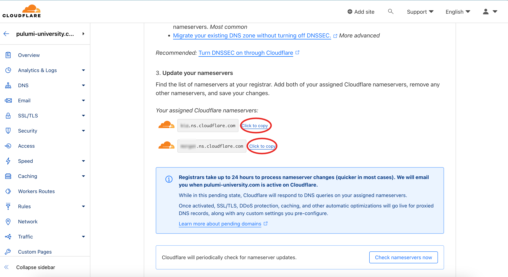

# Configurer cloudflare

## Traductions

Ce tutoriel est également disponible dans les langues suivantes :

* [English 🇬🇧](../../../../../tutorials/selfhosted/configuration/cloudflare.md)

## Configuration

1. Ajouter un nouveau site avec cloudflare:


1. Enregistrer votre nom de domaine avec le Free Plan, puis copier les DNS:



3. Mettre à jour les serveur DNS, exemple avec OVH:


Remplacer ici les serveurs `dns12.ovh.net` et `ns12.ovh.net` par ceux de cloudflare que vous avez copié juste avant.

Attendre un peu (jusqu'à 24h), les serveurs DNS devraient apparaitre à jour comme ceci:


4. Créer un token d'API pour votre instance cwcloud :


ensuite:


Ensuite choisir le bon template :


Ensuite choisir la zone DNS :


Copier/coller le token généré :


Vous devez setter la variable d'environnement `CLOUDFLARE_API_TOKEN` avec ce token.

5. Vous pouvez ensuite ajouter votre nouvelle zone DNS dans le fichier `cloud_environments.yml` :

```yaml
dns_zones:
  - name: pulumi-university.com
    driver: CloudflareDriver
    zone_id: XXXXXXX
```

Pour récupérer la `zone_id`, copier la valeur suivante depuis cloudflare :


