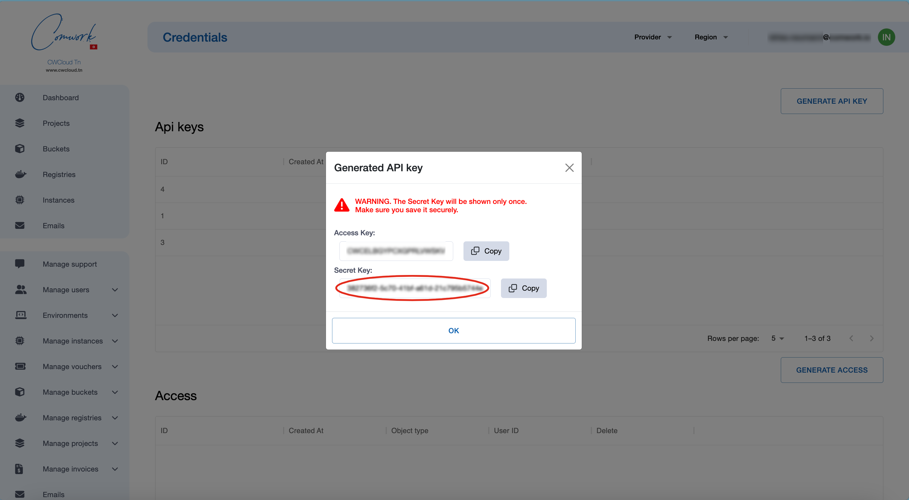

# API Credentials

## Translations

This tutorial is also available in the following languages:
* [Français 🇫🇷](../translations/fr/api/api_credentials.md)

## Getting started

In order to create API credentials, go here:

Then create new Api Key and Api Secret like that:

Then you can pick the secret key as `X-Auth-Token` in the Restful API and both the access and secret keys for the [cli](../cli/README.md).

Do not forget to save those credentials somewhere safe!
