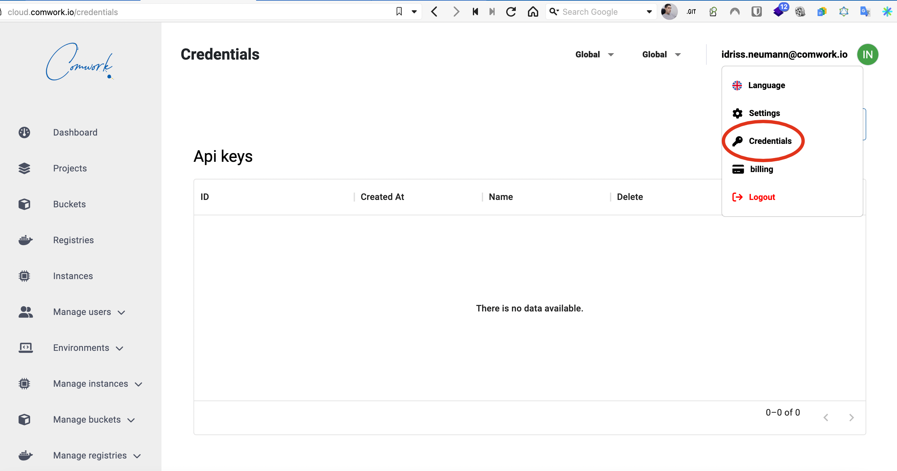
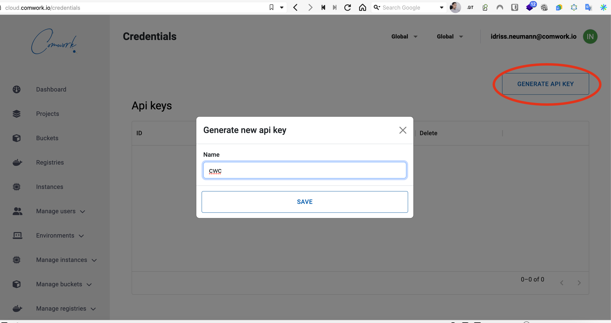
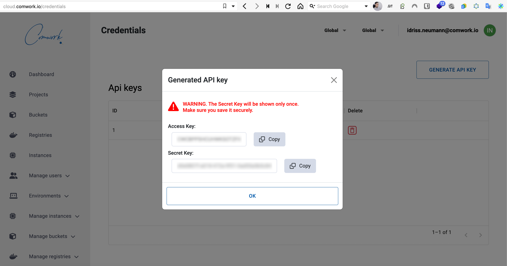

# Cli cwc

`cwc` is a CLI written in go that will help you to manipulate the [comwork cloud API](./README.md) avoiding the breaking changes.

As it's written in go, it's pretty easy to ship into your IaC pipelines.

## Installation

### Homebrew

First installation:

```shell
brew tap cwc/cwc https://gitlab.comwork.io/oss/cwc/homebrew-cwc.git 
brew install cwc
```

Upgrade:

```shell
brew update
brew upgrade cwc
```

### Curl

#### Linux

##### Linux x86 (64 bit)

```shell
curl -L "https://gitlab.comwork.io/oss/cwc/cwc/-/releases/v1.5.6/downloads/cwc_1.5.6_linux_amd64.tar.gz" -o "cwc_cli.tar.gz"
mkdir cwc_cli && tar -xf cwc_cli.tar.gz -C cwc_cli 
sudo ./cwc_cli/install.sh
```

##### Linux arm (64 bit)

```shell
curl -L "https://gitlab.comwork.io/oss/cwc/cwc/-/releases/v1.5.6/downloads/cwc_1.5.6_linux_arm64.tar.gz" -o "cwc_cli.tar.gz" 
mkdir cwc_cli && tar -xf cwc_cli.tar.gz -C cwc_cli 
sudo ./cwc_cli/install.sh
```

#### For MacOS

##### MacOS x86/arm (64 bit)

```shell
curl -L "https://gitlab.comwork.io/oss/cwc/cwc/-/releases/v1.5.6/downloads/cwc_1.5.6_darwin_all.tar.gz" -o "cwc_cli.tar.gz"
mkdir cwc_cli && tar -xf cwc_cli.tar.gz -C cwc_cli     
sudo ./cwc_cli/install.sh
```

#### For Windows

##### Windows x86 (64 bit)

```shell
curl -L "https://gitlab.comwork.io/oss/cwc/cwc/-/releases/v1.5.6/downloads/cwc_1.5.6_windows_amd64.zip" -o "cwc_cli.zip"
unzip cwc_cli.zip 
cd 
cwc.exe
```

##### Windows arm (64 bit)

```shell
curl -L "https://gitlab.comwork.io/oss/cwc/cwc/-/releases/v1.5.6/downloads/cwc_1.5.6_windows_arm64.zip" -o "cwc_cli.zip"
unzip cwc_cli.zip 
cd cwc_cli
cwc.exe
```

## Usage

### Usage, help version

```shell
cwc help # or -h or --help for getting help
cwc version # or -v or --version for getting the current version
```

### Authentication

#### Generating an API access and secret key

Go on your settings using the web console and click on "Credentials":



Then click on "Generate API key":



Then store the access and secret key somewhere safe because you won't be able to see it anymore:



#### Login

```shell
cwc login -a <access_key> -s <secret_key>
```

### Default configurations

#### Configure

Configuring the default endpoint, default region and provider with:

```shell
cwc configure
```

You can tap enter if you want to keep the current value

```shell
$ cwc configure
Default endpoint [https://cloud-api.comwork.io]: 
Default provider [ovh]: 
Default region [UK1]: 
```

You can check available providers and regions with the following commands

```shell
cwc provider ls
cwc region ls # you have to set the provider to get the up to date list of available regions here
```

### Projects

#### List

```shell
cwc project ls
```

#### Create

```shell
cwc project create -n <project_name>
```

#### Delete

```shell
cwc project delete -p <projectId>
cwc project delete --project <projectId>
```

### DNS zones

#### List

```shell
cwc dnszones ls
```

### Environments

#### List

```shell
cwc environment ls
```

### Instances

#### List

```shell
cwc instance ls
```

#### Create

```shell
cwc instance create -n <instance_name> -e <environement> -t <instance_type> -p <project_name> -z <zone>
```

Notes: 
* use `nova` zone for ovh and `1` or `2` for scaleway
* `instance_type` corresponds to the provider instance sizing (i.e: `DEV1-M` for Scaleway)
    
#### Attach

```shell
cwc instance attach -n <playbook_name> -t <instance_type> -p <project_name> -z <zone>
```

Notes: 
* use `nova` zone for ovh and `1` or `2` for scaleway
* `instance_type` corresponds to the provider instance sizing (i.e: `DEV1-M` for Scaleway)

#### Update status

```shell
cwc instance -i <instance_id> -s <action>
```

* Note status must be `poweroff`, `poweron` or `reboot`

#### Delete

```shell
cwc delete -i <instance_id>
```    

### Buckets / object storage

#### List

```shell
cwc bucket ls
```

#### Update credentials

```shell
cwc bucket update -b <bucket_id>
cwc bucket update --bucket <bucket_id>
```

#### Delete

```shell
cwc bucket delete -b <bucket_id>
cwc bucket delete --bucket <bucket_id>
```    

### OCI / Docker registries

#### List

```shell
cwc registry ls
```

#### Update credentials

```shell
cwc registry update -r <registry_id>
cwc registry update --registry <registry_id>
```

#### Delete

```shell
cwc registry delete -r <registry_id>
cwc registry delete --registry <registry_id>
```
