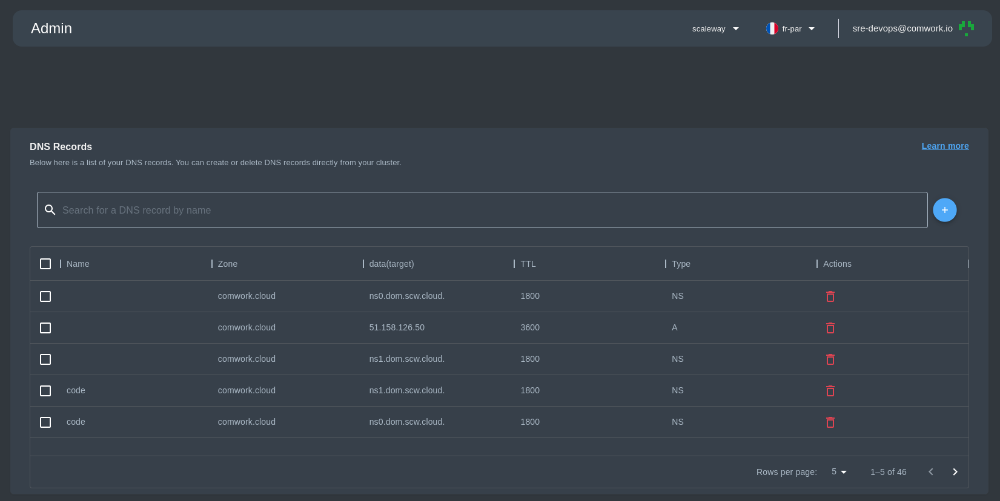
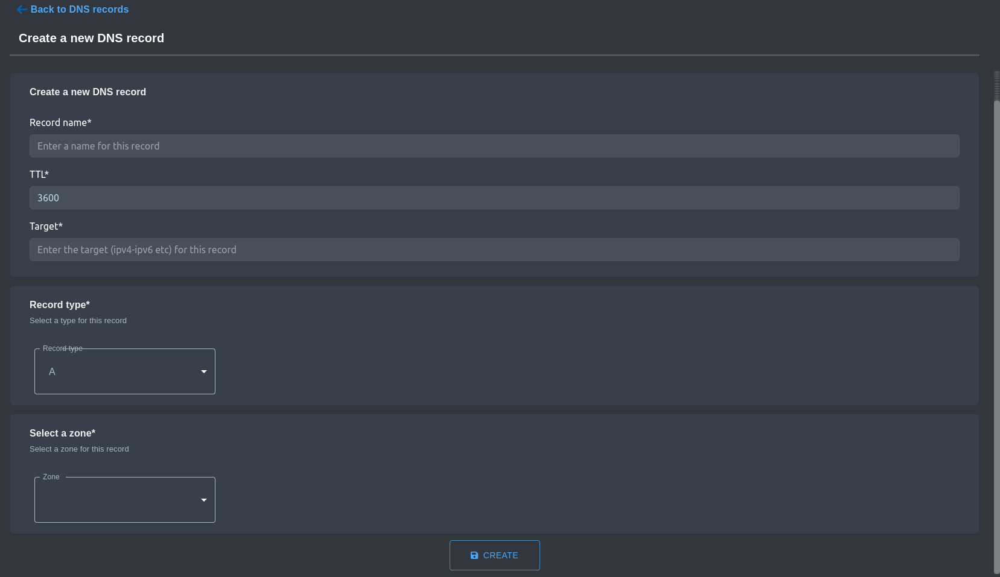

# DNS Records

## Translations

This tutorial is also available in the following languages:
* [Français 🇫🇷](../../translations/fr/tutorials/api/dns_records.md)

In this tutorial we will introduce you to the DNS records feature so let's get started !

## DNS records list

As an admin, you can manage your DNS records from multiple providers.

You can see the list of the DNS record with details on the Zone, Target, TTL, and Type.

Currently, the available actions are the new record creation and the delete (or multi-delete by selecting multiple DNS records).

## DNS records creation

For the DNS record creation, you are required to enter the:

- Record name.
- TTL (or Time To Live).
- Target. <!-- TODO: target need to be explained -->

Then choose the record type and select the zone.

With this your new record creation is done !

## What you need to know if you are self hosting Comwork Cloud
<!-- TODO: @oussama feel free to explain it specifically for every provider -->
