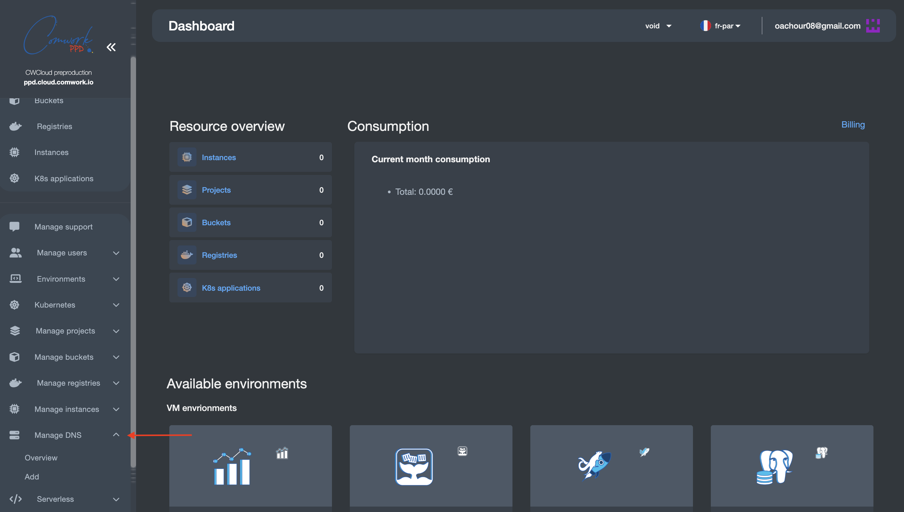
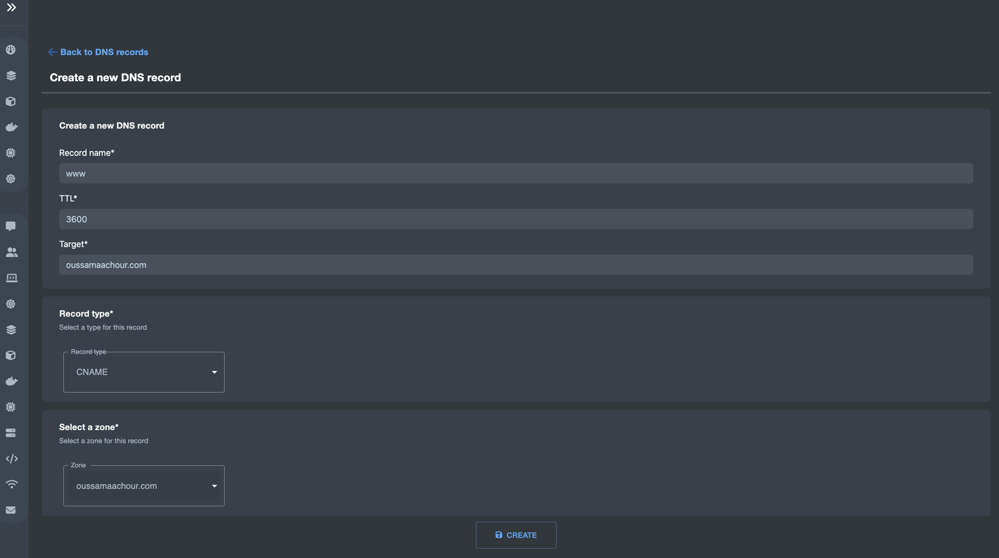

# DNS Records Management

## Translations

This tutorial is also available in the following languages:
* [Français 🇫🇷](../../translations/fr/tutorials/api/dns_records.md)

In this tutorial we will introduce you to the DNS records feature so let's get started !

## About the feature

This feature offers the end user (e.g admin) the ability to __manage DNS records__ for a selected DNS Zone.

This includes: 
* Listing all DNS records
* Creating new DNS records
* Deleting selected DNS record(s)

The cloud providers with which this feature works in its current version are: 
* [Amazon Web Services (AWS)](https://aws.amazon.com/)
* [Google Cloud Platform (GCP)](https://cloud.google.com/?hl=en)
* [Microsoft Azure](https://azure.microsoft.com/en-us)
* [Scaleway](https://www.scaleway.com/en/)
* [OVH](https://www.ovhcloud.com/fr/)

## Walking through the feature

### Select the service and the cloud provider

In the left panel of the dashboard page, select the __Manage DNS__, then __Overview__:

In the overview page, select the cloud provider in which you DNS hosted zone is hosted/
In left side of your account email address, you find a list of the cloud providers.
In this demo, we choose __Amazon Web Services (AWS)__:

Here all DNS hosted zones in your account in the selected cloud provider would be listed, select the one you want:

At this stage, we would start walking through the different functionality one by one: 
* [DNS records listing](#DNS-records-listing)
* [DNS records creation](#DNS-records-creation)
* [DNS records deletion](#DNS-records-deletion)

## DNS records listing

By just selecting your DNS hosted zone, all the respective DNS records would be listed:

Each row describes a single record including the following information (Record name, Record target/value, Record type, Record TTL).

These fields are explained in the next [DNS records creation](#DNS-records-creation) section.

## DNS records creation

Creating new DNS records consists of filling these values: 

* __Name__: This should be the _subdomain_, that would be later concatenated with the _domain-name_ forming the fully qualified domain name: `subdomain.domain-name`. For example: `foo.oussamaachour.com`.
* __Target__: this indicated where the traffic would be routed when accessing the respective URL. In this case, the record is a CNAME (Canonical NAME) record mapping to the original domain name which is `oussamaachour.com`.
* __TTL__: TTL stands for Time to Live. This is the time, in seconds, that it will take for any changes to the DNS record to go into effect. For example: with a TTL of 3600, all changes to this record should be refreshed every 3600 seconds (one hour).
* __Type__: the type of the record such as the following (A record, AAAA record,CNAME record, Nameserver (NS) record, Mail exchange (MX) record).
* __DNS Zone__: this the DNS hosted zone where your record would be created. In this example, we want to create a _CNAME record_ for the original domain name of `oussamaachour.com` to make the traffic coming from `www.oussamaachour.com` directed to `oussamaachour.com`.

__Note:__ A CNAME record is like an alias for the target domain name.

After filling all the fields, click on the `CREATE` button:

## DNS records deletion

Select your desired record(s) for deletion, then click in the `DELETE` icon in the right:

As we can see, the record is successfully deleted!

__Note__: Deleting the DNS record results in deleting the record itself, as well as its stack from the Pulumi state.

## Creating DNS records isn't enough!

Even though this feature enables the user to manage DNS records across different cloud environment, however this isn't enough to make the created record(s)  successfully resolved and functional.

Actually, __this is the scope of the feature__, providing a centralized point to manage DNS records, in the same way it would be achieved when doing it in every single cloud provider !

### Considerations

#### One DNS Zone across different cloud providers

In this case, we used just one zone across the three cloud providers (AWS, GCP and Azure)
Using just one zone across multiple cloud environment, which is actually hosted in AWS, __is just for testing purposes__.

Therefore, some extra configuration are needed. Such solution for this scenario is to enable _DNS delegation_, where you delegate a specific DNS domains/subdomains to the other cloud than the one in which you are hosting your DNS hosted zone.

#### Attaching SSL/TLS certificates to the created domain/subdomains

Creating DNS records isn't enough to make it fully functional in the user endpoint.

In fact, generally speaking, any domain/subdomain needs an SSL/TLS certificate to ensure secure connection through the internet.

Example: In the demonstration we made, after creating that `www.oussamaachour.com` we need to go to AWS and create a SSL/TLS certificate (could be done by AWS Certificate Manager or other authority). Also we could create one single SSL/TLS certificate for the domain and all its domains.
