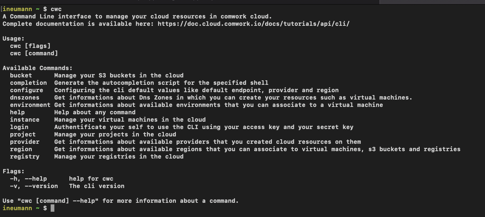

# Cli cwc

`cwc` is a CLI written in go that will help you to manipulate the [comwork cloud API](./README.md) avoiding the breaking changes.



As it's written in go, it's pretty easy to ship into your IaC pipelines.

## Installation

### Homebrew

First installation:

```shell
brew tap cwc/cwc https://gitlab.comwork.io/oss/cwc/homebrew-cwc.git 
brew install cwc
```

Upgrade:

```shell
brew update
brew upgrade cwc
```

### Curl

#### Linux

##### Linux x86 (64 bit)

```shell
curl -L "https://gitlab.comwork.io/oss/cwc/cwc/-/releases/v1.5.7/downloads/cwc_1.5.7_linux_amd64.tar.gz" -o "cwc_cli.tar.gz"
mkdir cwc_cli && tar -xf cwc_cli.tar.gz -C cwc_cli 
sudo ./cwc_cli/install.sh
```

##### Linux arm (64 bit)

```shell
curl -L "https://gitlab.comwork.io/oss/cwc/cwc/-/releases/v1.5.7/downloads/cwc_1.5.7_linux_arm64.tar.gz" -o "cwc_cli.tar.gz" 
mkdir cwc_cli && tar -xf cwc_cli.tar.gz -C cwc_cli 
sudo ./cwc_cli/install.sh
```

#### For MacOS

##### MacOS x86/arm (64 bit)

```shell
curl -L "https://gitlab.comwork.io/oss/cwc/cwc/-/releases/v1.5.7/downloads/cwc_1.5.7_darwin_all.tar.gz" -o "cwc_cli.tar.gz"
mkdir cwc_cli && tar -xf cwc_cli.tar.gz -C cwc_cli     
sudo ./cwc_cli/install.sh
```

#### For Windows

##### Windows x86 (64 bit)

```shell
curl -L "https://gitlab.comwork.io/oss/cwc/cwc/-/releases/v1.5.7/downloads/cwc_1.5.7_windows_amd64.zip" -o "cwc_cli.zip"
unzip cwc_cli.zip 
cd 
cwc.exe
```

##### Windows arm (64 bit)

```shell
curl -L "https://gitlab.comwork.io/oss/cwc/cwc/-/releases/v1.5.7/downloads/cwc_1.5.7_windows_arm64.zip" -o "cwc_cli.zip"
unzip cwc_cli.zip 
cd cwc_cli
cwc.exe
```
