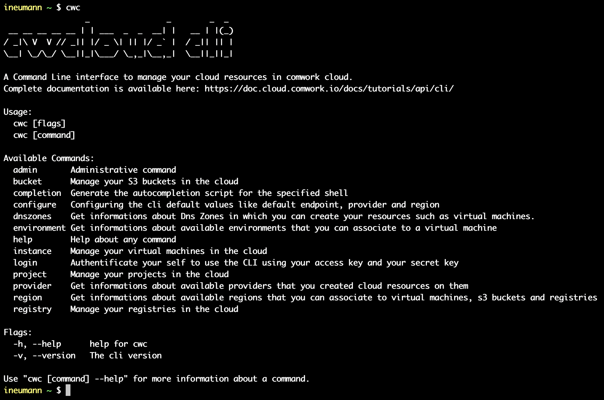

# Cli cwc

`cwc` is a CLI written in go that will help you to manipulate the [comwork cloud API](./README.md) avoiding the breaking changes.

As it's written in go, it's pretty easy to ship into your IaC pipelines.
## Chapters

* [installation](./install.md)
* [public commands](./public.md)
* [admin command](./admin.md)
