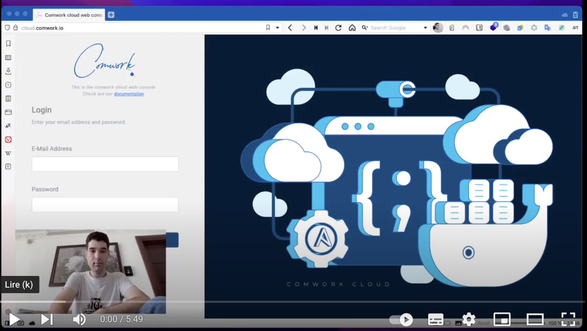

# Exposing a container running with K3D

Here you'll find a demo on how host a container inside your [code](../../code.md) instance with `docker` and `docker-compose` and how to expose it in public with `localtunnel`.

You can activate the subtitles in English or French to get more details on this demo.

Enjoy!
