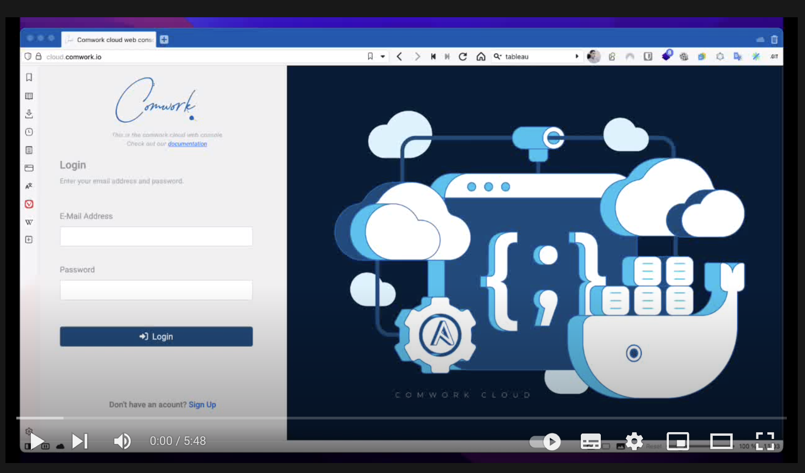

# Running and exposing a K3D pod

Here you'll find a demo on how host a container inside your [code](../../code.md) instance with `k3d` (Kubernetes K3S distribution on top docker) and how to expose it in public with `localtunnel`.

You can activate the subtitles in English or French to get more details on this demo. 

Enjoy!
