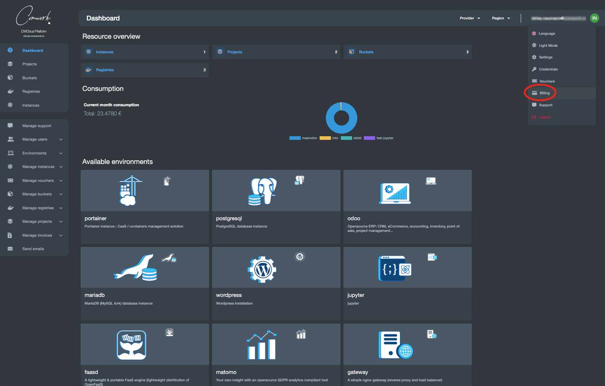
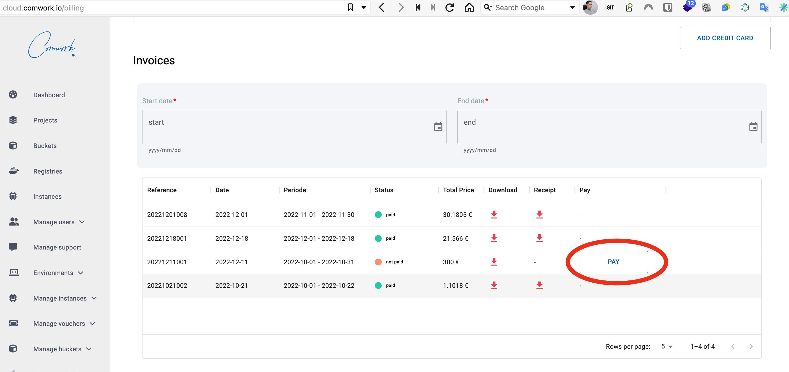

# Billing

## Translations

This tutorial is also available in the following languages:
* [Français 🇫🇷](../../translations/fr/console/public/billing.md)

## How to pay automatically

This is how to pay your monthly invoices. The billing system is using [stripe](https://www.stripe.com) for secured payments.

You can pay every 2nd of the month.

Click on "billing" on the user's menu:

Then configure your payment methods like this:

Note: you can enable the "payment auto" **after manually paid for the first time**. You'll have to check if your bank is allowing you to do it without confirmation. If that's not the case, you'll have to pay manually like the first time.

For processing to the manual payment:

Note: you're supposed to receive the PDF invoice by email but you can also download it on this screen.
