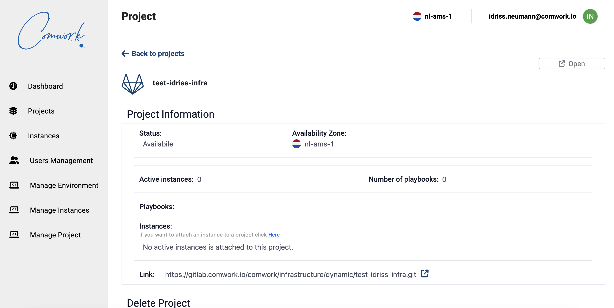
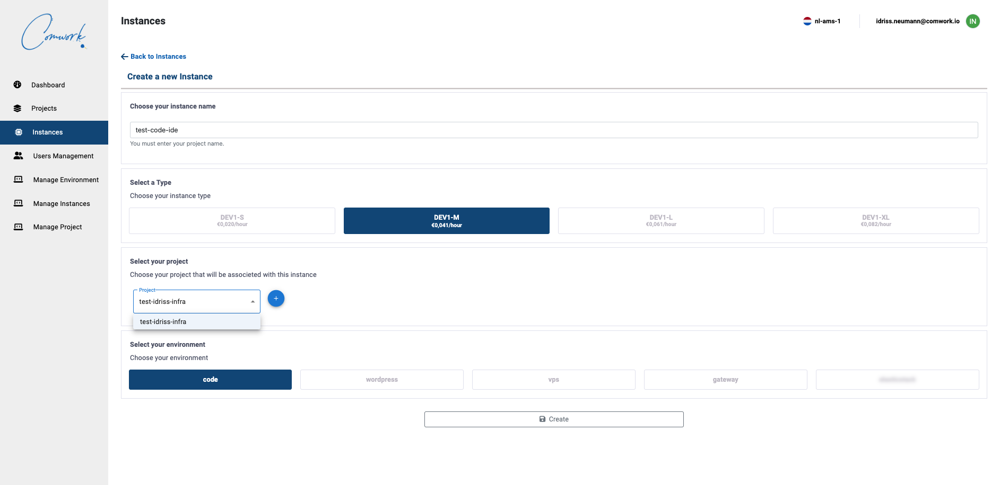
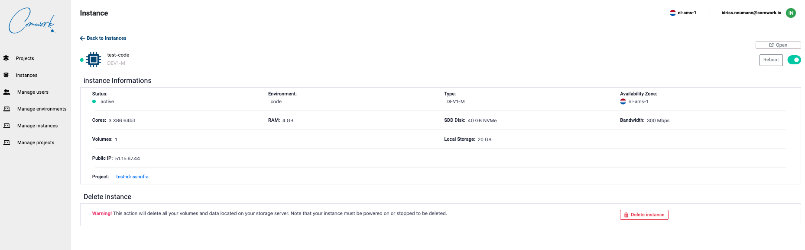

# Instances

## Translations

This tutorial is also available in the following languages:
* [Français 🇫🇷](../../../translations/fr/tutorials/console/public/instances.md)

## How to create new project and instances

The console is here: https://www.cwcloud.tech

First you have to [register](../../../subscription.md) if that's not the case, then you'll be able to create your gitlab projects:

Then you'll be able to create instances:

After creating your instance, you'll be able manage it from the web console:

